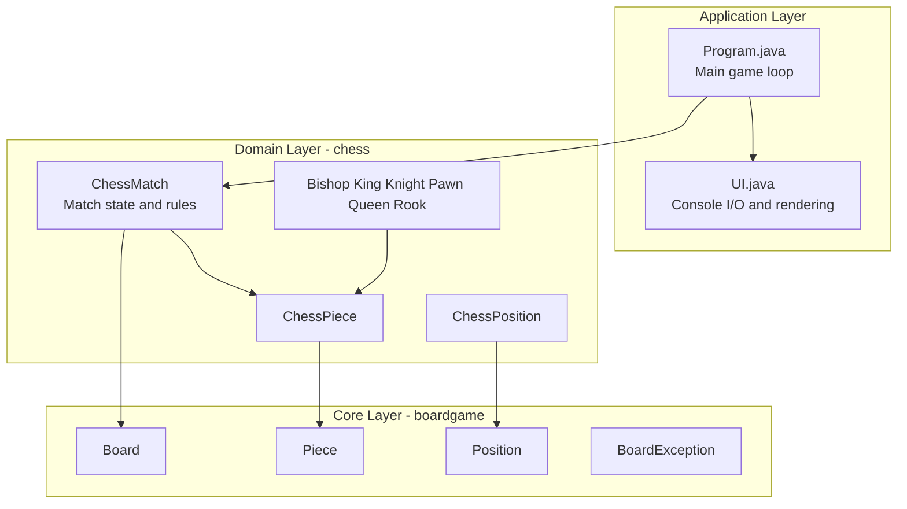
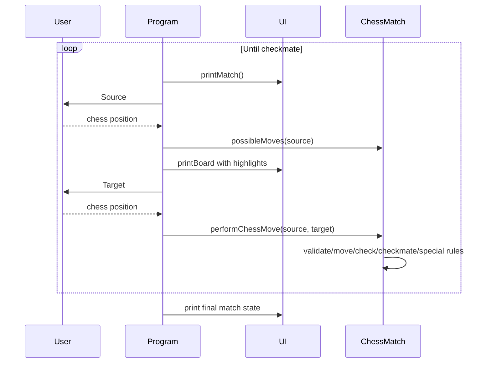

<div align="center">

**Choose Language / Selecione o Idioma / Elija el Idioma**

[](README.md)
[](README_PT.md)
[](README_ES.md)

</div>

---

<div align="center">

# Chess System Java

A complete console chess implementation in Java, with layered architecture,
move validation, check/checkmate detection, and special chess rules.


</div>

---

## Table of Contents

- [Overview](#overview)
- [Architecture](#architecture)
- [Technology Stack](#technology-stack)
- [Project Structure](#project-structure)
- [Core Rules Implemented](#core-rules-implemented)
- [Class Responsibilities](#class-responsibilities)
- [Execution Flow](#execution-flow)
- [How to Run](#how-to-run)
- [How to Play](#how-to-play)
- [Known Limitations](#known-limitations)
- [Contributing](#contributing)
- [Author](#author)
- [License](#license)

---

## Overview

Chess System Java is a terminal-based chess game focused on clean design and reliable game logic.

The codebase is organized in two clear layers:

- boardgame: reusable, generic board abstractions.
- chess: chess-specific rules and match state.

Current implementation includes:

- Full turn-based move cycle.
- Legal move generation per piece.
- Illegal move prevention.
- Check and checkmate detection.
- Castling (kingside and queenside).
- En passant.
- Pawn promotion (default queen, manual replacement allowed).

---

## Architecture



Design highlights:

- Inheritance between generic and chess-specific pieces.
- Encapsulation of board mutation inside Board and ChessMatch.
- Centralized rule enforcement in ChessMatch.

---

## Technology Stack

| Layer | Technology | Purpose |
|---|---|---|
| Language | Java 21+ | Game logic and object model |
| Build | Apache Ant + NetBeans project files | Build and run project |
| UI | Console ANSI output | Board rendering and input |
| Architecture | OOP | Inheritance, abstraction, encapsulation |

---

## Project Structure

```text
chess_system_java/
|-- build.xml
|-- manifest.mf
|-- README.md
|-- README_PT.md
|-- README_ES.md
|-- nbproject/
|   |-- build-impl.xml
|   |-- project.properties
|   `-- ...
`-- src/
    |-- Program.java
    |-- UI.java
    |-- boardgame/
    |   |-- Board.java
    |   |-- BoardException.java
    |   |-- Piece.java
    |   `-- Position.java
    `-- chess/
        |-- ChessException.java
        |-- ChessMatch.java
        |-- ChessPiece.java
        |-- ChessPosition.java
        |-- Color.java
        `-- pieces/
            |-- Bishop.java
            |-- King.java
            |-- Knight.java
            |-- Pawn.java
            |-- Queen.java
            `-- Rook.java
```

---

## Core Rules Implemented

### Standard rules

- Piece movement by type.
- Captures.
- Turn alternation (WHITE and BLACK).
- Illegal self-check move rejection.
- Check and checkmate detection.

### Special rules

- Castling:
  - Kingside castling.
  - Queenside castling.
  - Requires unmoved king/rook and clear path.
- En passant:
  - Tracks enPassantVulnerable pawn.
  - Available immediately after opponent double pawn move.
- Promotion:
  - Auto-promotes to Queen at last rank.
  - Supports replacement types: B (Bishop), H (Knight), R (Rook), Q (Queen).

---

## Class Responsibilities

| Class | Responsibility |
|---|---|
| Program | Main game loop, input sequence, exception handling |
| UI | Console rendering, board display, position parsing |
| ChessMatch | Match lifecycle, move execution, validation, checkmate evaluation |
| ChessPiece | Chess piece base abstraction with color and move count |
| ChessPosition | Chess notation conversion (a1-h8) <-> matrix coordinates |
| Board | Generic matrix board and low-level piece placement/removal |
| Piece | Generic abstract piece and possible move contract |
| Bishop/King/Knight/Pawn/Queen/Rook | Piece-specific movement logic |

---

## Execution Flow



---

## How to Run

### Prerequisites

- JDK 21 or newer.
- Optional: Apache NetBeans.
- Optional: Apache Ant.

### Option 1: NetBeans

1. Open project folder in NetBeans.
2. Run project (F6).
3. Main class is Program.

### Option 2: Ant

From repository root:

```bash
ant run
```

### Option 3: javac/java

From repository root:

```bash
cd src
javac Program.java UI.java boardgame/*.java chess/*.java chess/pieces/*.java
java Program
```

On Windows PowerShell:

```powershell
cd src
javac Program.java UI.java boardgame\*.java chess\*.java chess\pieces\*.java
java Program
```

---

## How to Play

1. Enter source square in algebraic form, for example e2.
2. Enter target square, for example e4.
3. Follow turn indicator shown in console.
4. Continue until checkmate.

Console messages indicate:

- Current turn.
- Current player.
- Check state.
- Captured pieces list.

---

## Known Limitations

- No graphical interface (console only).
- No persistence (match state is in-memory only).
- No automated test suite included yet.
- Some user-facing messages are in Portuguese.

---

## Contributing

1. Fork the repository.
2. Create a feature branch.
3. Commit with clear messages.
4. Open a pull request describing your change.

Suggested contribution areas:

- Unit tests for movement and checkmate scenarios.
- Internationalization for UI messages.
- Optional PGN export/import.
- Optional draw rules (threefold repetition, fifty-move rule, stalemate reporting improvements).

---

## Author

Victor H. J. Santiago

- GitHub: https://github.com/VictorHJesusSantiago
- LinkedIn: https://www.linkedin.com/in/victor-henrique-de-jesus-santiago/

---

## License

MIT License.

If the LICENSE file is not yet present in your local clone, add one before publishing derived work.

---

<div align="center">
Built for study, design practice, and clean chess rule implementation in Java.
</div>
