<div align="center">

**Choose Language / Selecione o Idioma / Elija el Idioma**

[](README.md)
[](README_PT.md)
[](README_ES.md)

</div>

---

<div align="center">

# Chess System Java

A complete console chess implementation in Java, with layered architecture,
move validation, check/checkmate detection, and special chess rules.


</div>

---

## Table of Contents

- [Overview](#overview)
- [Architecture](#architecture)
- [Technology Stack](#technology-stack)
- [Project Structure](#project-structure)
- [Core Rules Implemented](#core-rules-implemented)
- [Class Responsibilities](#class-responsibilities)
- [Execution Flow](#execution-flow)
- [Software Engineering Documentation](#-software-engineering-documentation)
- [How to Run](#how-to-run)
- [How to Play](#how-to-play)
- [Known Limitations](#known-limitations)
- [Contributing](#contributing)
- [Author](#author)
- [License](#license)

---

## Overview

Chess System Java is a terminal-based chess game focused on clean design and reliable game logic.

The codebase is organized in two clear layers:

- boardgame: reusable, generic board abstractions.
- chess: chess-specific rules and match state.

Current implementation includes:

- Full turn-based move cycle.
- Legal move generation per piece.
- Illegal move prevention.
- Check and checkmate detection.
- Castling (kingside and queenside).
- En passant.
- Pawn promotion (default queen, manual replacement allowed).

---

## Architecture

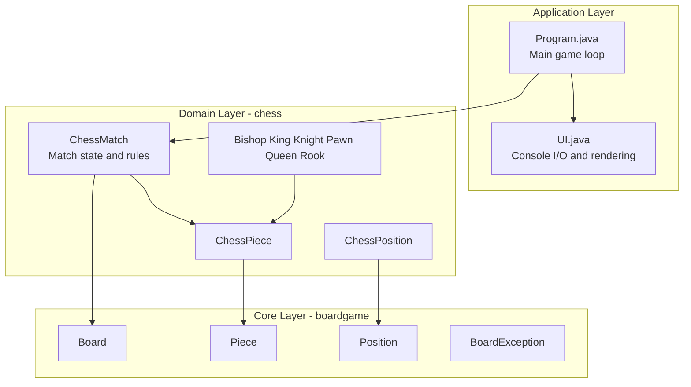

Design highlights:

- Inheritance between generic and chess-specific pieces.
- Encapsulation of board mutation inside Board and ChessMatch.
- Centralized rule enforcement in ChessMatch.

---

## Technology Stack

| Layer | Technology | Purpose |
|---|---|---|
| Language | Java 21+ | Game logic and object model |
| Build | Apache Ant + NetBeans project files | Build and run project |
| UI | Console ANSI output | Board rendering and input |
| Architecture | OOP | Inheritance, abstraction, encapsulation |

---

## Project Structure

```text
chess_system_java/
|-- build.xml
|-- manifest.mf
|-- README.md
|-- README_PT.md
|-- README_ES.md
|-- nbproject/
|   |-- build-impl.xml
|   |-- project.properties
|   `-- ...
`-- src/
    |-- Program.java
    |-- UI.java
    |-- boardgame/
    |   |-- Board.java
    |   |-- BoardException.java
    |   |-- Piece.java
    |   `-- Position.java
    `-- chess/
        |-- ChessException.java
        |-- ChessMatch.java
        |-- ChessPiece.java
        |-- ChessPosition.java
        |-- Color.java
        `-- pieces/
            |-- Bishop.java
            |-- King.java
            |-- Knight.java
            |-- Pawn.java
            |-- Queen.java
            `-- Rook.java
```

---

## Core Rules Implemented

### Standard rules

- Piece movement by type.
- Captures.
- Turn alternation (WHITE and BLACK).
- Illegal self-check move rejection.
- Check and checkmate detection.

### Special rules

- Castling:
  - Kingside castling.
  - Queenside castling.
  - Requires unmoved king/rook and clear path.
- En passant:
  - Tracks enPassantVulnerable pawn.
  - Available immediately after opponent double pawn move.
- Promotion:
  - Auto-promotes to Queen at last rank.
  - Supports replacement types: B (Bishop), H (Knight), R (Rook), Q (Queen).

---

## Class Responsibilities

| Class | Responsibility |
|---|---|
| Program | Main game loop, input sequence, exception handling |
| UI | Console rendering, board display, position parsing |
| ChessMatch | Match lifecycle, move execution, validation, checkmate evaluation |
| ChessPiece | Chess piece base abstraction with color and move count |
| ChessPosition | Chess notation conversion (a1-h8) <-> matrix coordinates |
| Board | Generic matrix board and low-level piece placement/removal |
| Piece | Generic abstract piece and possible move contract |
| Bishop/King/Knight/Pawn/Queen/Rook | Piece-specific movement logic |

---

## Execution Flow

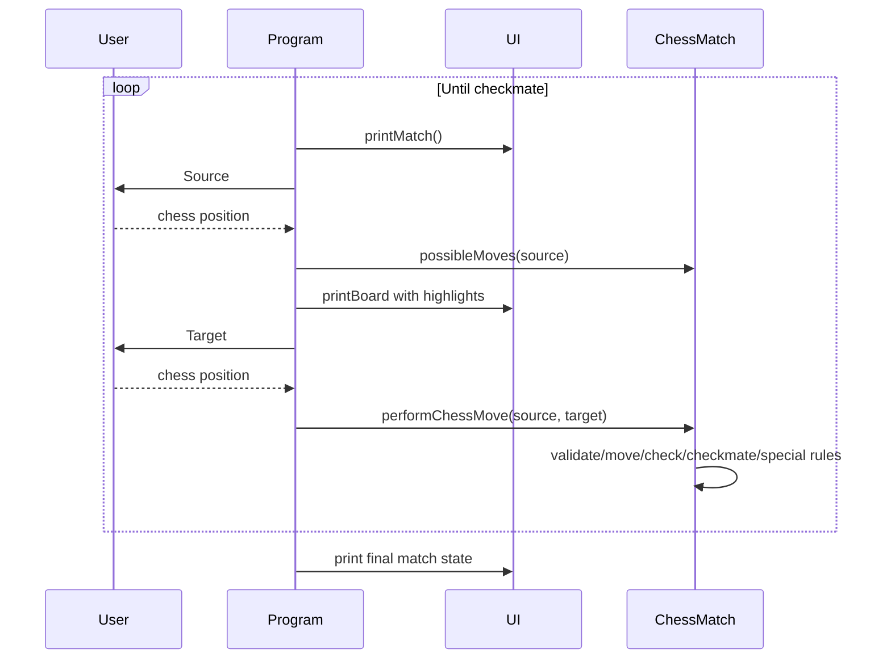

---

## 📚 Software Engineering Documentation

<div align="center">

Condensed requirements, UML, data-modeling and UX artifacts for this project.
Click each item to expand / collapse.

</div>

### 📋 Requirements

<details>
<summary><b>✅ Functional Requirements (FR)</b></summary>

| ID | Requirement |
|---|---|
| FR-01 | Allow two players to alternate turns (White / Black). |
| FR-02 | Compute legal moves for each piece type. |
| FR-03 | Reject any move that leaves the mover's own king in check. |
| FR-04 | Detect check and checkmate after every move. |
| FR-05 | Support castling (king-side and queen-side). |
| FR-06 | Support en passant capture. |
| FR-07 | Support pawn promotion with player-selected piece. |
| FR-08 | Render the board and captured pieces after every move. |
| FR-09 | End the match automatically on checkmate. |

</details>

<details>
<summary><b>⚙️ Non-Functional Requirements (NFR)</b></summary>

| ID | Requirement | Category |
|---|---|---|
| NFR-01 | Move validation responds in < 50 ms | Performance |
| NFR-02 | Runs on any OS with JDK 21+ | Portability |
| NFR-03 | Clear error messages for invalid input | Usability |
| NFR-04 | Strict separation between generic `boardgame` and domain `chess` layers | Maintainability |
| NFR-05 | No invalid board state is ever reachable | Reliability |
| NFR-06 | Compiles with zero warnings under `javac -Xlint` | Code Quality |

</details>

<details>
<summary><b>📏 Business Rules (BR)</b></summary>

| ID | Rule |
|---|---|
| BR-01 | A move that exposes the mover's king to check is illegal. |
| BR-02 | Castling requires king and rook never moved, a clear path, and king not in/through check. |
| BR-03 | En passant is valid only on the move immediately after an opponent's two-square pawn advance. |
| BR-04 | A pawn reaching the last rank must be promoted (default: Queen). |
| BR-05 | Checkmate ends the match; no further moves are accepted. |
| BR-06 | A player may only move their own pieces, and only on their turn. |

</details>

<details>
<summary><b>🌐 Domain Requirements</b></summary>

- All movement, capture, check, checkmate and draw rules follow standard FIDE chess rules.
- The board is an 8x8 grid addressed in algebraic notation (`a1`-`h8`).
- Each piece tracks `color` (WHITE/BLACK) and a `moveCount`, used for castling, en passant and a pawn's first move.

</details>

<details>
<summary><b>🗄️ Data Requirements</b></summary>

- **Board**: 8x8 matrix of `Piece` references (nullable).
- **ChessMatch**: `turn`, `currentPlayer`, `check`, `checkMate`, `enPassantVulnerable`, `promoted`, `piecesOnTheBoard`, `capturedPieces`.
- **ChessPosition**: `column` (a-h) and `row` (1-8), converted to matrix coordinates.

</details>

<details>
<summary><b>🖥️ Interface Requirements</b></summary>

- Text-based console input/output only.
- Move input as two positions (e.g., `e2` then `e4`).
- Board rendered with ANSI colors; possible moves highlighted.
- Promotion choice entered as a single character (`B`/`N`/`R`/`Q`).

</details>

<details>
<summary><b>🎯 Use Cases</b></summary>

| ID | Use Case | Primary Actor | Summary |
|---|---|---|---|
| UC-01 | Make a Move | Player | Select source/target squares; system validates and applies the move. |
| UC-02 | Castle | Player | Move king two squares toward a rook under castling conditions. |
| UC-03 | Capture En Passant | Player | Capture an adjacent pawn that just advanced two squares. |
| UC-04 | Promote Pawn | Player | Choose a replacement piece when a pawn reaches the last rank. |
| UC-05 | Detect Check / Checkmate | System | Evaluate king safety after every move; end match on checkmate. |
| UC-06 | Start New Match | Player | Initialize the board with the standard starting position. |

</details>

<details>
<summary><b>🔗 Requirements Traceability Matrix</b></summary>

| Requirement(s) | Use Case | Class(es) |
|---|---|---|
| FR-01, BR-06 | UC-01, UC-06 | `ChessMatch`, `Program` |
| FR-02 | UC-01 | `Bishop`, `King`, `Knight`, `Pawn`, `Queen`, `Rook` |
| FR-03, BR-01 | UC-01, UC-05 | `ChessMatch#testCheck`, `King` |
| FR-04, BR-05 | UC-05 | `ChessMatch#testCheckMate` |
| FR-05, BR-02 | UC-02 | `ChessMatch`, `King`, `Rook` |
| FR-06, BR-03 | UC-03 | `ChessMatch`, `Pawn` |
| FR-07, BR-04 | UC-04 | `ChessMatch`, `Pawn`, `UI` |
| FR-08 | all | `UI`, `Board` |

</details>

<details>
<summary><b>📄 Software Requirements Specification (SRS)</b></summary>

This README forms a condensed SRS (IEEE 830-inspired):

- **Introduction / scope** → [Overview](#overview)
- **System context** → [Architecture](#architecture)
- **Specific requirements** → Functional, Non-Functional, Business Rules and Use Cases above
- **Design view** → [Class Responsibilities](#class-responsibilities) and the UML diagrams below
- **Assumptions / open issues** → [Known Limitations](#known-limitations)

</details>

---

### 🧩 UML Diagrams

<details>
<summary><b>🎭 Use Case Diagram</b></summary>

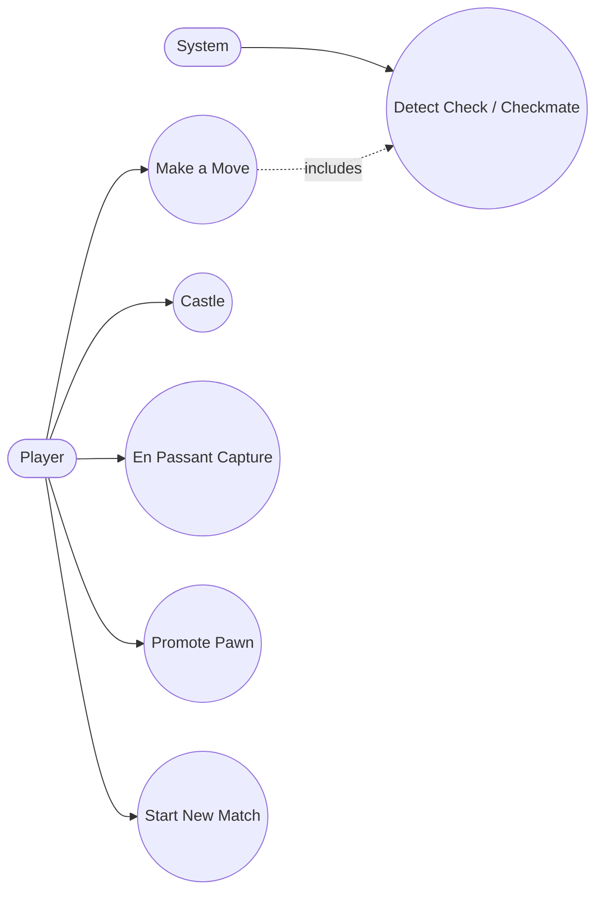

</details>

<details>
<summary><b>🏗️ Class Diagram</b></summary>

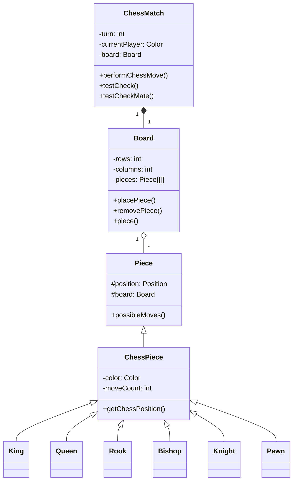

</details>

<details>
<summary><b>🧱 Object Diagram</b></summary>

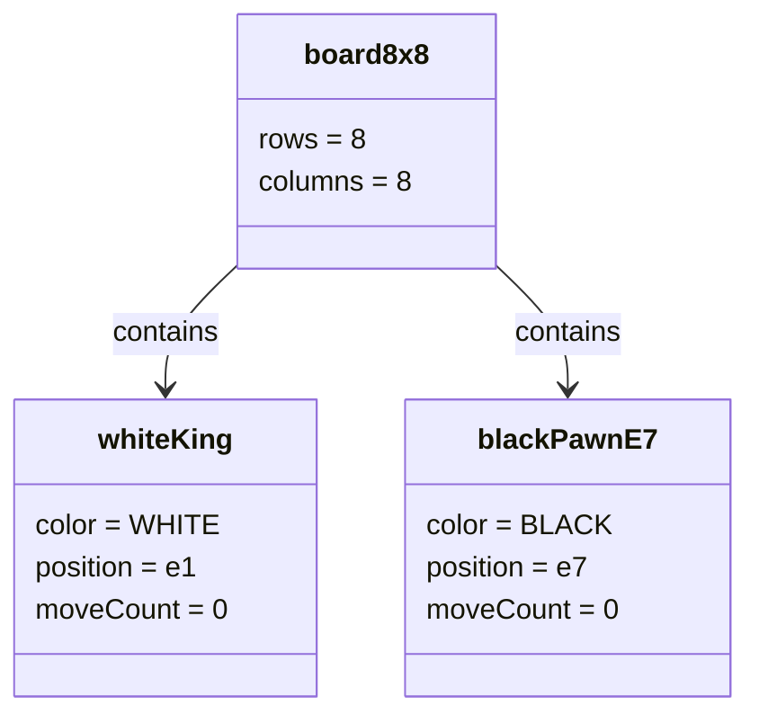

</details>

<details>
<summary><b>🔁 Sequence Diagram</b></summary>

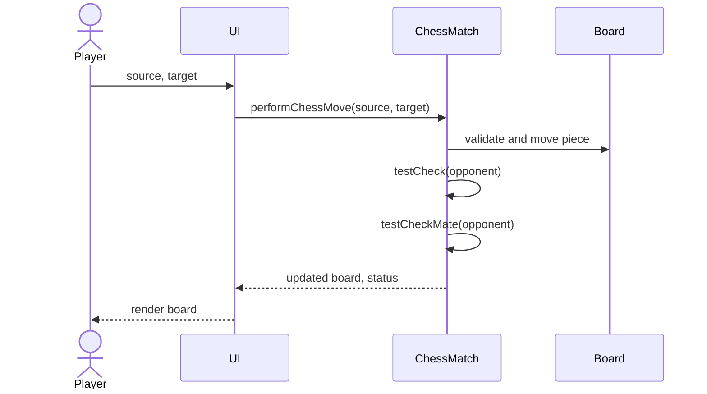

</details>

<details>
<summary><b>💬 Communication Diagram</b></summary>

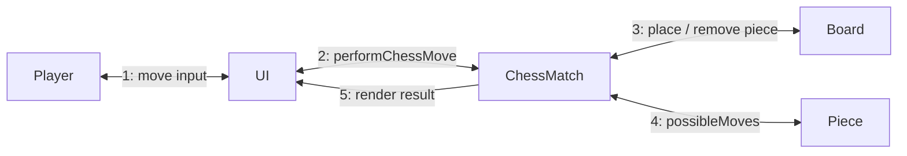

</details>

<details>
<summary><b>🏃 Activity Diagram</b></summary>

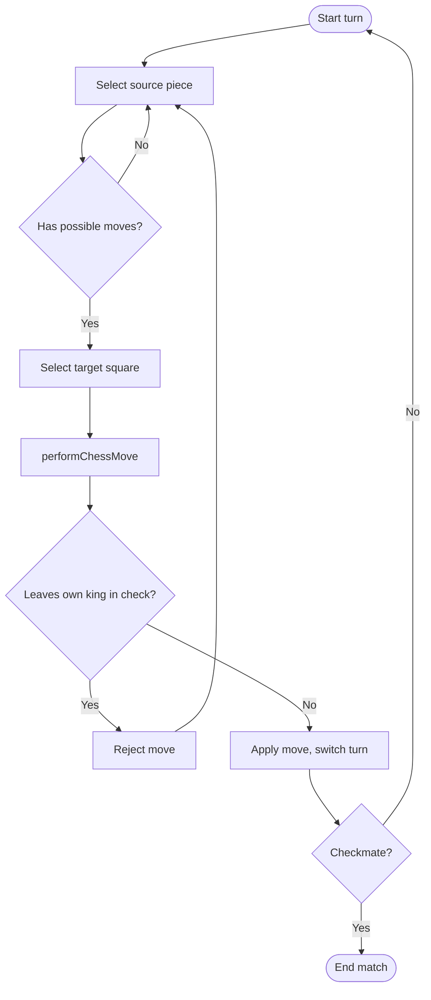

</details>

<details>
<summary><b>🔄 State Machine Diagram</b></summary>

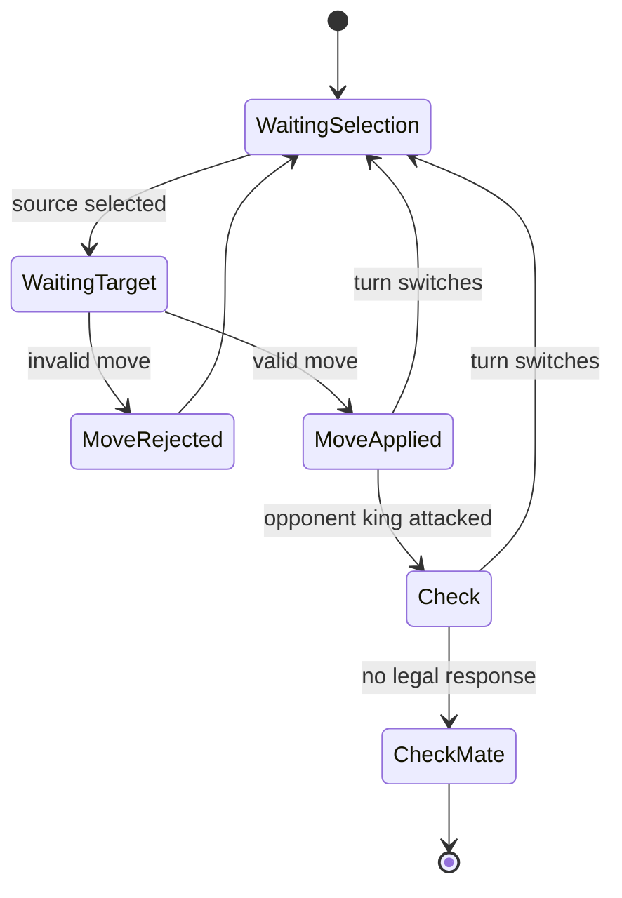

</details>

<details>
<summary><b>🧩 Component Diagram</b></summary>

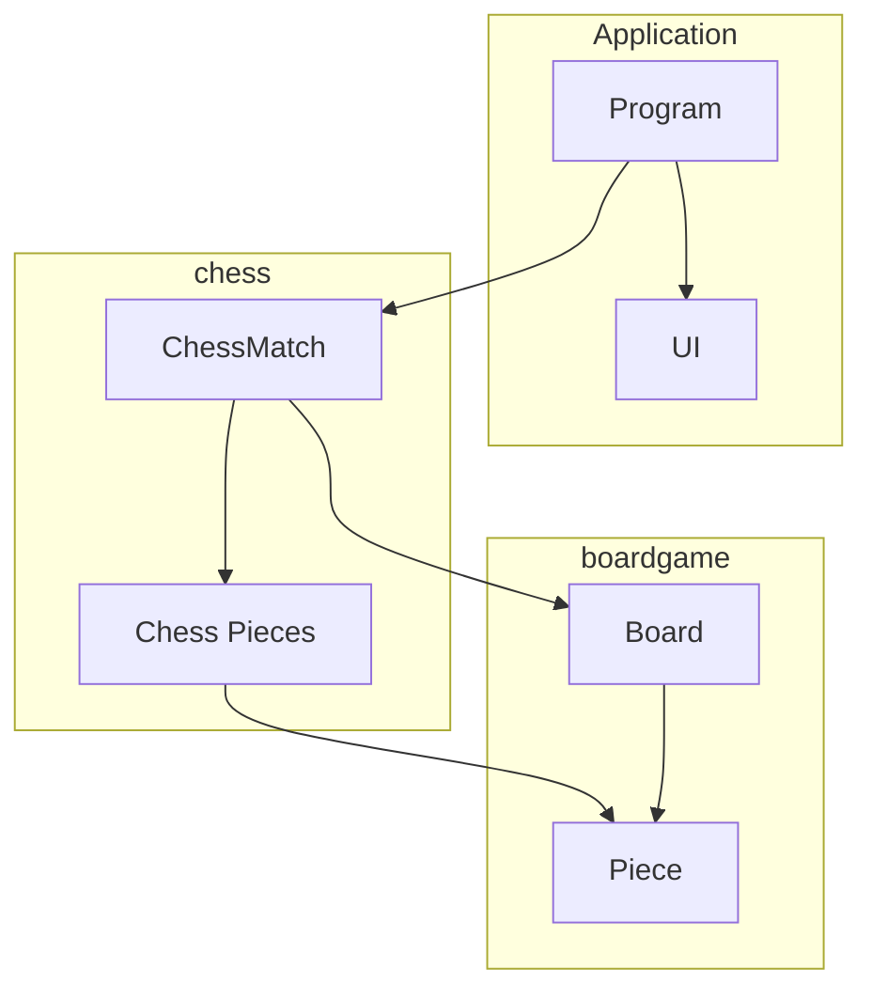

</details>

<details>
<summary><b>🚀 Deployment Diagram</b></summary>

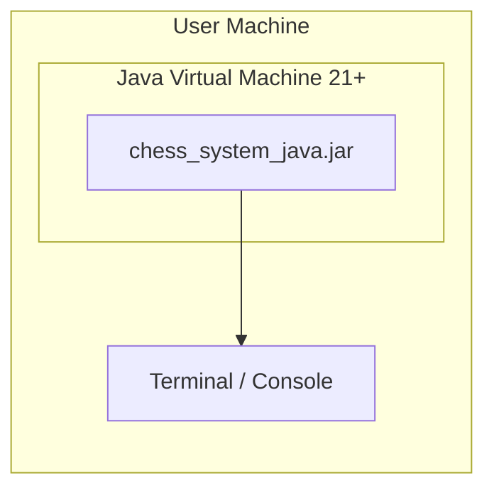

</details>

<details>
<summary><b>📦 Package Diagram</b></summary>

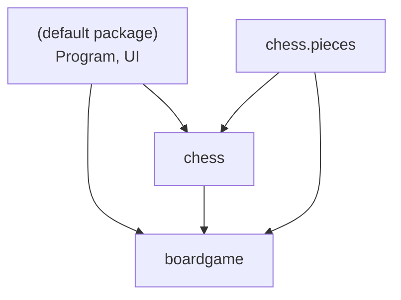

</details>

<details>
<summary><b>🧬 Composite Structure Diagram</b></summary>

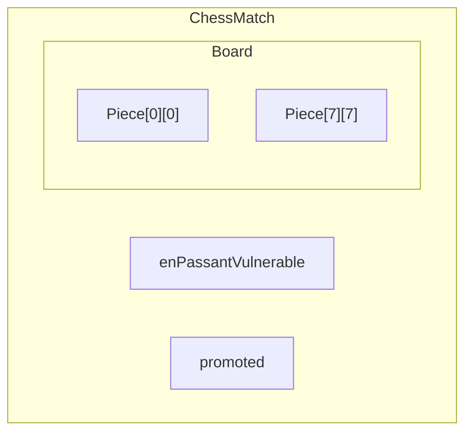

</details>

<details>
<summary><b>🗺️ Interaction Overview Diagram</b></summary>

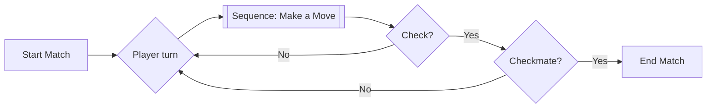

</details>

<details>
<summary><b>⏱️ Timing Diagram</b></summary>

| Turn | currentPlayer | check | checkMate | Event |
|---|---|---|---|---|
| 1 | WHITE | false | false | e2 → e4 |
| 2 | BLACK | false | false | e7 → e5 |
| 3 | WHITE | false | false | Bf1 → c4 |
| ... | ... | ... | ... | ... |
| n | BLACK | true | true | Qh4 → f2# |

</details>

---

### 🗃️ Data Modeling

<details>
<summary><b>🔗 Entity-Relationship Diagram (ERD)</b></summary>

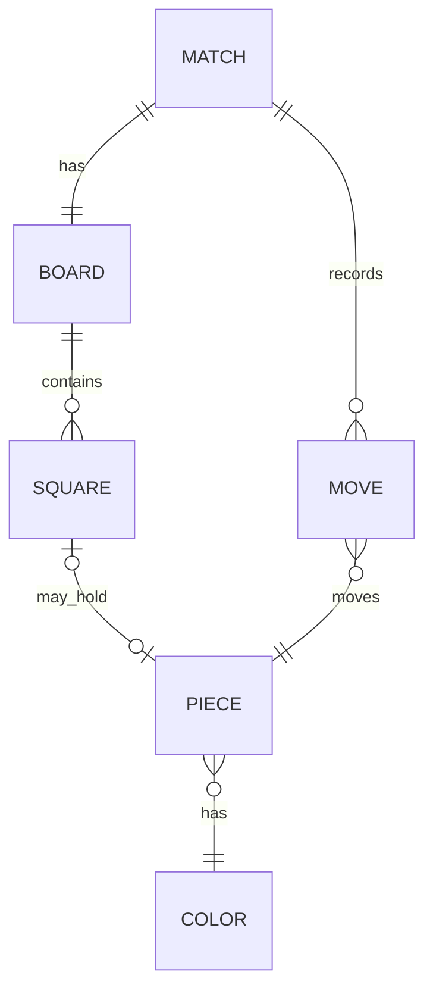

</details>

<details>
<summary><b>💡 Conceptual Data Model</b></summary>

- **Match**: one game session.
- **Board**: 8x8 grid of Squares.
- **Square**: identified by column (a-h) and row (1-8).
- **Piece**: type (King/Queen/Rook/Bishop/Knight/Pawn), color, position, moveCount.
- **Move**: source square, target square, optional captured piece, optional special-move flag.

</details>

<details>
<summary><b>🧮 Logical Data Model</b></summary>

| Entity | Attributes |
|---|---|
| Match | turn: int, currentPlayer: enum, check: bool, checkMate: bool |
| Board | rows: int, columns: int |
| Piece | type: enum, color: enum, position: (col, row), moveCount: int |
| Move | source: (col, row), target: (col, row), capturedPiece: Piece?, specialMove: enum? |

</details>

<details>
<summary><b>⚙️ Physical Data Model</b></summary>

| Logical Entity | Java Representation | Hypothetical SQL Table |
|---|---|---|
| Match | `ChessMatch` fields | `matches(id, turn, current_player, check, checkmate)` |
| Board | `Piece[8][8]` inside `Board` | `board_squares(match_id, col, row, piece_id)` |
| Piece | `ChessPiece` subclasses | `pieces(id, type, color, move_count)` |
| Move | not persisted today | `moves(id, match_id, source, target, captured_piece_id, special_move)` |

</details>

<details>
<summary><b>📖 Data Dictionary</b></summary>

| Field | Type | Domain | Description |
|---|---|---|---|
| color | enum | WHITE, BLACK | Owner of a piece / current player |
| column | char | a-h | Board column (algebraic notation) |
| row | int | 1-8 | Board row (algebraic notation) |
| moveCount | int | >= 0 | Times a piece has moved |
| check | boolean | true/false | Current player's king under attack |
| checkMate | boolean | true/false | No legal response to check |
| promoted | ChessPiece | nullable | Pawn pending promotion |

</details>

<details>
<summary><b>🌊 Data Flow Diagram (DFD)</b></summary>

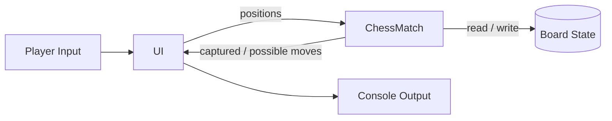

</details>

<details>
<summary><b>🧵 Data Lineage Diagram</b></summary>

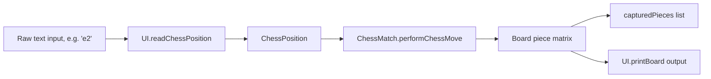

</details>

---

### 🏛️ Architecture & Flow

<details>
<summary><b>🏛️ Architecture Diagram (overview)</b></summary>

See the full diagram in the [Architecture](#architecture) section above — layered into `Application` (`Program`, `UI`), `chess` (domain rules) and `boardgame` (generic board engine).

</details>

<details>
<summary><b>📐 Flowchart (main loop)</b></summary>

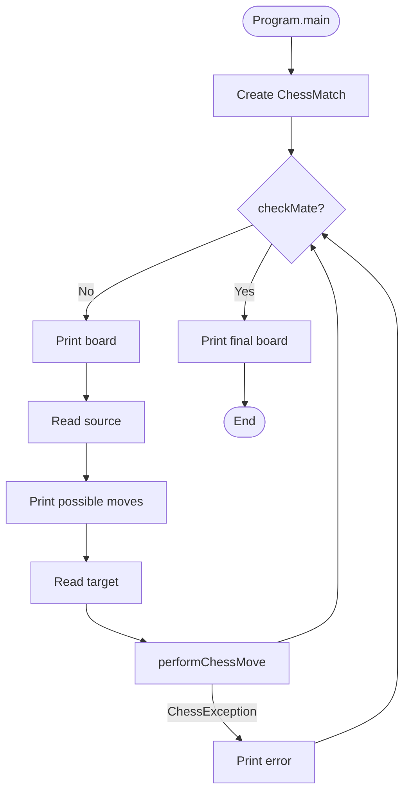

</details>

---

### 🎨 UX Artifacts

<details>
<summary><b>🧑 Persona</b></summary>

**Alex, "The Casual Strategist"**

- **Age**: 28
- **Goal**: Play a quick chess match against a friend on a shared terminal.
- **Tech comfort**: Comfortable with the command line.
- **Frustration**: Wants clear feedback on illegal moves and whose turn it is.

</details>

<details>
<summary><b>🗺️ User Journey Map</b></summary>

| Stage | Action | Feeling | Pain Point | Opportunity |
|---|---|---|---|---|
| Launch | Run `ant run` / `java Program` | Curious | Needs JDK installed | Provide a pre-built JAR |
| Setup | See initial board | Familiar | None | - |
| Play | Enter source/target squares | Focused | Typos cause errors | Friendlier input validation messages |
| Special move | Castle / en passant / promote | Delighted | Unsure when available | Highlight legal special moves |
| End | Checkmate message | Satisfied | No replay/save option | Add save/export (PGN) |

</details>

<details>
<summary><b>🖼️ Wireframe</b></summary>

```text
+------------------------------------+
| Turn: 5      Waiting player: WHITE  |
|                                      |
| 8 r n b q k b n r                   |
| 7 p p p p . p p p                   |
| 6 . . . . . . . .                   |
| 5 . . . . p . . .                   |
| 4 . . . . P . . .                   |
| 3 . . . . . . . .                   |
| 2 P P P P . P P P                   |
| 1 R N B Q K B N R                   |
|   a b c d e f g h                   |
|                                      |
| Captured - WHITE: []  BLACK: []     |
| Source: _   Target: _               |
+------------------------------------+
```

</details>

<details>
<summary><b>🎭 Mockup</b></summary>

```text
Legend:
  [x] = highlighted possible-move square
  Cyan letters   = WHITE pieces
  Yellow letters = BLACK pieces

   a  b  c  d  e  f  g  h
8  r  n  b  q  k  b  n  r
7  p  p  p  p  .  p  p  p
6  .  .  .  .  .  .  .  .
5  .  .  .  . [p] .  .  .
4  .  .  .  . [P] .  .  .
3  .  .  .  .  .  .  .  .
2  P  P  P  P  .  P  P  P
1  R  N  B  Q  K  B  N  R
```

</details>

---

## How to Run

### Prerequisites

- JDK 21 or newer.
- Optional: Apache NetBeans.
- Optional: Apache Ant.

### Option 1: NetBeans

1. Open project folder in NetBeans.
2. Run project (F6).
3. Main class is Program.

### Option 2: Ant

From repository root:

```bash
ant run
```

### Option 3: javac/java

From repository root:

```bash
cd src
javac Program.java UI.java boardgame/*.java chess/*.java chess/pieces/*.java
java Program
```

On Windows PowerShell:

```powershell
cd src
javac Program.java UI.java boardgame\*.java chess\*.java chess\pieces\*.java
java Program
```

---

## How to Play

1. Enter source square in algebraic form, for example e2.
2. Enter target square, for example e4.
3. Follow turn indicator shown in console.
4. Continue until checkmate.

Console messages indicate:

- Current turn.
- Current player.
- Check state.
- Captured pieces list.

---

## Known Limitations

- No graphical interface (console only).
- No persistence (match state is in-memory only).
- No automated test suite included yet.
- Some user-facing messages are in Portuguese.

---

## Contributing

1. Fork the repository.
2. Create a feature branch.
3. Commit with clear messages.
4. Open a pull request describing your change.

Suggested contribution areas:

- Unit tests for movement and checkmate scenarios.
- Internationalization for UI messages.
- Optional PGN export/import.
- Optional draw rules (threefold repetition, fifty-move rule, stalemate reporting improvements).

---

## Author

Victor H. J. Santiago

- GitHub: https://github.com/VictorHJesusSantiago
- LinkedIn: https://www.linkedin.com/in/victor-henrique-de-jesus-santiago/

---

## License

MIT License.

If the LICENSE file is not yet present in your local clone, add one before publishing derived work.

---

<div align="center">
Built for study, design practice, and clean chess rule implementation in Java.
</div>
