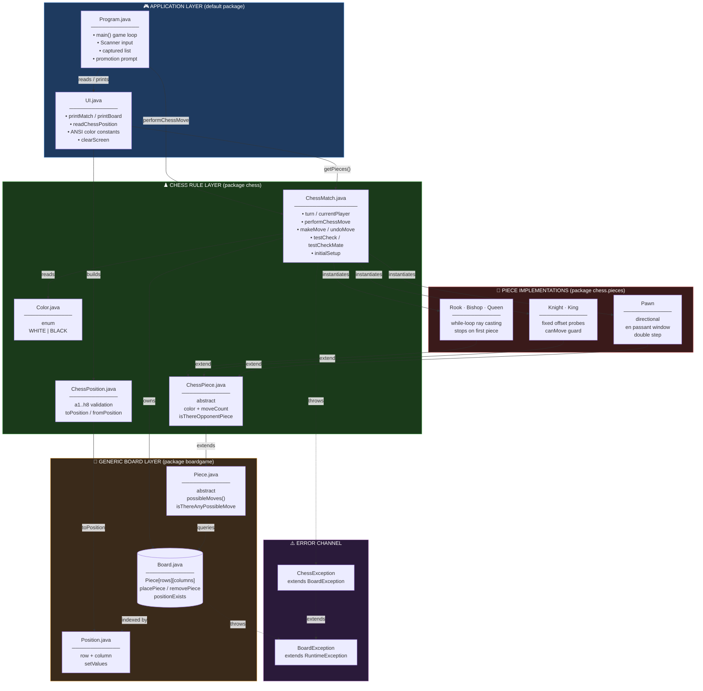
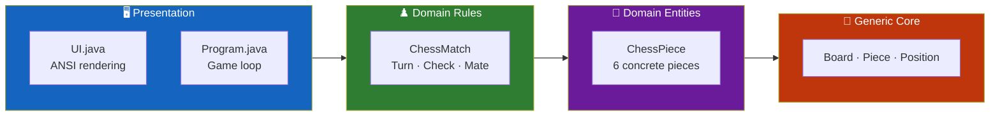
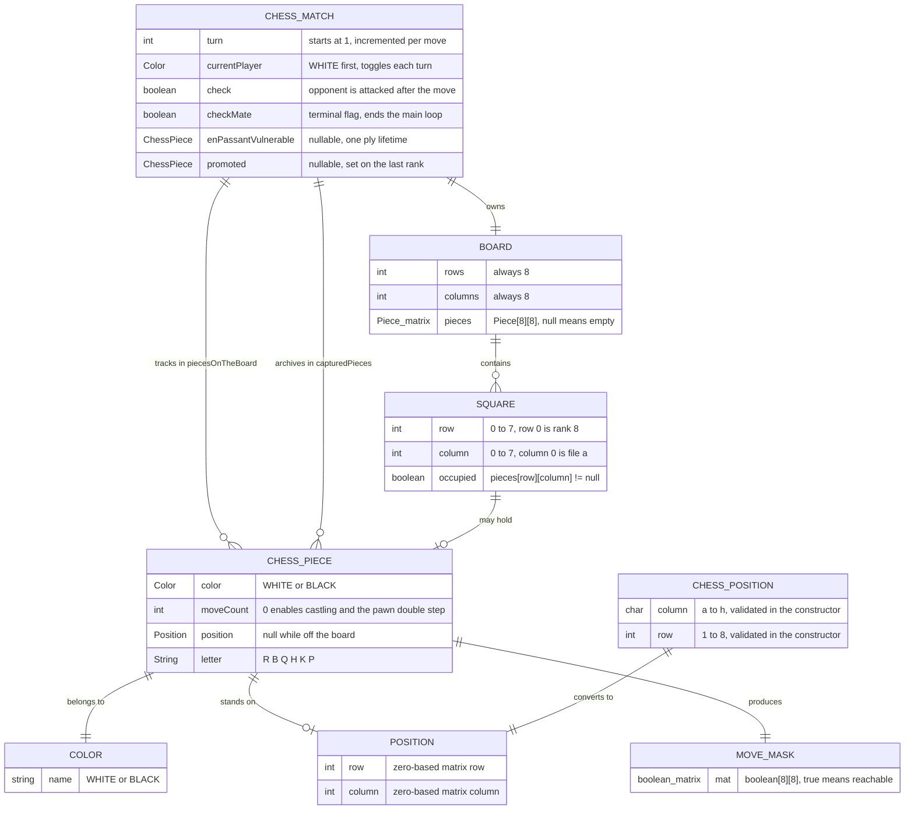
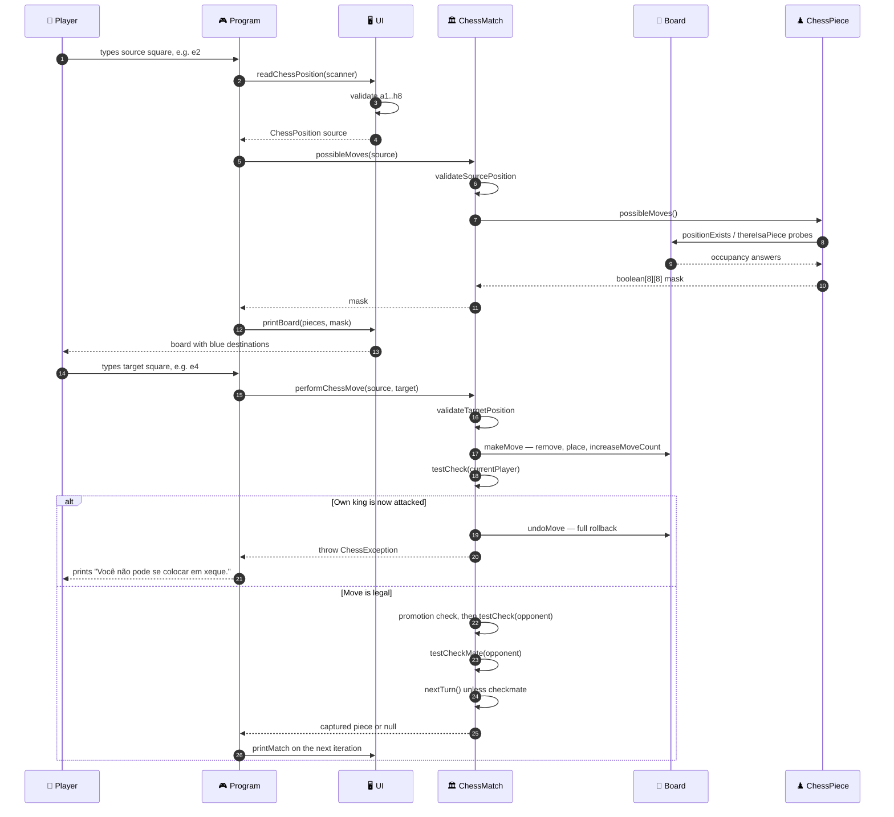
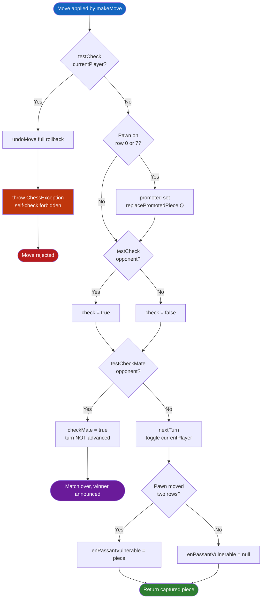
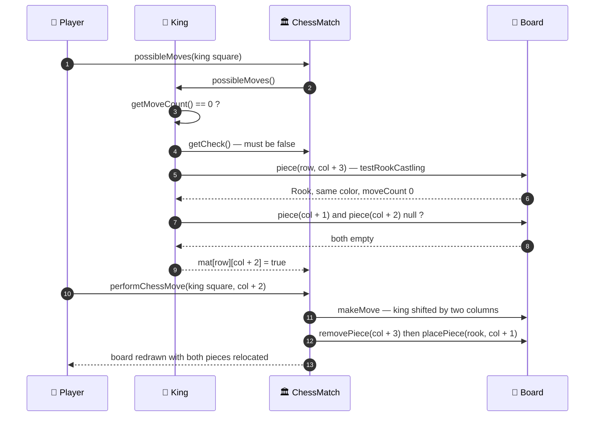
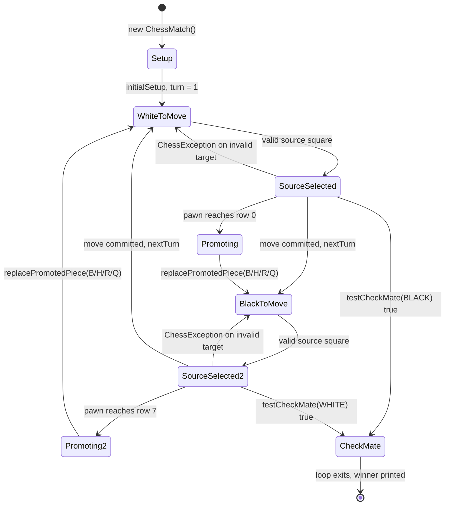
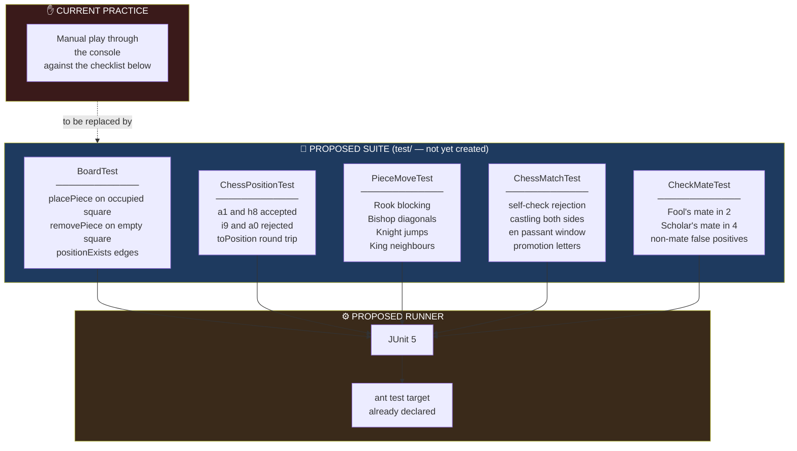

<div align="center">

**🌐 Choose Language / Selecione o Idioma / Elija el Idioma**

[](README.md)&nbsp;&nbsp;&nbsp;[](README_PT.md)&nbsp;&nbsp;&nbsp;[](README_ES.md)

</div>

---

<div align="center">

```
 ██████╗██╗  ██╗███████╗███████╗███████╗
██╔════╝██║  ██║██╔════╝██╔════╝██╔════╝
██║     ███████║█████╗  ███████╗███████╗
██║     ██╔══██║██╔══╝  ╚════██║╚════██║
╚██████╗██║  ██║███████╗███████║███████║
 ╚═════╝╚═╝  ╚═╝╚══════╝╚══════╝╚══════╝
        Object-Oriented Chess Engine for the Terminal
```

---

[](https://openjdk.org/)
[](https://ant.apache.org/)
[](https://netbeans.apache.org/)
[]()
[]()
[]()
[]()

<br/>

> **A complete two-player chess match rendered in the terminal,**
> built on a reusable generic board layer and a chess rule layer that stacks on top of it.

<br/>


</div>

---

## 📑 Table of Contents

<details>
<summary>▶️ <strong>Click to expand / collapse this section</strong></summary>

<table>
<tr>
<td valign="top" width="50%">

**🏗️ System**
- [Overview](#-overview)
- [System Architecture](#-system-architecture)
- [Technology Stack](#-technology-stack)
- [Design Patterns](#-design-patterns-applied)
- [Project Structure](#-project-structure)

**📦 Modules**
- [Program — Entry Point](#-program--application-entry-point)
- [UI — Console Renderer](#-ui--console-renderer)
- [Board — Generic Matrix](#-board--generic-board-matrix)
- [Piece — Abstract Contract](#-piece--abstract-movement-contract)
- [ChessMatch — Rule Orchestrator](#-chessmatch--rule-orchestrator)
- [ChessPiece — Chess Semantics](#-chesspiece--chess-semantics)
- [ChessPosition — Algebraic Coordinate](#-chessposition--algebraic-coordinate)
- [Sliding Pieces](#-sliding-pieces--rook-bishop-queen)
- [Knight — Fixed Offsets](#-knight--fixed-offset-jumper)
- [King — Castling Host](#-king--castling-host)
- [Pawn — En Passant Host](#-pawn--en-passant-and-promotion-host)
- [Exception Hierarchy](#-exception-hierarchy)

</td>
<td valign="top" width="50%">

**💼 Business**
- [Business Rules](#-business-rules)
- [Functional Requirements](#-functional-requirements)
- [Non-Functional Requirements](#-non-functional-requirements)

**📐 Design**
- [Data Model](#-data-model)
- [System Flows](#-system-flows)
- [Move Execution Flow](#move-execution-flow)
- [Check Detection Flow](#check-and-checkmate-detection-flow)
- [Castling Flow](#castling-flow)
- [Match State Machine](#match-state-machine)

**🔐 Security & Ops**
- [Security](#-security)
- [Installation & Execution](#-installation--execution)
- [Automated Tests](#-automated-tests)
- [Metrics & Monitoring](#-metrics--monitoring)
- [Known Limitations](#-known-limitations)

</td>
</tr>
</table>

---

</details>

## 🌟 Overview

<details>
<summary>▶️ <strong>Click to expand / collapse this section</strong></summary>

**chess_system** is a fully playable, hot-seat chess game written in **pure Java** with no external dependency. Two human players share the same terminal, entering algebraic coordinates such as `e2` and `e4`, and the engine validates every move against the complete rule set before committing it to the board.

The codebase is deliberately split into **two stacked layers**. The `boardgame` package knows nothing about chess: it models an `N × M` matrix of abstract `Piece` objects, the concept of a `Position`, and the invariants of placing and removing pieces. The `chess` package sits on top and adds everything chess-specific, that is turn alternation, colors, algebraic notation, check, checkmate, castling, en passant and promotion. This separation means the lower layer could host checkers or another grid game without a single change.

Rule enforcement is centralized in `ChessMatch`, a 354-line orchestrator that owns the board, the turn counter, the current player, the check and checkmate flags, and two live inventories of pieces. Its most characteristic technique is **speculative execution**: a move is physically applied with `makeMove`, the resulting position is tested for self-check, and `undoMove` rolls the board back atom by atom when the move is illegal. The same trick powers checkmate detection, which brute-forces every legal move of the threatened side looking for one escape.

### 🎯 System Objectives

| Objective | Description |
|-----------|-------------|
| ♟️ **Full Rule Set** | All six piece types with correct movement, capture and blocking behaviour |
| 👑 **Special Moves** | Castling (king side and queen side), en passant and pawn promotion |
| 🛡️ **Legality Guarantee** | No move may leave or place its own king in check, verified by make/undo simulation |
| 🏁 **Terminal Conditions** | Automatic detection of check and checkmate, ending the main loop |
| 🧱 **Layer Separation** | A chess-agnostic `boardgame` core reused by a chess-specific `chess` layer |
| 🎨 **Readable Console UI** | ANSI-colored 8×8 grid, coordinate rulers and highlighted destination squares |
| 🧯 **Graceful Error Handling** | Typed exceptions turn invalid input into a message, never into a crash |
| 📦 **Zero Dependencies** | Compiles and runs on a bare JDK with the bundled Ant script |
| 🎓 **Teaching Artifact** | Demonstrates inheritance, polymorphism, encapsulation and abstraction in one coherent domain |

---

</details>

## 🏗️ System Architecture

<details>
<summary>▶️ <strong>Click to expand / collapse this section</strong></summary>

### Module Diagram



### Architecture Layers



---

</details>

## 🛠️ Technology Stack

<details>
<summary>▶️ <strong>Click to expand / collapse this section</strong></summary>

<table>
<thead>
<tr>
<th>Layer</th>
<th>Technology</th>
<th>Version</th>
<th>Purpose</th>
</tr>
</thead>
<tbody>
<tr>
<td rowspan="2"><strong>🧠 Language</strong></td>
<td>Java SE</td>
<td>21</td>
<td>Source and target level (<code>javac.source</code> / <code>javac.target</code> in <code>nbproject/project.properties</code>)</td>
</tr>
<tr>
<td>Source encoding</td>
<td>UTF-8</td>
<td>Required for the accented Portuguese messages embedded in the sources</td>
</tr>
<tr>
<td rowspan="3"><strong>📚 Standard Library</strong></td>
<td><code>java.util.Scanner</code></td>
<td>JDK</td>
<td>Reads player input line by line in <code>Program.main</code></td>
</tr>
<tr>
<td><code>java.util.List</code> / <code>ArrayList</code> / <code>stream</code></td>
<td>JDK</td>
<td>Piece inventories, plus <code>filter</code> and <code>Collectors.toList()</code> in <code>testCheck</code>, <code>King()</code> and <code>printCapturedPieces</code></td>
</tr>
<tr>
<td><code>java.security.InvalidParameterException</code></td>
<td>JDK</td>
<td>Thrown by <code>replacePromotedPiece</code> on an unknown promotion letter</td>
</tr>
<tr>
<td rowspan="3"><strong>🔧 Build</strong></td>
<td>Apache Ant</td>
<td><code>build.xml</code></td>
<td>Delegates to the generated <code>nbproject/build-impl.xml</code></td>
</tr>
<tr>
<td>NetBeans J2SE project</td>
<td>schema 3</td>
<td><code>nbproject/project.xml</code> declares source root <code>src</code> and test root <code>test</code></td>
</tr>
<tr>
<td>Manifest</td>
<td><code>manifest.mf</code></td>
<td><code>Main-Class</code> injected at jar time from <code>main.class=Program</code></td>
</tr>
<tr>
<td rowspan="2"><strong>🖥️ Interface</strong></td>
<td>ANSI escape codes</td>
<td>—</td>
<td>16 color constants plus <code>\033[H\033[2J</code> screen clear, all declared in <code>UI.java</code></td>
</tr>
<tr>
<td>Algebraic notation</td>
<td><code>a1</code>–<code>h8</code></td>
<td>Input contract enforced by the <code>ChessPosition</code> constructor</td>
</tr>
<tr>
<td rowspan="2"><strong>📦 Distribution</strong></td>
<td>Executable JAR</td>
<td><code>dist/chess_system.jar</code></td>
<td>Produced by <code>ant jar</code>, runnable with <code>java -jar</code></td>
</tr>
<tr>
<td>External dependencies</td>
<td>none</td>
<td><code>javac.classpath</code> is empty, the project compiles against the JDK alone</td>
</tr>
</tbody>
</table>

---

</details>

## 🎨 Design Patterns Applied

<details>
<summary>▶️ <strong>Click to expand / collapse this section</strong></summary>

| Pattern | Where | Rationale |
|---------|-------|-----------|
| 🧬 **Template Method** | `Piece.possibleMoves()` abstract, implemented by all six pieces | The board and the match invoke one signature and each piece supplies its own geometry |
| 🏛️ **Layered Architecture** | `boardgame` package versus `chess` package | The generic grid layer has no import from the chess layer, so it stays reusable |
| 🎭 **Polymorphism** | `piecesOnTheBoard` typed as `List<Piece>` | `testCheck` iterates heterogeneous pieces and calls one method on all of them |
| ↩️ **Memento (lightweight)** | `makeMove` / `undoMove` pair in `ChessMatch` | The board is mutated speculatively and restored field by field, including rook position and move counts |
| 🏭 **Factory Method** | `ChessMatch.newPiece(String, Color)` | Maps the promotion letters `B`, `H`, `R`, `Q` to concrete piece constructors |
| 🎯 **Facade** | `ChessMatch.performChessMove(ChessPosition, ChessPosition)` | One call hides validation, simulation, special moves, check tests and turn advance |
| 🚦 **Guard Clause** | `validateSourcePosition` and `validateTargetPosition` | Illegal input aborts with a typed exception before any mutation reaches the board |
| 🧮 **Strategy by subclass** | `Rook`, `Bishop`, `Queen` ray casting versus `Knight`, `King` offset probing | Two movement algorithms coexist behind the same abstract method |
| 🔒 **Encapsulation with protected upcast** | `Piece.position` is `protected`, `ChessPosition.toPosition()` is `protected` | Coordinate conversion stays inside the packages that are allowed to know about it |
| 🏷️ **Type Object** | `Color` enum consulted by every piece and by `ChessMatch.opponent` | Player identity is a value, not a boolean, which makes the rules read naturally |

---

</details>

## 📁 Project Structure

<details>
<summary>▶️ <strong>Click to expand / collapse this section</strong></summary>

```
chess_system_java/
│
├── 📄 build.xml                          # Ant entry script, imports nbproject/build-impl.xml
├── 📄 manifest.mf                        # Jar manifest stub, Main-Class added by the build
├── 📄 .gitignore                         # Excludes build/, dist/ and IDE private files
│
├── 📂 nbproject/                         # NetBeans J2SE project metadata
│   ├── 📄 build-impl.xml                 # Generated Ant target library (clean, compile, jar, run, test)
│   ├── 📄 project.xml                    # Project type, source root = src, test root = test
│   ├── 📄 project.properties             # main.class=Program, javac.source=21, dist.jar path
│   ├── 📄 genfiles.properties            # CRC checksums of the generated build files
│   └── 📂 private/                        # Machine-local settings, not meant to be shared
│       ├── config.properties
│       ├── private.properties
│       └── private.xml
│
├── 📂 src/
│   │
│   ├── 📄 Program.java                    # ★ main() — game loop, Scanner, captured list, promotion prompt
│   ├── 📄 UI.java                         # Console renderer, ANSI palette, coordinate parser
│   │
│   ├── 📂 boardgame/                      # Game-agnostic board core
│   │   ├── 📄 Board.java                  # Piece[rows][columns], placePiece, removePiece, positionExists
│   │   ├── 📄 Piece.java                  # abstract possibleMoves(), possibleMove(), isThereAnyPossibleMove()
│   │   ├── 📄 Position.java               # Zero-based matrix coordinate, setValues, toString
│   │   └── 📄 BoardException.java         # RuntimeException for board-level violations
│   │
│   ├── 📂 chess/                          # Chess-specific rule layer
│   │   ├── 📄 ChessMatch.java             # ★ Orchestrator — turn, check, mate, castling, en passant, promotion
│   │   ├── 📄 ChessPiece.java             # abstract, adds Color and moveCount to Piece
│   │   ├── 📄 ChessPosition.java          # a1..h8 coordinate, validates and converts to Position
│   │   ├── 📄 Color.java                  # enum WHITE, BLACK
│   │   └── 📄 ChessException.java         # Extends BoardException, signals a rule violation
│   │
│   └── 📂 chess/pieces/                   # The six concrete pieces
│       ├── 📄 Rook.java                   # "R" — 4 orthogonal rays
│       ├── 📄 Bishop.java                 # "B" — 4 diagonal rays
│       ├── 📄 Queen.java                  # "Q" — 8 rays, union of rook and bishop
│       ├── 📄 Knight.java                 # "H" — 8 fixed L offsets
│       ├── 📄 King.java                   # "K" — 8 neighbours plus both castling probes
│       └── 📄 Pawn.java                   # "P" — direction by color, double step, en passant
│
├── 📄 README.md                          # 🇺🇸 English (primary)
├── 📄 README_PT.md                       # 🇧🇷 Português
└── 📄 README_ES.md                       # 🇪🇸 Español
```

> [!NOTE]
> `nbproject/project.properties` declares `test.src.dir=test`, but no `test/` directory exists in the repository. There is currently no automated test source set.

---

</details>

## 📦 System Modules

<details>
<summary>▶️ <strong>Click to expand / collapse this section</strong></summary>

### 🎮 Program — Application Entry Point

The 59-line `main` method that drives the whole session. It creates one `ChessMatch`, one `Scanner` and one `List<ChessPiece> captured`, then loops until the match reports checkmate.

| Step | Statement | Purpose |
|------|-----------|---------|
| 1 | `UI.clearScreen()` | Wipes the terminal before every redraw |
| 2 | `UI.printMatch(chessMatch, captured)` | Board, captured inventory, turn, player, check banner |
| 3 | `UI.readChessPosition(sc)` → source | Reads the origin square, prompt `Procura:` |
| 4 | `chessMatch.possibleMoves(source)` | Returns the `boolean[8][8]` legality mask |
| 5 | `UI.printBoard(pieces, possibleMoves)` | Redraws with reachable squares highlighted |
| 6 | `UI.readChessPosition(sc)` → target | Reads the destination square, prompt `Alvo:` |
| 7 | `chessMatch.performChessMove(source, target)` | Executes the move, returns the captured piece or `null` |
| 8 | `captured.add(capturedPiece)` | Grows the trophy list when a capture happened |
| 9 | `chessMatch.getPromoted()` | When non-null, prompts `B/H/R/Q` and calls `replacePromotedPiece` |

Two catch blocks keep the loop alive: `ChessException` for rule violations and `InputMismatchException` for malformed coordinates. Both print the message and consume one line so the next iteration starts clean.

---

### 🖥️ UI — Console Renderer

A package-private class (`class UI`, no `public` modifier) holding every rendering concern. It never mutates the match, it only reads it.

| Member | Signature | Role |
|--------|-----------|------|
| ANSI constants | 17 `public static final String` | 8 foreground colors, 8 background colors, 1 reset |
| `clearScreen` | `static void clearScreen()` | Emits `\033[H\033[2J` and flushes |
| `readChessPosition` | `static ChessPosition readChessPosition(Scanner)` | Splits the line into `char column` and `int row` |
| `printMatch` | `static void printMatch(ChessMatch, List<ChessPiece>)` | Board plus captured plus turn plus status banner |
| `printBoard` | `static void printBoard(ChessPiece[][])` | Plain 8×8 render with row and column rulers |
| `printBoard` | `static void printBoard(ChessPiece[][], boolean[][])` | Overloaded render that paints legal targets |
| `printPiece` | `private static void printPiece(ChessPiece, boolean)` | One cell, applies background and color |
| `printCapturedPieces` | `private static void printCapturedPieces(List<ChessPiece>)` | Stream-partitions captures by color |

**Color contract**

| Element | ANSI constant | Rendered as |
|---------|---------------|-------------|
| White piece | `ANSI_WHITE` | Bright letter |
| Black piece | `ANSI_YELLOW` | Yellow letter |
| Empty square | none | `-` |
| Legal destination | `ANSI_BLUE_BACKGROUND` | Blue-filled cell |

`readChessPosition` wraps any `RuntimeException` into an `InputMismatchException` carrying the message *"Erro lendo a posição de Xadrez. Valores válidos são de a1 to h8."*, which the main loop catches.

---

### 🧩 Board — Generic Board Matrix

`boardgame.Board` is the only class that owns the `Piece[][]` array. It is completely chess-free: it never mentions color, turn or check.

| Method | Signature | Contract |
|--------|-----------|----------|
| Constructor | `Board(int rows, int columns)` | Throws `BoardException` when `rows < 1 \|\| columns < 1` |
| `getRows` / `getColumns` | `int` | Read-only dimensions, no setters exist |
| `piece` | `Piece piece(int row, int column)` | Validates existence, then indexes the matrix |
| `piece` | `Piece piece(Position position)` | Direct index, no bounds check on this overload |
| `placePiece` | `void placePiece(Piece, Position)` | Rejects an occupied square, then back-links `piece.position` |
| `removePiece` | `Piece removePiece(Position)` | Returns `null` on an empty square, otherwise detaches and returns |
| `positionExists` | `boolean positionExists(Position)` | Public bounds test used by every piece implementation |
| `thereIsaPiece` | `boolean thereIsaPiece(Position)` | Bounds-checks first, then tests for occupancy |

The class enforces exactly three invariants: the board must have at least one row and one column, a coordinate must be inside the grid, and a square must be empty before a piece lands on it.

---

### ♟️ Piece — Abstract Movement Contract

`boardgame.Piece` is the abstract root of the whole piece hierarchy. It holds a `protected Position position` and a `private Board board`.

| Member | Kind | Purpose |
|--------|------|---------|
| `position` | `protected Position` | Written by `Board.placePiece` and `Board.removePiece`, read by every subclass |
| `board` | `private Board` | Reached through `protected Board getBoard()` so subclasses can query the grid |
| `possibleMoves()` | `public abstract boolean[][]` | The single extension point every concrete piece must implement |
| `possibleMove(Position)` | `public boolean` | Convenience lookup into the mask returned by `possibleMoves()` |
| `isThereAnyPossibleMove()` | `public boolean` | Scans the mask for at least one `true`, used to reject frozen pieces |

The constructor deliberately sets `position = null`, so a piece exists before it is placed and the board is the single authority on where it stands.

---

**Companion type — `boardgame.Position`** is a mutable pair of zero-based integers (`getRow`/`setRow`, `getColumn`/`setColumn`, `setValues(int, int)`, `toString` as `"row, column"`). Mutability is intentional: every sliding piece reuses one instance while walking a ray with `setValues`, which avoids allocating a new object per square.

---

### 🏛️ ChessMatch — Rule Orchestrator

The heart of the project, 354 lines. It owns the `Board`, the turn counter, the current player, both status flags and two piece inventories.

| Field | Type | Meaning |
|-------|------|---------|
| `turn` | `int` | Starts at 1, incremented by `nextTurn()` |
| `currentPlayer` | `Color` | Starts `WHITE`, toggles every turn |
| `board` | `Board` | Always an 8×8 instance |
| `check` | `boolean` | True when the opponent is in check after a move |
| `checkMate` | `boolean` | True ends the loop in `Program` |
| `enPassantVulnerable` | `ChessPiece` | The pawn that just advanced two squares, or `null` |
| `promoted` | `ChessPiece` | The piece standing on the promotion rank, or `null` |
| `piecesOnTheBoard` | `List<Piece>` | Live inventory scanned by `testCheck` and `King()` |
| `capturedPieces` | `List<Piece>` | Internal capture archive, distinct from the list held by `Program` |

**Public API**

| Method | Returns | Behaviour |
|--------|---------|-----------|
| `getPieces()` | `ChessPiece[][]` | Downcasts the whole board into a chess-typed matrix for the UI |
| `possibleMoves(ChessPosition)` | `boolean[][]` | Validates the source, then delegates to the piece |
| `performChessMove(ChessPosition, ChessPosition)` | `ChessPiece` | Full move pipeline, returns the captured piece or `null` |
| `replacePromotedPiece(String)` | `ChessPiece` | Swaps the promoted pawn for `B`, `H`, `R` or `Q` |
| `getTurn`, `getCurrentPlayer`, `getCheck`, `getCheckMate`, `getEnPassantVulnerable`, `getPromoted` | — | Read-only status accessors consumed by `UI` and `Program` |

**Private machinery**

| Method | Role |
|--------|------|
| `makeMove(Position, Position)` | Applies the move, handles both castlings and the en passant capture, updates both inventories |
| `undoMove(Position, Position, Piece)` | Exact inverse of `makeMove`, including rook restoration and `decreaseMoveCount` |
| `validateSourcePosition(Position)` | Three checks: a piece exists, it belongs to the current player, it has at least one move |
| `validateTargetPosition(Position, Position)` | Rejects a destination absent from the source piece's mask |
| `testCheck(Color)` | Locates the king, then asks every opposing piece whether it reaches that square |
| `testCheckMate(Color)` | Brute-forces every legal move of the side in check looking for one that escapes |
| `King(Color)` | Streams `piecesOnTheBoard` for the king of a color, throws `IllegalStateException` when absent |
| `opponent(Color)` | Returns the other color |
| `nextTurn()` | Increments the counter and toggles the player |
| `newPiece(String, Color)` | Promotion factory |
| `placeNewPiece(char, int, ChessPiece)` | Places a piece using algebraic coordinates and registers it in the inventory |
| `initialSetup()` | 32 `placeNewPiece` calls building the standard opening position |

---

### ♜ ChessPiece — Chess Semantics

`chess.ChessPiece extends boardgame.Piece` and adds exactly what chess needs on top of a generic piece.

| Member | Kind | Purpose |
|--------|------|---------|
| `color` | `private Color` | Immutable after construction, exposed by `getColor()` |
| `moveCount` | `private int` | Drives castling eligibility and the pawn double step |
| `increaseMoveCount` / `decreaseMoveCount` | `public void` | Called by `makeMove` and `undoMove` so simulation stays reversible |
| `getChessPosition()` | `ChessPosition` | Converts the internal matrix position back to algebraic notation |
| `isThereOpponentPiece(Position)` | `protected boolean` | Shared capture test used by every concrete piece |

---

### 🔤 ChessPosition — Algebraic Coordinate

The translation boundary between what the player types and what the matrix understands.

| Aspect | Detail |
|--------|--------|
| Fields | `char column` (`a`–`h`), `int row` (`1`–`8`) |
| Validation | The constructor throws `ChessException` outside that range |
| `toPosition()` | `new Position(8 - row, column - 'a')`, visibility `protected` |
| `fromPosition(Position)` | `new ChessPosition((char)('a' + column), 8 - row)`, `protected static` |
| `toString()` | `"" + column + row`, for example `e4` |

Because both conversion methods are `protected`, code outside the `chess` package can never obtain a raw matrix `Position` from a chess coordinate, which keeps the zero-based indexing an implementation detail.

---

**Companion type — `chess.Color`** is an eight-line enum with two constants, `BLACK` and `WHITE`, consulted in five places: `ChessMatch.currentPlayer` (whose turn it is), `ChessMatch.opponent(Color)` (the ternary flip used by check and mate tests), `ChessPiece.color` (ownership), `Pawn.possibleMoves` (advance direction, up for white and down for black), and `UI.printPiece` / `printCapturedPieces` (ANSI color choice and capture partitioning).

---

### 🎯 Sliding Pieces — Rook, Bishop, Queen

Three classes sharing one algorithm: pick a direction, walk it with a `while` loop while squares are empty, mark each one, then mark the first occupied square only when it holds an opponent.

| Piece | Letter | Directions | Lines |
|-------|--------|------------|-------|
| `Rook` | `R` | Up, down, left, right | 64 |
| `Bishop` | `B` | The four diagonals | 64 |
| `Queen` | `Q` | All eight, the union of the two above | 100 |

```java
p.setValues(position.getRow() - 1, position.getColumn());
while (getBoard().positionExists(p) && !getBoard().thereIsaPiece(p)) {
    mat[p.getRow()][p.getColumn()] = true;
    p.setRow(p.getRow() - 1);
}
if (getBoard().positionExists(p) && isThereOpponentPiece(p)) {
    mat[p.getRow()][p.getColumn()] = true;
}
```

The single mutable `Position p` is reset with `setValues` before each ray, which is why `Position` exposes setters at all.

---

### 🐴 Knight — Fixed-Offset Jumper

`Knight` renders as `H` (from the Portuguese *cavalo*) and probes eight explicit offsets. It never inspects intermediate squares, which is exactly what makes it jump over pieces.

| # | Row delta | Column delta |
|---|-----------|--------------|
| 1 | −1 | −2 |
| 2 | −2 | −1 |
| 3 | −2 | +1 |
| 4 | −1 | +2 |
| 5 | +1 | +2 |
| 6 | +2 | +1 |
| 7 | +2 | −1 |
| 8 | +1 | −2 |

Each probe passes through the private `canMove(Position)` helper, which accepts the square when it is empty or occupied by an opponent.

---

### 👑 King — Castling Host

`King` is the only piece constructed with a back-reference to the match: `King(Board, Color, ChessMatch)`. It needs that reference so it can ask `chessMatch.getCheck()` before offering a castling move.

| Concern | Implementation |
|---------|----------------|
| Adjacent squares | Eight `setValues` probes filtered by `canMove` |
| Castling precondition | `getMoveCount() == 0 && !chessMatch.getCheck()` |
| King-side rook probe | `new Position(row, column + 3)` tested by `testRookCastling` |
| King-side empty test | Both squares at `column + 1` and `column + 2` must be `null` |
| King-side result | Marks `mat[row][column + 2]` |
| Queen-side rook probe | `new Position(row, column - 4)` tested by `testRookCastling` |
| Queen-side empty test | Three squares at `column - 1`, `column - 2`, `column - 3` must be `null` |
| Queen-side result | Marks `mat[row][column - 2]` |
| `testRookCastling` | Requires a non-null piece that `instanceof Rook`, same color, `moveCount == 0` |

The rook relocation itself lives in `ChessMatch.makeMove`, which detects a two-square king displacement and moves the corresponding rook, and in `ChessMatch.undoMove`, which reverses it.

> [!WARNING]
> The eight adjacency probes contain a duplicate: the offset `(+1, +1)` is tested twice and `(+1, −1)` is never tested. The king therefore cannot move to its lower-left diagonal neighbour. See [Known Limitations](#-known-limitations).

---

### ♙ Pawn — En Passant and Promotion Host

Like the king, `Pawn` receives the match reference: `Pawn(Board, Color, ChessMatch)`. It needs `chessMatch.getEnPassantVulnerable()` to decide whether the diagonal capture of an empty square is legal.

| Move | White | Black | Condition |
|------|-------|-------|-----------|
| Single advance | row − 1 | row + 1 | Destination empty |
| Double advance | row − 2 | row + 2 | Both squares empty and `getMoveCount() == 0` |
| Diagonal capture left | row − 1, col − 1 | row + 1, col − 1 | `isThereOpponentPiece` |
| Diagonal capture right | row − 1, col + 1 | row + 1, col + 1 | `isThereOpponentPiece` |
| En passant left | from row 3 | from row 4 | Neighbour is the `enPassantVulnerable` pawn |
| En passant right | from row 3 | from row 4 | Neighbour is the `enPassantVulnerable` pawn |

Rows 3 and 4 are the zero-based matrix rows that correspond to ranks 5 and 4, the only ranks from which en passant is possible.

**Promotion** is handled in `ChessMatch.performChessMove`: when the moved piece is a `Pawn` and it lands on row 0 (white) or row 7 (black), `promoted` is set and immediately replaced by a `Queen` as the default. `Program` then prompts the player and calls `replacePromotedPiece(type)` a second time with the chosen letter.

---

### ⚠️ Exception Hierarchy

Two unchecked exception types form a two-level hierarchy, so a single `catch` can absorb either one when that is desirable.

| Exception | Extends | Thrown by | Example message |
|-----------|---------|-----------|-----------------|
| `BoardException` | `RuntimeException` | `Board` constructor, `piece`, `placePiece`, `removePiece`, `thereIsaPiece` | *"Posição não está no tabuleiro."* |
| `ChessException` | `BoardException` | `ChessPosition` constructor, `validateSourcePosition`, `validateTargetPosition`, `performChessMove` | *"Você não pode se colocar em xeque."* |
| `IllegalStateException` | `RuntimeException` | `King(Color)`, `replacePromotedPiece` | *"Não há peça para ser promovida."* |
| `InvalidParameterException` | `IllegalArgumentException` | `replacePromotedPiece` on an unknown letter | *"Tipo de promoção inválido."* |
| `InputMismatchException` | `NoSuchElementException` | `UI.readChessPosition` | *"Erro lendo a posição de Xadrez…"* |

`Program` catches only `ChessException` and `InputMismatchException`. The other three escape the loop and terminate the process.

---

</details>

## 💼 Business Rules

<details>
<summary>▶️ <strong>Click to expand / collapse this section</strong></summary>

### ♟️ Turn and Ownership Rules

| # | Rule | Enforcement |
|---|------|-------------|
| BR-01 | White always moves first | `currentPlayer = Color.WHITE` in the `ChessMatch` constructor |
| BR-02 | Players alternate after every completed move | `nextTurn()` ternary toggle |
| BR-03 | The turn counter starts at 1 and never decreases | `turn = 1`, `turn++` in `nextTurn()` |
| BR-04 | A player may only select a piece of their own color | `validateSourcePosition` compares `currentPlayer` to the piece color |
| BR-05 | A player may not select an empty square | `board.thereIsaPiece(position)` guard |
| BR-06 | A player may not select a piece that has no legal move | `isThereAnyPossibleMove()` guard |
| BR-07 | The destination must appear in the source piece's mask | `validateTargetPosition` consults `possibleMove(target)` |
| BR-08 | The turn does not advance when checkmate is detected | `nextTurn()` is only reached in the `else` branch |

### 🛡️ Legality and Check Rules

| # | Rule | Enforcement |
|---|------|-------------|
| BR-09 | No move may leave your own king in check | `makeMove` then `testCheck(currentPlayer)` then `undoMove` and throw |
| BR-10 | Check is recomputed for the opponent after every accepted move | `check = testCheck(opponent(currentPlayer))` |
| BR-11 | Checkmate requires check plus no escaping move | `testCheckMate` returns `false` early when `testCheck` is false |
| BR-12 | Every candidate escape is verified by full simulation | `testCheckMate` calls `makeMove`, `testCheck`, `undoMove` per candidate |
| BR-13 | A capture removes the piece from `piecesOnTheBoard` and appends it to `capturedPieces` | Bookkeeping inside `makeMove` |
| BR-14 | An undone capture restores both lists exactly | Symmetric bookkeeping inside `undoMove` |
| BR-15 | The match ends as soon as `checkMate` becomes true | `while (!chessMatch.getCheckMate())` in `Program` |

### 👑 Special Move Rules

| # | Rule | Enforcement |
|---|------|-------------|
| BR-16 | Castling requires an unmoved king | `getMoveCount() == 0` in `King.possibleMoves` |
| BR-17 | Castling requires an unmoved rook of the same color | `testRookCastling` checks type, color and `moveCount` |
| BR-18 | Castling is forbidden while the king is in check | `!chessMatch.getCheck()` guard |
| BR-19 | All squares between king and rook must be empty | Two squares king side, three squares queen side |
| BR-20 | The rook jumps to the square the king crossed | `makeMove` relocates it when the king shifts by two columns |
| BR-21 | A pawn may advance two squares only on its first move | `getMoveCount() == 0` plus both squares empty |
| BR-22 | A double pawn advance makes that pawn en passant vulnerable | `enPassantVulnerable = movedPiece` when the row delta is 2 |
| BR-23 | En passant vulnerability lasts exactly one ply | The field is reset to `null` on any other move |
| BR-24 | An en passant capture removes the pawn beside the destination | `makeMove` removes at `target.row ± 1` |
| BR-25 | A pawn reaching the far rank must be promoted | Rows 0 (white) and 7 (black) trigger promotion |
| BR-26 | Promotion accepts only `B`, `H`, `R` or `Q` | `replacePromotedPiece` throws `InvalidParameterException` otherwise |
| BR-27 | Promotion defaults to Queen before the player is asked | `promoted = replacePromotedPiece("Q")` inside `performChessMove` |

---

</details>

## ✅ Functional Requirements

<details>
<summary>▶️ <strong>Click to expand / collapse this section</strong></summary>

| ID | Requirement | Priority | Status |
|----|-------------|----------|--------|
| **RF-01** | The system shall build an 8×8 board with the standard 32-piece opening position | 🔴 High | ✅ Implemented |
| **RF-02** | The system shall render the board in the terminal with rank and file rulers | 🔴 High | ✅ Implemented |
| **RF-03** | The system shall accept moves in algebraic notation from `a1` to `h8` | 🔴 High | ✅ Implemented |
| **RF-04** | The system shall reject coordinates outside the board with a readable message | 🔴 High | ✅ Implemented |
| **RF-05** | The system shall highlight every legal destination of the selected piece | 🟡 Medium | ✅ Implemented |
| **RF-06** | The system shall enforce rook, bishop and queen ray movement with blocking | 🔴 High | ✅ Implemented |
| **RF-07** | The system shall enforce knight L movement ignoring intermediate pieces | 🔴 High | ✅ Implemented |
| **RF-08** | The system shall enforce pawn direction, double step and diagonal capture | 🔴 High | ✅ Implemented |
| **RF-09** | The system shall enforce king single-square movement | 🔴 High | ⚠️ Partial — the lower-left diagonal is missing |
| **RF-10** | The system shall support king-side and queen-side castling | 🟡 Medium | ✅ Implemented |
| **RF-11** | The system shall support the en passant capture | 🟡 Medium | ✅ Implemented |
| **RF-12** | The system shall promote a pawn reaching the final rank | 🟡 Medium | ✅ Implemented |
| **RF-13** | The system shall let the player choose the promotion piece | 🟡 Medium | ✅ Implemented |
| **RF-14** | The system shall forbid any move that leaves the mover's king in check | 🔴 High | ✅ Implemented |
| **RF-15** | The system shall announce check on the console | 🔴 High | ✅ Implemented |
| **RF-16** | The system shall detect checkmate and end the match | 🔴 High | ✅ Implemented |
| **RF-17** | The system shall announce the winner when the match ends | 🔴 High | ✅ Implemented |
| **RF-18** | The system shall list captured pieces separated by color | 🟢 Low | ✅ Implemented |
| **RF-19** | The system shall display the current turn number and the player to move | 🟢 Low | ✅ Implemented |
| **RF-20** | The system shall clear the screen between redraws | 🟢 Low | ✅ Implemented |
| **RF-21** | The system shall keep running after an invalid move instead of terminating | 🔴 High | ✅ Implemented |
| **RF-22** | The system shall alternate turns automatically | 🔴 High | ✅ Implemented |
| **RF-23** | The system shall detect stalemate and declare a draw | 🟡 Medium | ⬜ Planned |
| **RF-24** | The system shall support draw by repetition, 50-move rule or insufficient material | 🟢 Low | ⬜ Planned |
| **RF-25** | The system shall allow a move to be taken back by the player | 🟢 Low | ⬜ Planned — `undoMove` exists but is private and simulation-only |

---

</details>

## ⚡ Non-Functional Requirements

<details>
<summary>▶️ <strong>Click to expand / collapse this section</strong></summary>

| ID | Category | Requirement | Target |
|----|----------|-------------|--------|
| **RNF-01** | ⚡ Performance | Time to compute one piece's legality mask | Under 1 ms, at most 64 board probes |
| **RNF-02** | ⚡ Performance | Time to evaluate `testCheckMate` | Under 100 ms, bounded by pieces × 64 simulations |
| **RNF-03** | ⚡ Performance | Perceived latency between input and redraw | Instant, no I/O beyond `System.out` |
| **RNF-04** | 🧠 Memory | Total resident objects during a match | Under 100 objects, one board plus at most 32 pieces |
| **RNF-05** | 📦 Footprint | Distribution artifact size | Well under 100 KB for `dist/chess_system.jar` |
| **RNF-06** | 🔌 Portability | Runtime requirement | Any JRE 21 or newer, no native code |
| **RNF-07** | 🔌 Portability | Terminal requirement | Any ANSI-capable terminal, degrades to raw escape text elsewhere |
| **RNF-08** | 🧱 Maintainability | Coupling direction | `boardgame` must never import from `chess` |
| **RNF-09** | 🧱 Maintainability | Adding a new piece type | One new class extending `ChessPiece`, no change to `Board` or `ChessMatch` |
| **RNF-10** | 🧱 Maintainability | Largest class | `ChessMatch` at 354 lines, all other classes under 120 |
| **RNF-11** | 🧯 Reliability | Invalid input must never terminate the process | Both expected exception types are caught in the main loop |
| **RNF-12** | 🧯 Reliability | A rejected move must leave the board byte-identical | Guaranteed by the `undoMove` inverse |
| **RNF-13** | 🎨 Usability | Move entry length | Exactly two characters, for example `e2` |
| **RNF-14** | 🎨 Usability | Feedback on every rejection | The exception message is printed before the next redraw |
| **RNF-15** | 🌍 Internationalization | UI language | Portuguese literals inline in the sources, not externalized |
| **RNF-16** | 🔐 Privacy | Data leaving the machine | None, no network, no file, no telemetry |
| **RNF-17** | 🧪 Testability | Domain isolation | `ChessMatch` is fully driveable without `UI` or `Program` |
| **RNF-18** | 🔧 Build | Reproducibility | One `ant jar` on a bare JDK, zero downloads |

---

</details>

## 🗄️ Data Model

<details>
<summary>▶️ <strong>Click to expand / collapse this section</strong></summary>

> [!IMPORTANT]
> This project has **no database and no persistence of any kind**. Nothing is written to disk, no file is opened, no connection is created. The model below describes the **in-memory object graph** that lives inside a single JVM process for the duration of one match. When the process exits, the match is gone.

### Entity-Relationship Diagram



### Board Coordinate Mapping

| Algebraic input | `ChessPosition` | `Position` (matrix) | Rendered row label |
|-----------------|-----------------|---------------------|--------------------|
| `a8` | `column='a'`, `row=8` | `[0][0]` | `8` |
| `h8` | `column='h'`, `row=8` | `[0][7]` | `8` |
| `e4` | `column='e'`, `row=4` | `[4][4]` | `4` |
| `a1` | `column='a'`, `row=1` | `[7][0]` | `1` |
| `h1` | `column='h'`, `row=1` | `[7][7]` | `1` |

Conversion formula: `row_matrix = 8 - row_algebraic` and `column_matrix = column_char - 'a'`.

### Piece Registry and Promotion Map

The `initialSetup()` method fills matrix row 0 (rank 8) and row 1 (rank 7) with black pieces, rows 2–5 stay empty, and rows 6–7 (ranks 2 and 1) hold white, both back ranks ordered `R H B Q K B H R` from file `a` to file `h`.

| Class | `toString()` | Movement family | Accepted as promotion input |
|-------|--------------|-----------------|------------------------------|
| `Rook` | `R` | Sliding, 4 orthogonal rays | ✅ `R`, also the fallback return of `newPiece` |
| `Knight` | `H` | Jumping, 8 fixed offsets | ✅ `H`, from the Portuguese *cavalo*, not `N` |
| `Bishop` | `B` | Sliding, 4 diagonal rays | ✅ `B` |
| `Queen` | `Q` | Sliding, 8 rays | ✅ `Q`, also the automatic default |
| `King` | `K` | Stepping, 8 neighbours plus castling | ❌ a pawn may never become a king |
| `Pawn` | `P` | Directional, double step, en passant | ❌ any other letter raises `InvalidParameterException` |

---

</details>

## 🔄 System Flows

<details>
<summary>▶️ <strong>Click to expand / collapse this section</strong></summary>

### Move Execution Flow



### Check and Checkmate Detection Flow



### Castling Flow



### Match State Machine



---

</details>

## 🔐 Security

<details>
<summary>▶️ <strong>Click to expand / collapse this section</strong></summary>

This is an offline, single-process console application with no network stack, no persistence and no user accounts. Its security surface is therefore reduced to **input validation, state integrity and failure containment**, which is exactly what the controls below address.

### Implemented Controls

| Control | Implementation | Effect |
|---------|---------------|--------|
| 🔤 **Input range validation** | `ChessPosition` constructor rejects anything outside `a1`–`h8` | Malformed coordinates can never reach the matrix indexer |
| 🧱 **Bounds enforcement** | `Board.positionExists` guards `piece`, `removePiece` and `thereIsaPiece` | Prevents `ArrayIndexOutOfBoundsException` from user input |
| 🧯 **Exception containment** | `Program` catches `ChessException` and `InputMismatchException` | A bad move costs one turn, never the process |
| ↩️ **Atomic move semantics** | `makeMove` followed by `undoMove` on rejection | A rejected move leaves the board exactly as it was |
| 🔒 **Encapsulated coordinates** | `toPosition` and `fromPosition` are `protected` | External code cannot fabricate raw matrix indices |
| 🛡️ **Ownership check** | `validateSourcePosition` compares piece color to `currentPlayer` | A player cannot move the opponent's pieces |
| 🚫 **Occupancy invariant** | `placePiece` throws when the target square is occupied | Two pieces can never share a square |
| 🧾 **Typed error hierarchy** | `ChessException extends BoardException extends RuntimeException` | Callers can distinguish rule violations from structural violations |
| 🌐 **No I/O surface** | No socket, no file, no reflection, no deserialization | Nothing to attack remotely and nothing to poison from disk |
| 📦 **No third-party code** | `javac.classpath` is empty | Zero supply-chain exposure |

### Known Security Limitations

> [!WARNING]
> The items below are real weaknesses in the current code. None of them is exploitable remotely, because the program has no remote surface at all, but each one is a correctness or robustness defect that would matter if this engine were embedded in a server.

| Limitation | Risk | Mitigation path |
|------------|------|-----------------|
| 🕳️ **`Board.piece(Position)` skips bounds checking** | The overload indexes the matrix directly, so an out-of-range `Position` built internally would throw an unchecked `ArrayIndexOutOfBoundsException` | Route the overload through `positionExists` like the `(int, int)` variant does |
| 💣 **Uncaught `IllegalStateException`** | `King(Color)` and `replacePromotedPiece` throw a type the main loop does not catch, terminating the JVM | Widen the `catch` in `Program` or convert these to `ChessException` |
| 💣 **Uncaught `InvalidParameterException`** | An unexpected promotion letter crashes the process instead of re-prompting | Loop on the prompt until a valid letter is entered |
| 🔁 **No input length check in `readChessPosition`** | `s.charAt(0)` on an empty line throws, and although it is wrapped, the surrounding catch relies on a broad `RuntimeException` | Validate the string length before parsing |
| 🧬 **Mutable `Position` shared by reference** | `Board.placePiece` stores the caller's `Position` instance in `piece.position`, so an external `setValues` call could silently relocate a piece | Store a defensive copy inside `placePiece` |
| 📤 **`getPieces()` exposes live piece references** | The UI receives the real `ChessPiece` objects, not copies, so any caller could mutate `moveCount` | Return an immutable view or a rendering DTO |
| ♾️ **No stalemate detection** | A stalemated position makes `Program` loop forever asking for a move that cannot be made legally | Add a `testStaleMate` mirroring `testCheckMate` without the check precondition |
| 🧮 **Castling ignores attacked transit squares** | The king may legally castle through a square that the opponent attacks, which is illegal chess | Simulate the intermediate square with `makeMove` and `testCheck` before offering castling |

---

</details>

## 🚀 Installation & Execution

<details>
<summary>▶️ <strong>Click to expand / collapse this section</strong></summary>

### Prerequisites

```bash
# JDK 21 or newer, because nbproject/project.properties pins source and target to 21
java -version        # expect 21 or above
javac -version       # expect 21 or above

# Apache Ant, only if you want to use the bundled build script
ant -version         # any recent 1.10.x works

# An ANSI-capable terminal is strongly recommended:
#   Linux and macOS terminals support ANSI natively.
#   Windows Terminal and PowerShell 7 support it.
#   The legacy cmd.exe console prints raw escape sequences instead of colors.
```

### Build

```bash
# --- Option A: the bundled Ant build (NetBeans generated targets) ---

# Compile every source under src/ into build/classes
ant compile

# Compile and package dist/chess_system.jar with Main-Class=Program
ant jar

# Remove build/ and dist/
ant clean

# Clean rebuild in one command
ant clean jar

# --- Option B: plain javac, no Ant required ---

# Create the output directory and compile from the entry point
mkdir -p build/classes
javac -encoding UTF-8 -d build/classes -sourcepath src src/Program.java
```

### Execution

```bash
# --- From the packaged jar ---
java -jar dist/chess_system.jar

# --- From the compiled classes ---
java -cp build/classes Program

# --- Straight through Ant, which compiles then runs main.class ---
ant run

# --- From NetBeans ---
# Open the folder as a project, then press F6 (Run Project).
```

**How to play**

1. The board is printed with rank numbers `8` down to `1` on the left and file letters `a` to `h` underneath.
2. At the `Procura:` prompt, type the square of the piece you want to move, for example `e2`, then press Enter.
3. The board is redrawn with every legal destination of that piece painted on a blue background.
4. At the `Alvo:` prompt, type the destination square, for example `e4`.
5. If the move is illegal the reason is printed and you press Enter to continue, otherwise the board advances to the opponent.
6. When a pawn reaches the far rank you are asked `Entre com a promoção da peça (B/H/R/Q:` — type one letter and press Enter.
7. The loop ends on checkmate, printing `XEQUEMATE!` and the winning color.

### Ant Targets

| Target | Purpose |
|--------|---------|
| `ant compile` | Compile `src/` into `build/classes` |
| `ant jar` | Build `dist/chess_system.jar` with the manifest main class |
| `ant run` | Compile if needed, then run `Program` |
| `ant clean` | Delete `build/` and `dist/` |
| `ant debug` | Launch under the NetBeans debugger transport |
| `ant javadoc` | Generate API documentation into `dist/javadoc` |
| `ant test` | Declared by `build-impl.xml`, currently a no-op because `test/` does not exist |
| `ant -p` | List every target exposed by the imported build file |

### Build Configuration

| Setting | Value | Declared in |
|---------|-------|-------------|
| `application.title` | `chess_system` | `nbproject/project.properties` |
| `main.class` | `Program` | `nbproject/project.properties` |
| `javac.source` / `javac.target` | `21` / `21` | `nbproject/project.properties` |
| `source.encoding` | `UTF-8` | `nbproject/project.properties` |
| `src.dir` | `src` | `nbproject/project.properties` |
| `test.src.dir` | `test` (directory absent) | `nbproject/project.properties` |
| `dist.jar` | `dist/chess_system.jar` | `nbproject/project.properties` |
| `javac.classpath` | empty | `nbproject/project.properties` |
| `jar.compress` | `false` | `nbproject/project.properties` |
| `manifest.file` | `manifest.mf` | `nbproject/project.properties` |
| `build.sysclasspath` | `ignore` | `nbproject/project.properties` |

---

</details>

## 🧪 Automated Tests

<details>
<summary>▶️ <strong>Click to expand / collapse this section</strong></summary>

> [!IMPORTANT]
> **There are currently no automated tests in this repository.** `nbproject/project.properties` declares `test.src.dir=test` and `build-impl.xml` exposes a `test` target, but the `test/` directory does not exist and no test framework is on the classpath. Everything below describes the **proposed** suite and the **manual** acceptance procedure that is used today.

### Test Architecture



### Test Sources Present in the Repository

| Path | Status | Notes |
|------|--------|-------|
| `test/` | ❌ Absent | Declared as `test.src.dir` but never created |
| `build/test/results` | ❌ Absent | Would hold the JUnit XML output of `ant test` |
| JUnit on the classpath | ❌ Absent | `javac.classpath` is empty |

### Running the Tests

```bash
# The target exists and will run, but finds nothing to compile or execute:
ant test

# To make it meaningful, first create the source root:
mkdir -p test/chess

# Then add JUnit to the project classpath in NetBeans
#   (Project Properties > Libraries > Add Library > JUnit),
# write the suites listed above, and run again:
ant test

# Reports would then appear under:
#   build/test/results/*.xml
```

### Manual Acceptance Checklist

| # | Scenario | Expected result |
|---|----------|-----------------|
| 1 | Launch the program | 8×8 board, white pieces on ranks 1–2, `Turno: 1`, `Aguardando o jogador: WHITE` |
| 2 | Enter `e2` as source | Board redrawn, `e3` and `e4` highlighted in blue |
| 3 | Enter `e4` as target | Pawn advances, turn becomes 2, player becomes BLACK |
| 4 | Enter a black piece square while white is to move | Message *A peça escolhida não é sua.* |
| 5 | Enter an empty square as source | Message *Não há peça na posicão procurada.* |
| 6 | Enter `z9` | Message *Erro lendo a posição de Xadrez…*, loop continues |
| 7 | Try to move a pinned piece off the pin line | Message *Você não pode se colocar em xeque.* |
| 8 | Move a knight over occupied squares | Accepted, proving the jump is not blocked |
| 9 | Slide a rook toward a friendly piece, then toward an enemy piece | The friendly square is not highlighted, the enemy square is, and nothing beyond it |
| 10 | Clear e1–h1, then castle king side | King lands on `g1`, rook lands on `f1`, both move counts increase |
| 11 | Clear b1–d1, then castle queen side | King lands on `c1`, rook lands on `d1` |
| 12 | Advance a pawn two squares beside an enemy pawn on rank 5 | The en passant capture square is highlighted for the enemy pawn |
| 13 | Skip the en passant capture for one move | The capture square is no longer highlighted |
| 14 | Push a pawn to rank 8, answer `Q` | Prompt `Entre com a promoção da peça (B/H/R/Q:` appears, then a `Q` stands on the square |
| 15 | Answer `X` at the promotion prompt | The process terminates with `InvalidParameterException` (known defect) |
| 16 | Deliver a check | `XEQUE!` printed above the prompt |
| 17 | Deliver Fool's mate (`f2f3`, `e7e5`, `g2g4`, `d8h4`) | `XEQUEMATE!` and `VENCEDOR: BLACK` printed, program exits |
| 18 | Capture several pieces | `Peças capturadas:` lists them split into `BRANCAS:` and `PRETAS:` |
| 19 | Try to move the king diagonally down-left | The square is not highlighted (known defect) |

---

</details>

## 📊 Metrics & Monitoring

<details>
<summary>▶️ <strong>Click to expand / collapse this section</strong></summary>

### Codebase Metrics

| Metric | Value |
|--------|-------|
| Java source files | 17 |
| Total lines of Java | 1,284 |
| Packages | 4 (default, `boardgame`, `chess`, `chess.pieces`) |
| Abstract classes | 2 (`Piece`, `ChessPiece`) |
| Concrete piece classes | 6 |
| Enums | 1 (`Color`) |
| Custom exception classes | 2 (`BoardException`, `ChessException`) |
| Test classes | 0 |
| External dependencies | 0 |
| Largest class | `ChessMatch.java`, 354 lines |
| Smallest class | `Color.java`, 8 lines |
| Public methods on `ChessMatch` | 10 |
| Private methods on `ChessMatch` | 11 |
| Pieces placed by `initialSetup()` | 32, via 32 `placeNewPiece` calls |

### Runtime Signals

| Signal | Source | Where to observe |
|--------|--------|------------------|
| Turn number | `chessMatch.getTurn()` | `Turno: N` line printed by `printMatch` |
| Side to move | `chessMatch.getCurrentPlayer()` | `Aguardando o jogador: WHITE\|BLACK` |
| Check state | `chessMatch.getCheck()` | `XEQUE!` banner |
| Terminal state | `chessMatch.getCheckMate()` | `XEQUEMATE!` plus `VENCEDOR:` |
| Legal move set | `chessMatch.possibleMoves(source)` | Blue-background squares in the redraw |
| Capture history | `List<ChessPiece> captured` in `Program` | `Peças capturadas:` block |
| Rule violation | `ChessException.getMessage()` | Printed line, loop continues |
| Parse failure | `InputMismatchException.getMessage()` | Printed line, loop continues |

### Useful Diagnostic Commands

```bash
# Count lines per source file, largest first
find src -name "*.java" -exec wc -l {} + | sort -rn

# Find every place a rule violation is raised, and every board mutation
grep -rn "throw new ChessException" src
grep -rn "placePiece\|removePiece" src

# Verify that the generic layer never imports the chess layer
grep -rn "import chess" src/boardgame        # must print nothing

# Confirm the declared main class, then inspect the produced jar
grep -n "main.class" nbproject/project.properties
unzip -p dist/chess_system.jar META-INF/MANIFEST.MF
```

### Standardized Status Signals

| Signal | Source | Meaning |
|--------|--------|---------|
| `turn = 1`, `currentPlayer = WHITE` | Constructor | Fresh match, nothing has happened yet |
| `check = false`, `checkMate = false` | Default field state | Normal play |
| `check = true` | `testCheck(opponent)` | The side to move must resolve the attack |
| `checkMate = true` | `testCheckMate(opponent)` | Loop exits, the previous mover wins |
| `enPassantVulnerable != null` | Double pawn advance | The capture window is open for exactly one ply |
| `promoted != null` | Pawn on row 0 or 7 | `Program` will prompt for a replacement letter |
| `performChessMove` returns non-null | A capture occurred | The piece is appended to the displayed list |
| `performChessMove` returns `null` | Quiet move | No capture on this ply |
| JVM exit code `0` | `main` returns after checkmate | Normal termination |
| JVM exit code `1` | Uncaught `IllegalStateException` or `InvalidParameterException` | Abnormal termination, see Known Limitations |

---

</details>

## ⚠️ Known Limitations

<details>
<summary>▶️ <strong>Click to expand / collapse this section</strong></summary>

> [!IMPORTANT]
> This project is an educational implementation built to practise object-oriented design in Java: inheritance, abstraction, polymorphism, encapsulation and layered packaging. It plays a legal game of chess in the vast majority of positions, but it is not a competition engine and the defects below are real and reproducible.

| Category | Issue | Status |
|----------|-------|--------|
| 👑 **King movement** | `King.possibleMoves` probes the offset `(+1, +1)` twice and never probes `(+1, −1)`, so the king cannot step to its lower-left diagonal neighbour | ⚠️ Open — change the eighth probe to `position.getRow() + 1, position.getColumn() - 1` |
| 🏰 **Castling legality** | The king is allowed to castle across a square attacked by the opponent, which the official rules forbid | ⚠️ Open — simulate the transit square with `makeMove` and `testCheck` |
| 🤝 **Stalemate** | Only checkmate ends the match, so a stalemated player is asked forever for a move that cannot be made | ⚠️ Open — add `testStaleMate` and a draw branch in the main loop |
| 📜 **Draw rules** | Threefold repetition, the fifty-move rule and insufficient material are not implemented | ⚠️ Open |
| 👑 **Promotion prompt** | `performChessMove` promotes to Queen automatically, then `Program` asks again, so the pawn is replaced twice for a single promotion | ➕ Intentional as a default, but the double replacement is wasteful |
| 💥 **Promotion input** | An unexpected letter raises `InvalidParameterException`, which `Program` does not catch, ending the process | ⚠️ Open — re-prompt in a loop |
| 💥 **Missing king** | `King(Color)` throws an uncaught `IllegalStateException` if a king is ever absent from `piecesOnTheBoard` | ⚠️ Open — impossible in normal play, but unguarded |
| 🔁 **Redundant validation** | `validateTargetPosition` contains the same `if` nested inside itself, evaluating `possibleMove(target)` twice | ⚠️ Open — trivial cleanup |
| 🧪 **No automated tests** | The `test/` source root declared in `project.properties` does not exist | ⚠️ Open — the proposed suite is described in the Tests section |
| 🌍 **Hardcoded Portuguese** | Every prompt, banner and exception message is a Portuguese literal inside the source files | ➕ Intentional for the original audience, but blocks localization |
| 🖥️ **ANSI assumption** | `clearScreen` and the color constants print raw escape sequences on terminals that do not support ANSI, such as legacy `cmd.exe` | ➕ Intentional — the trade-off for a dependency-free UI |
| ♻️ **No undo for the player** | `undoMove` exists but is `private` and used only for simulation, there is no take-back command | ➕ Intentional — the public API deliberately exposes only committed moves |
| 💾 **No persistence** | A match cannot be saved, loaded, exported to PGN or replayed | ➕ Intentional — the scope is the rule engine, not storage |
| 🤖 **No opponent AI** | Both sides are human, there is no engine to play against | ➕ Intentional — hot-seat by design |

> [!TIP]
> The single highest-value fix is the **king's missing lower-left diagonal probe**. It is a one-line change in `King.possibleMoves`, it silently affects every game played so far, and it is the only defect in this list that makes the engine reject a move that the rules of chess explicitly allow.

</details>

---

<div align="center">

---

### ♟️ chess_system

*A generic board, a chess layer, and one rule that never bends: never expose your own king*

[](https://openjdk.org/)
[](https://ant.apache.org/)
[]()
[]()
[]()

<br/>

```
"Every move is a hypothesis.
 Play it, test the king, and take it back if the board disagrees."
```

</div>
