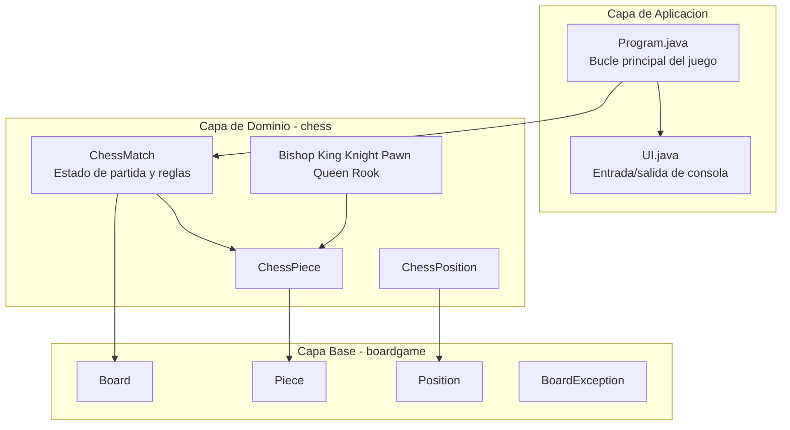
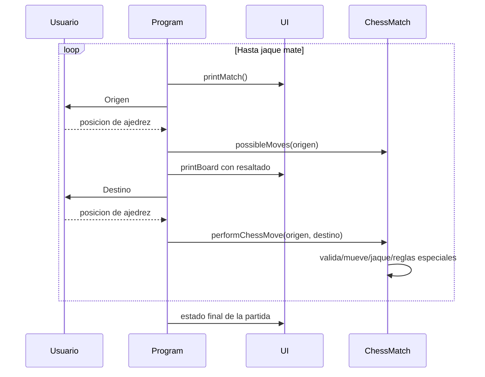

<div align="center">

**Choose Language / Selecione o Idioma / Elija el Idioma**

[](README.md)
[](README_PT.md)
[](README_ES.md)

</div>

---

<div align="center">

# Sistema de Ajedrez Java

Implementacion completa de ajedrez en consola con Java, con arquitectura en capas,
validacion de jugadas, deteccion de jaque/jaque mate y reglas especiales.


</div>

---

## Tabla de Contenidos

- [Resumen](#resumen)
- [Arquitectura](#arquitectura)
- [Stack Tecnologico](#stack-tecnologico)
- [Estructura del Proyecto](#estructura-del-proyecto)
- [Reglas Implementadas](#reglas-implementadas)
- [Responsabilidades de Clases](#responsabilidades-de-clases)
- [Flujo de Ejecucion](#flujo-de-ejecucion)
- [Como Ejecutar](#como-ejecutar)
- [Como Jugar](#como-jugar)
- [Limitaciones Conocidas](#limitaciones-conocidas)
- [Contribucion](#contribucion)
- [Autor](#autor)
- [Licencia](#licencia)

---

## Resumen

Chess System Java es un juego de ajedrez por terminal, enfocado en diseno limpio y logica confiable.

El proyecto esta separado en dos capas:

- boardgame: abstracciones genericas de tablero reutilizables.
- chess: reglas especificas del ajedrez y estado de la partida.

Implementado actualmente:

- Ciclo completo por turnos.
- Generacion de movimientos legales por pieza.
- Bloqueo de jugadas ilegales.
- Deteccion de jaque y jaque mate.
- Enroque corto y largo.
- En passant.
- Promocion de peon (reina por defecto, con reemplazo manual).

---

## Arquitectura



Puntos de diseno:

- Herencia entre pieza generica y pieza de ajedrez.
- Encapsulacion de cambios del tablero en Board y ChessMatch.
- Reglas centralizadas en ChessMatch.

---

## Stack Tecnologico

| Capa | Tecnologia | Proposito |
|---|---|---|
| Lenguaje | Java 21+ | Logica de juego y modelo de objetos |
| Build | Apache Ant + archivos de NetBeans | Compilar y ejecutar |
| UI | Consola con ANSI | Render de tablero y entrada |
| Arquitectura | OOP | Herencia, abstraccion, encapsulacion |

---

## Estructura del Proyecto

```text
chess_system_java/
|-- build.xml
|-- manifest.mf
|-- README.md
|-- README_PT.md
|-- README_ES.md
|-- nbproject/
|   |-- build-impl.xml
|   |-- project.properties
|   `-- ...
`-- src/
    |-- Program.java
    |-- UI.java
    |-- boardgame/
    |   |-- Board.java
    |   |-- BoardException.java
    |   |-- Piece.java
    |   `-- Position.java
    `-- chess/
        |-- ChessException.java
        |-- ChessMatch.java
        |-- ChessPiece.java
        |-- ChessPosition.java
        |-- Color.java
        `-- pieces/
            |-- Bishop.java
            |-- King.java
            |-- Knight.java
            |-- Pawn.java
            |-- Queen.java
            `-- Rook.java
```

---

## Reglas Implementadas

### Reglas estandar

- Movimiento por tipo de pieza.
- Capturas.
- Alternancia de turnos (WHITE y BLACK).
- Bloqueo de jugadas que dejan al propio rey en jaque.
- Deteccion de jaque y jaque mate.

### Reglas especiales

- Enroque:
  - Enroque corto.
  - Enroque largo.
  - Requiere rey/torre sin movimientos y camino libre.
- En passant:
  - Control por enPassantVulnerable.
  - Disponible inmediatamente despues del doble avance rival.
- Promocion:
  - Promocion automatica a Reina en la ultima fila.
  - Tipos aceptados: B (Alfil), H (Caballo), R (Torre), Q (Reina).

---

## Responsabilidades de Clases

| Clase | Responsabilidad |
|---|---|
| Program | Bucle principal, secuencia de entradas y manejo de excepciones |
| UI | Render en consola, impresion de tablero, lectura de posicion |
| ChessMatch | Ciclo de partida, ejecucion de jugadas, validaciones y jaque mate |
| ChessPiece | Abstraccion de pieza con color y contador de movimientos |
| ChessPosition | Conversion entre notacion (a1-h8) y coordenadas de matriz |
| Board | Matriz generica y operaciones de colocar/quitar piezas |
| Piece | Contrato generico de movimientos posibles |
| Bishop/King/Knight/Pawn/Queen/Rook | Logica especifica de movimiento |

---

## Flujo de Ejecucion



---

## Como Ejecutar

### Requisitos

- JDK 21 o superior.
- Opcional: Apache NetBeans.
- Opcional: Apache Ant.

### Opcion 1: NetBeans

1. Abre la carpeta del proyecto en NetBeans.
2. Ejecuta el proyecto (F6).
3. Clase principal: Program.

### Opcion 2: Ant

Desde la raiz del repositorio:

```bash
ant run
```

### Opcion 3: javac/java

Desde la raiz del repositorio:

```bash
cd src
javac Program.java UI.java boardgame/*.java chess/*.java chess/pieces/*.java
java Program
```

En Windows PowerShell:

```powershell
cd src
javac Program.java UI.java boardgame\*.java chess\*.java chess\pieces\*.java
java Program
```

---

## Como Jugar

1. Escribe la casilla de origen en formato algebraico, por ejemplo e2.
2. Escribe la casilla de destino, por ejemplo e4.
3. Sigue el indicador de turno en consola.
4. Continua hasta jaque mate.

La consola muestra:

- Turno actual.
- Jugador actual.
- Estado de jaque.
- Lista de piezas capturadas.

---

## Limitaciones Conocidas

- Sin interfaz grafica (solo consola).
- Sin persistencia de partidas (estado en memoria).
- Sin suite automatica de pruebas en el repositorio.
- Algunos mensajes visibles al usuario estan en portugues.

---

## Contribucion

1. Haz un fork del repositorio.
2. Crea una branch de funcionalidad.
3. Haz commit con mensajes claros.
4. Abre un pull request explicando el cambio.

Buenas areas para contribuir:

- Pruebas unitarias de movimientos y escenarios de jaque mate.
- Internacionalizacion de mensajes de UI.
- Exportacion/importacion opcional de PGN.
- Reglas de tablas (triple repeticion, regla de 50 movimientos, etc.).

---

## Autor

Victor H. J. Santiago

- GitHub: https://github.com/VictorHJesusSantiago
- LinkedIn: https://www.linkedin.com/in/victor-henrique-de-jesus-santiago/

---

## Licencia

Licencia MIT.

Si el archivo LICENSE todavia no existe en tu clon local, agregalo antes de publicar trabajos derivados.

---

<div align="center">
Proyecto hecho para estudio, practica de arquitectura e implementacion limpia de reglas de ajedrez en Java.
</div>
