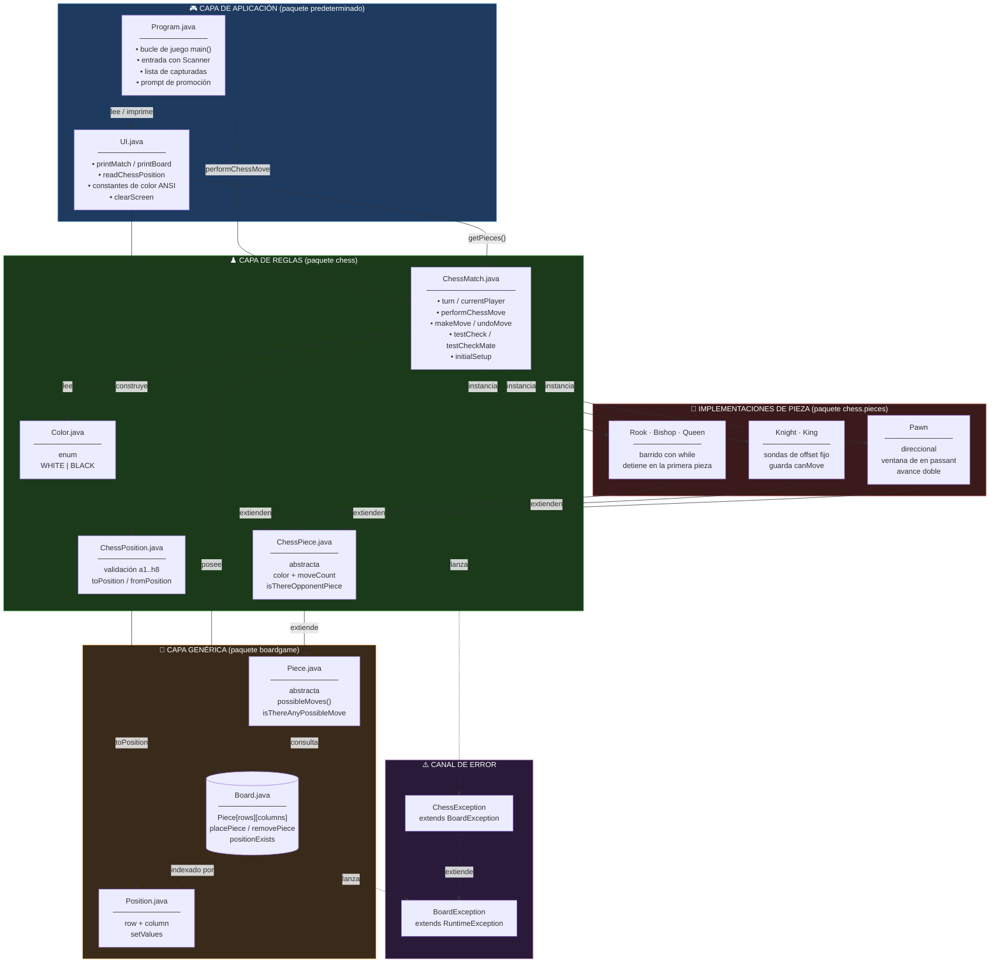
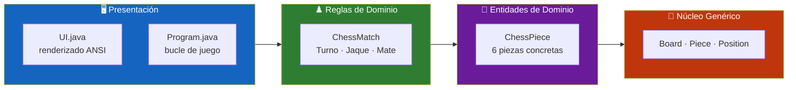
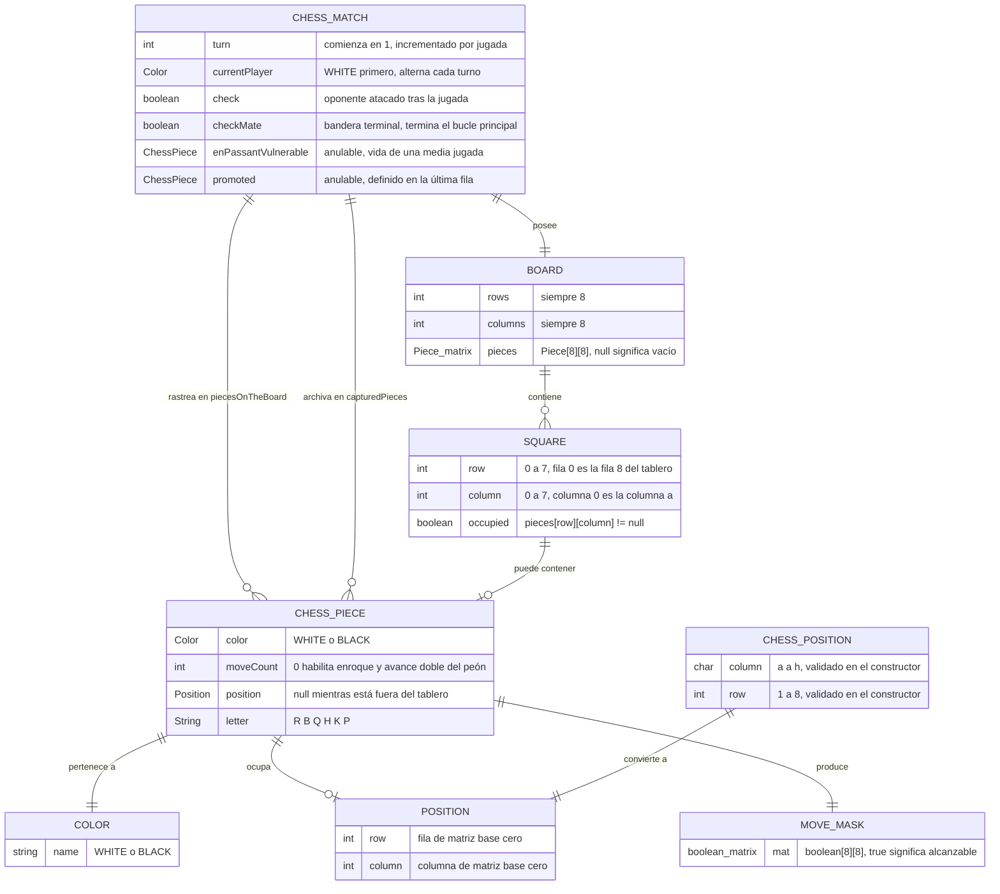
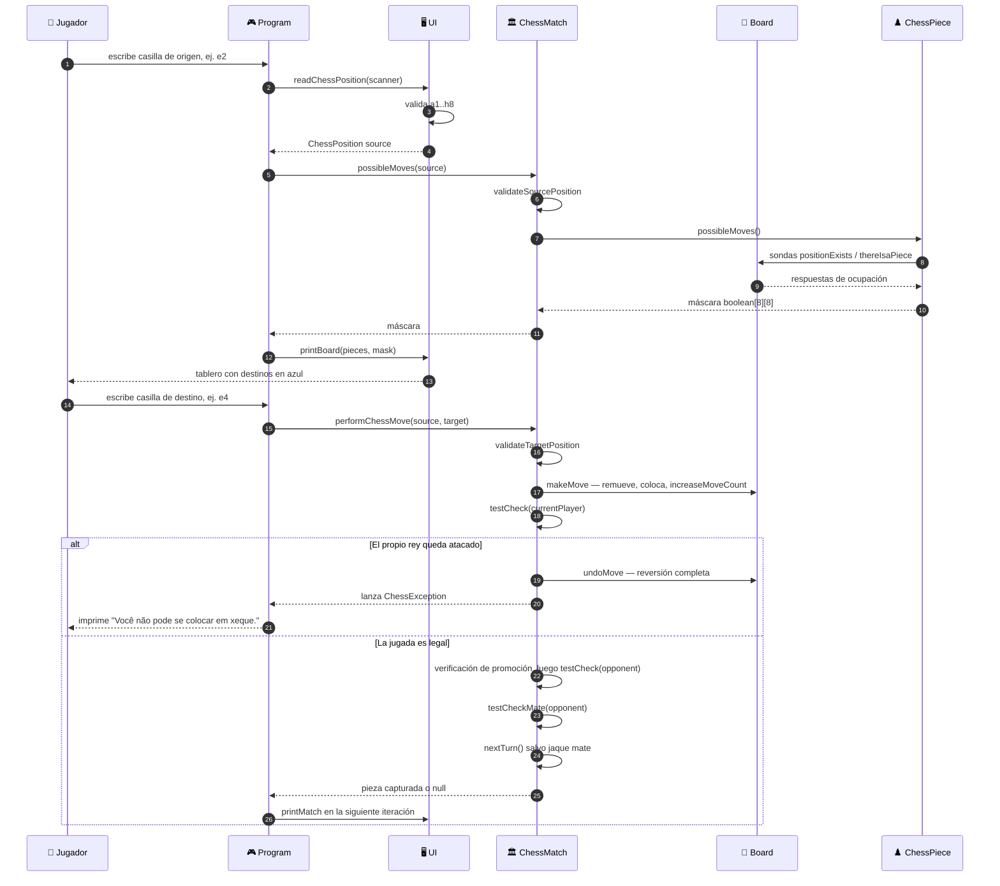
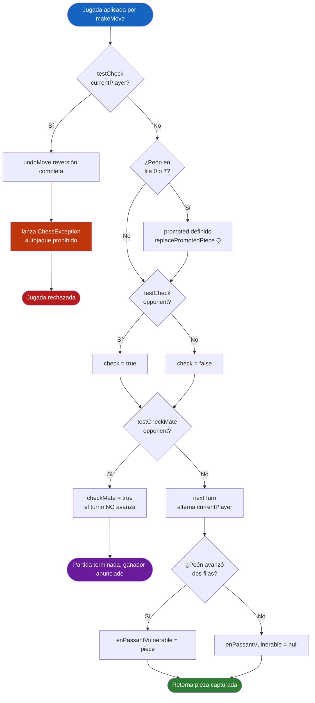
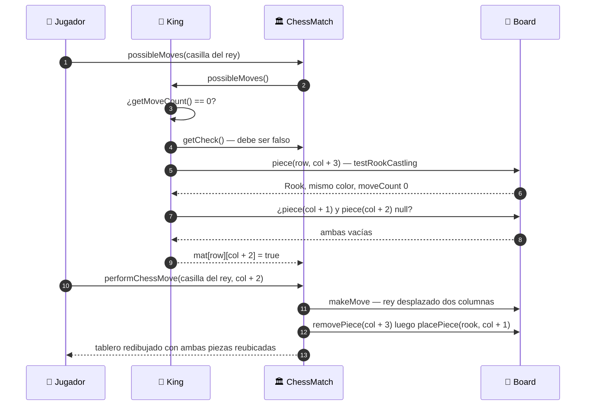
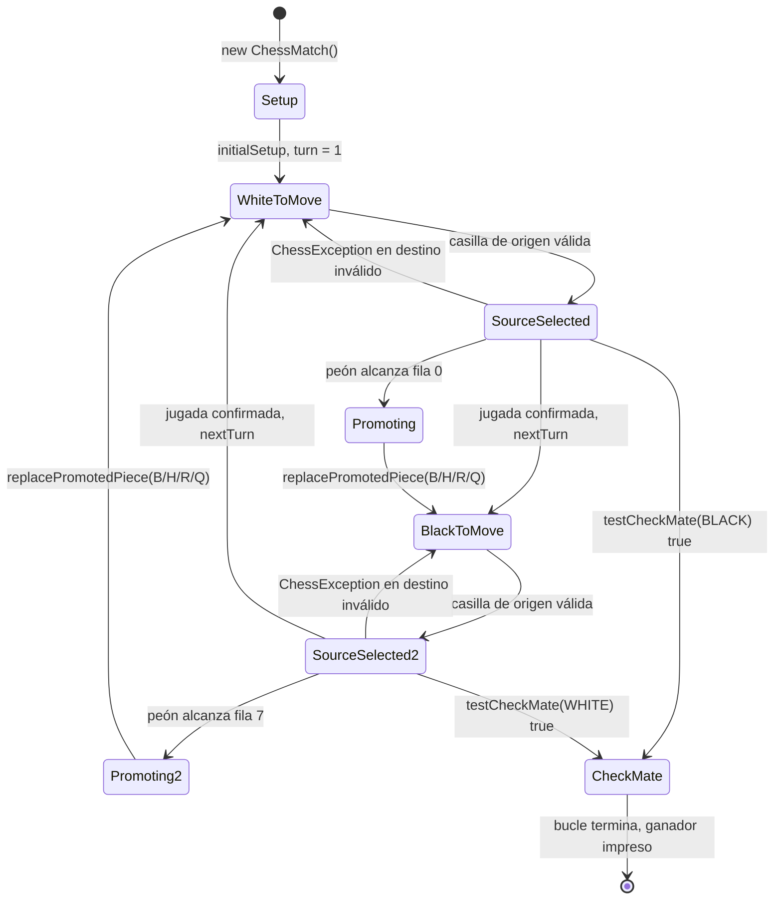
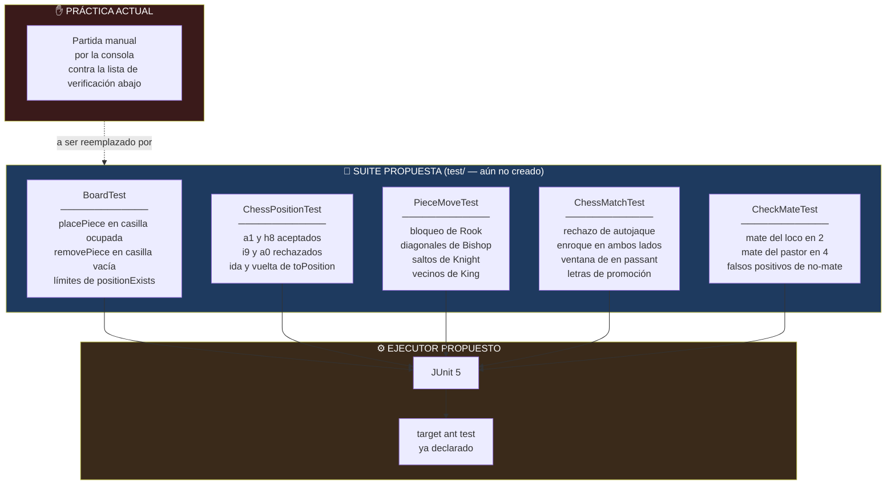

<div align="center">

**🌐 Choose Language / Selecione o Idioma / Elija el Idioma**

[](README.md)&nbsp;&nbsp;&nbsp;[](README_PT.md)&nbsp;&nbsp;&nbsp;[](README_ES.md)

</div>

---

<div align="center">

```
 ██████╗██╗  ██╗███████╗███████╗███████╗
██╔════╝██║  ██║██╔════╝██╔════╝██╔════╝
██║     ███████║█████╗  ███████╗███████╗
██║     ██╔══██║██╔══╝  ╚════██║╚════██║
╚██████╗██║  ██║███████╗███████║███████║
 ╚═════╝╚═╝  ╚═╝╚══════╝╚══════╝╚══════╝
       Motor de Ajedrez Orientado a Objetos para la Terminal
```

---

[](https://openjdk.org/)
[](https://ant.apache.org/)
[](https://netbeans.apache.org/)
[]()
[]()
[]()
[]()

<br/>

> **Una partida completa de ajedrez para dos jugadores renderizada en la terminal,**
> construida sobre una capa genérica de tablero reutilizable y una capa de reglas de ajedrez apilada sobre ella.

<br/>


</div>

---

## 📑 Tabla de Contenidos

<details>
<summary>▶️ <strong>Haga clic para expandir / contraer esta sección</strong></summary>

<table>
<tr>
<td valign="top" width="50%">

**🏗️ Sistema**
- [Visión General](#-visión-general)
- [Arquitectura del Sistema](#-arquitectura-del-sistema)
- [Stack Tecnológico](#-stack-tecnológico)
- [Patrones de Diseño](#-patrones-de-diseño-aplicados)
- [Estructura del Proyecto](#-estructura-del-proyecto)

**📦 Módulos**
- [Program — Punto de Entrada](#-program--punto-de-entrada-de-la-aplicación)
- [UI — Renderizador de Consola](#-ui--renderizador-de-consola)
- [Board — Matriz Genérica](#-board--matriz-genérica-de-tablero)
- [Piece — Contrato Abstracto](#-piece--contrato-abstracto-de-movimiento)
- [ChessMatch — Orquestador](#-chessmatch--orquestador-de-reglas)
- [ChessPiece — Semántica de Ajedrez](#-chesspiece--semántica-de-ajedrez)
- [ChessPosition — Coordenada Algebraica](#-chessposition--coordenada-algebraica)
- [Piezas Deslizantes](#-piezas-deslizantes--torre-alfil-dama)
- [Knight — Saltos Fijos](#-knight--saltador-de-desplazamiento-fijo)
- [King — Anfitrión del Enroque](#-king--anfitrión-del-enroque)
- [Pawn — En Passant y Promoción](#-pawn--anfitrión-del-en-passant-y-la-promoción)
- [Jerarquía de Excepciones](#-jerarquía-de-excepciones)

</td>
<td valign="top" width="50%">

**💼 Negocio**
- [Reglas de Negocio](#-reglas-de-negocio)
- [Requisitos Funcionales](#-requisitos-funcionales)
- [Requisitos No Funcionales](#-requisitos-no-funcionales)

**📐 Diseño**
- [Modelo de Datos](#-modelo-de-datos)
- [Flujos del Sistema](#-flujos-del-sistema)
- [Flujo de Ejecución de Jugada](#flujo-de-ejecución-de-jugada)
- [Flujo de Detección de Jaque](#flujo-de-detección-de-jaque-y-jaque-mate)
- [Flujo del Enroque](#flujo-del-enroque)
- [Máquina de Estados de la Partida](#máquina-de-estados-de-la-partida)

**🔐 Seguridad & Operación**
- [Seguridad](#-seguridad)
- [Instalación & Ejecución](#-instalación--ejecución)
- [Pruebas Automatizadas](#-pruebas-automatizadas)
- [Métricas & Monitoreo](#-métricas--monitoreo)
- [Limitaciones Conocidas](#-limitaciones-conocidas)

</td>
</tr>
</table>

---

</details>

## 🌟 Visión General

<details>
<summary>▶️ <strong>Haga clic para expandir / contraer esta sección</strong></summary>

**chess_system** es un juego de ajedrez totalmente jugable, en modo *hot-seat*, escrito en **Java puro** y sin ninguna dependencia externa. Dos jugadores humanos comparten la misma terminal, escribiendo coordenadas algebraicas como `e2` y `e4`, y el motor valida cada jugada contra el conjunto completo de reglas antes de aplicarla al tablero.

El código está deliberadamente dividido en **dos capas apiladas**. El paquete `boardgame` no sabe nada de ajedrez: modela una matriz `N × M` de objetos `Piece` abstractos, el concepto de `Position` y los invariantes de colocar y quitar piezas. El paquete `chess` se ubica encima y agrega todo lo específico del ajedrez, es decir, alternancia de turnos, colores, notación algebraica, jaque, jaque mate, enroque, en passant y promoción. Esta separación significa que la capa inferior podría alojar damas u otro juego de cuadrícula sin un solo cambio.

La aplicación de las reglas está centralizada en `ChessMatch`, un orquestador de 354 líneas que posee el tablero, el contador de turnos, el jugador actual, las banderas de jaque y jaque mate, y dos inventarios activos de piezas. Su técnica más característica es la **ejecución especulativa**: una jugada se aplica físicamente con `makeMove`, la posición resultante se prueba por autojaque, y `undoMove` revierte el tablero átomo por átomo cuando la jugada es ilegal. El mismo truco impulsa la detección de jaque mate, que recorre por fuerza bruta todas las jugadas legales del bando amenazado buscando una escapatoria.

### 🎯 Objetivos del Sistema

| Objetivo | Descripción |
|----------|-------------|
| ♟️ **Conjunto Completo de Reglas** | Los seis tipos de pieza con movimiento, captura y bloqueo correctos |
| 👑 **Jugadas Especiales** | Enroque (corto y largo), en passant y promoción del peón |
| 🛡️ **Garantía de Legalidad** | Ninguna jugada puede dejar o poner al propio rey en jaque, verificado por simulación make/undo |
| 🏁 **Condiciones Terminales** | Detección automática de jaque y jaque mate, terminando el bucle principal |
| 🧱 **Separación de Capas** | Un núcleo `boardgame` agnóstico al ajedrez reutilizado por una capa `chess` específica |
| 🎨 **UI de Consola Legible** | Cuadrícula 8×8 coloreada con ANSI, reglas de coordenadas y destinos resaltados |
| 🧯 **Manejo Elegante de Errores** | Excepciones tipadas convierten entrada inválida en mensaje, nunca en caída del proceso |
| 📦 **Cero Dependencias** | Compila y se ejecuta en un JDK puro con el script Ant incluido |
| 🎓 **Artefacto Didáctico** | Demuestra herencia, polimorfismo, encapsulamiento y abstracción en un dominio coherente |

---

</details>

## 🏗️ Arquitectura del Sistema

<details>
<summary>▶️ <strong>Haga clic para expandir / contraer esta sección</strong></summary>

### Diagrama de Módulos



### Capas de la Arquitectura



---

</details>

## 🛠️ Stack Tecnológico

<details>
<summary>▶️ <strong>Haga clic para expandir / contraer esta sección</strong></summary>

<table>
<thead>
<tr>
<th>Capa</th>
<th>Tecnología</th>
<th>Versión</th>
<th>Propósito</th>
</tr>
</thead>
<tbody>
<tr>
<td rowspan="2"><strong>🧠 Lenguaje</strong></td>
<td>Java SE</td>
<td>21</td>
<td>Nivel de fuente y destino (<code>javac.source</code> / <code>javac.target</code> en <code>nbproject/project.properties</code>)</td>
</tr>
<tr>
<td>Codificación de la fuente</td>
<td>UTF-8</td>
<td>Necesaria para los mensajes acentuados en portugués incrustados en los fuentes</td>
</tr>
<tr>
<td rowspan="3"><strong>📚 Biblioteca Estándar</strong></td>
<td><code>java.util.Scanner</code></td>
<td>JDK</td>
<td>Lee la entrada del jugador línea por línea en <code>Program.main</code></td>
</tr>
<tr>
<td><code>java.util.List</code> / <code>ArrayList</code> / <code>stream</code></td>
<td>JDK</td>
<td>Inventarios de piezas, más <code>filter</code> y <code>Collectors.toList()</code> en <code>testCheck</code>, <code>King()</code> y <code>printCapturedPieces</code></td>
</tr>
<tr>
<td><code>java.security.InvalidParameterException</code></td>
<td>JDK</td>
<td>Lanzada por <code>replacePromotedPiece</code> ante una letra de promoción desconocida</td>
</tr>
<tr>
<td rowspan="3"><strong>🔧 Build</strong></td>
<td>Apache Ant</td>
<td><code>build.xml</code></td>
<td>Delega al <code>nbproject/build-impl.xml</code> generado</td>
</tr>
<tr>
<td>Proyecto NetBeans J2SE</td>
<td>schema 3</td>
<td><code>nbproject/project.xml</code> declara la raíz de fuentes <code>src</code> y la de pruebas <code>test</code></td>
</tr>
<tr>
<td>Manifiesto</td>
<td><code>manifest.mf</code></td>
<td><code>Main-Class</code> inyectada al empaquetar desde <code>main.class=Program</code></td>
</tr>
<tr>
<td rowspan="2"><strong>🖥️ Interfaz</strong></td>
<td>Códigos de escape ANSI</td>
<td>—</td>
<td>16 constantes de color más la limpieza de pantalla <code>\033[H\033[2J</code>, todas declaradas en <code>UI.java</code></td>
</tr>
<tr>
<td>Notación algebraica</td>
<td><code>a1</code>–<code>h8</code></td>
<td>Contrato de entrada impuesto por el constructor de <code>ChessPosition</code></td>
</tr>
<tr>
<td rowspan="2"><strong>📦 Distribución</strong></td>
<td>JAR ejecutable</td>
<td><code>dist/chess_system.jar</code></td>
<td>Producido por <code>ant jar</code>, ejecutable con <code>java -jar</code></td>
</tr>
<tr>
<td>Dependencias externas</td>
<td>ninguna</td>
<td><code>javac.classpath</code> está vacío, el proyecto compila solo contra el JDK</td>
</tr>
</tbody>
</table>

---

</details>

## 🎨 Patrones de Diseño Aplicados

<details>
<summary>▶️ <strong>Haga clic para expandir / contraer esta sección</strong></summary>

| Patrón | Dónde | Justificación |
|--------|-------|----------------|
| 🧬 **Template Method** | `Piece.possibleMoves()` abstracto, implementado por las seis piezas | El tablero y la partida invocan una firma y cada pieza aporta su propia geometría |
| 🏛️ **Arquitectura en Capas** | Paquete `boardgame` versus paquete `chess` | La capa genérica de cuadrícula no importa nada de la capa de ajedrez, por lo que sigue siendo reutilizable |
| 🎭 **Polimorfismo** | `piecesOnTheBoard` tipado como `List<Piece>` | `testCheck` itera piezas heterogéneas y llama a un único método en todas ellas |
| ↩️ **Memento (ligero)** | Par `makeMove` / `undoMove` en `ChessMatch` | El tablero se muta especulativamente y se restaura campo a campo, incluyendo la posición de la torre y los contadores de jugada |
| 🏭 **Factory Method** | `ChessMatch.newPiece(String, Color)` | Mapea las letras de promoción `B`, `H`, `R`, `Q` a constructores concretos |
| 🎯 **Facade** | `ChessMatch.performChessMove(ChessPosition, ChessPosition)` | Una llamada oculta validación, simulación, jugadas especiales, pruebas de jaque y avance de turno |
| 🚦 **Guard Clause** | `validateSourcePosition` y `validateTargetPosition` | La entrada ilegal aborta con excepción tipada antes de que cualquier mutación alcance el tablero |
| 🧮 **Strategy por subclase** | Barrido de `Rook`, `Bishop`, `Queen` versus sondeo de `Knight`, `King` | Dos algoritmos de movimiento conviven tras el mismo método abstracto |
| 🔒 **Encapsulamiento con upcast protegido** | `Piece.position` es `protected`, `ChessPosition.toPosition()` es `protected` | La conversión de coordenadas queda restringida a los paquetes autorizados a conocerla |
| 🏷️ **Type Object** | Enum `Color` consultado por cada pieza y por `ChessMatch.opponent` | La identidad del jugador es un valor, no un booleano, lo que hace que las reglas se lean con naturalidad |

---

</details>

## 📁 Estructura del Proyecto

<details>
<summary>▶️ <strong>Haga clic para expandir / contraer esta sección</strong></summary>

```
chess_system_java/
│
├── 📄 build.xml                          # Script Ant de entrada, importa nbproject/build-impl.xml
├── 📄 manifest.mf                        # Esqueleto del manifiesto, Main-Class añadida por el build
├── 📄 .gitignore                         # Excluye build/, dist/ y archivos privados del IDE
│
├── 📂 nbproject/                         # Metadatos del proyecto NetBeans J2SE
│   ├── 📄 build-impl.xml                 # Biblioteca Ant generada (clean, compile, jar, run, test)
│   ├── 📄 project.xml                    # Tipo de proyecto, raíz de fuentes = src, de pruebas = test
│   ├── 📄 project.properties             # main.class=Program, javac.source=21, ruta del dist.jar
│   ├── 📄 genfiles.properties            # Sumas CRC de los archivos de build generados
│   └── 📂 private/                        # Configuraciones locales de la máquina, no versionables
│       ├── config.properties
│       ├── private.properties
│       └── private.xml
│
├── 📂 src/
│   │
│   ├── 📄 Program.java                    # ★ main() — bucle de juego, Scanner, capturadas, prompt de promoción
│   ├── 📄 UI.java                         # Renderizador de consola, paleta ANSI, parser de coordenadas
│   │
│   ├── 📂 boardgame/                      # Núcleo de tablero agnóstico al juego
│   │   ├── 📄 Board.java                  # Piece[rows][columns], placePiece, removePiece, positionExists
│   │   ├── 📄 Piece.java                  # possibleMoves() abstracto, possibleMove(), isThereAnyPossibleMove()
│   │   ├── 📄 Position.java               # Coordenada de matriz base cero, setValues, toString
│   │   └── 📄 BoardException.java         # RuntimeException para violaciones a nivel de tablero
│   │
│   ├── 📂 chess/                          # Capa de reglas específica del ajedrez
│   │   ├── 📄 ChessMatch.java             # ★ Orquestador — turno, jaque, mate, enroque, en passant, promoción
│   │   ├── 📄 ChessPiece.java             # abstracta, añade Color y moveCount a Piece
│   │   ├── 📄 ChessPosition.java          # Coordenada a1..h8, valida y convierte a Position
│   │   ├── 📄 Color.java                  # enum WHITE, BLACK
│   │   └── 📄 ChessException.java         # Extiende BoardException, señala violación de regla
│   │
│   └── 📂 chess/pieces/                   # Las seis piezas concretas
│       ├── 📄 Rook.java                   # "R" — 4 rayos ortogonales
│       ├── 📄 Bishop.java                 # "B" — 4 rayos diagonales
│       ├── 📄 Queen.java                  # "Q" — 8 rayos, unión de torre y alfil
│       ├── 📄 Knight.java                 # "H" — 8 desplazamientos fijos en L
│       ├── 📄 King.java                   # "K" — 8 vecinos más ambas sondas de enroque
│       └── 📄 Pawn.java                   # "P" — dirección según color, avance doble, en passant
│
├── 📄 README.md                          # 🇺🇸 English (primario)
├── 📄 README_PT.md                       # 🇧🇷 Português
└── 📄 README_ES.md                       # 🇪🇸 Español
```

> [!NOTE]
> `nbproject/project.properties` declara `test.src.dir=test`, pero no existe el directorio `test/` en el repositorio. Actualmente no hay conjunto de fuentes de prueba automatizado.

---

</details>

## 📦 Módulos del Sistema

<details>
<summary>▶️ <strong>Haga clic para expandir / contraer esta sección</strong></summary>

### 🎮 Program — Punto de Entrada de la Aplicación

El método `main` de 59 líneas que conduce toda la sesión. Crea un `ChessMatch`, un `Scanner` y una `List<ChessPiece> captured`, y luego itera hasta que la partida reporta jaque mate.

| Paso | Instrucción | Propósito |
|------|-------------|-----------|
| 1 | `UI.clearScreen()` | Limpia la terminal antes de cada redibujo |
| 2 | `UI.printMatch(chessMatch, captured)` | Tablero, inventario de capturadas, turno, jugador, banner de jaque |
| 3 | `UI.readChessPosition(sc)` → source | Lee la casilla de origen, prompt `Procura:` |
| 4 | `chessMatch.possibleMoves(source)` | Devuelve la máscara de legalidad `boolean[8][8]` |
| 5 | `UI.printBoard(pieces, possibleMoves)` | Redibuja con las casillas alcanzables resaltadas |
| 6 | `UI.readChessPosition(sc)` → target | Lee la casilla de destino, prompt `Alvo:` |
| 7 | `chessMatch.performChessMove(source, target)` | Ejecuta la jugada, devuelve la pieza capturada o `null` |
| 8 | `captured.add(capturedPiece)` | Aumenta la lista de trofeos cuando hubo captura |
| 9 | `chessMatch.getPromoted()` | Cuando no es nulo, pide `B/H/R/Q` y llama a `replacePromotedPiece` |

Dos bloques `catch` mantienen vivo el bucle: `ChessException` para violaciones de regla e `InputMismatchException` para coordenadas mal formadas. Ambos imprimen el mensaje y consumen una línea para que la siguiente iteración empiece limpia.

---

### 🖥️ UI — Renderizador de Consola

Una clase con visibilidad de paquete (`class UI`, sin modificador `public`) que concentra toda la responsabilidad de renderizado. Nunca muta la partida, solo la lee.

| Miembro | Firma | Rol |
|---------|-------|-----|
| Constantes ANSI | 17 `public static final String` | 8 colores de primer plano, 8 de fondo, 1 reset |
| `clearScreen` | `static void clearScreen()` | Emite `\033[H\033[2J` y hace flush |
| `readChessPosition` | `static ChessPosition readChessPosition(Scanner)` | Divide la línea en `char column` y `int row` |
| `printMatch` | `static void printMatch(ChessMatch, List<ChessPiece>)` | Tablero, capturadas, turno y banner de estado |
| `printBoard` | `static void printBoard(ChessPiece[][])` | Renderizado 8×8 simple con reglas de fila y columna |
| `printBoard` | `static void printBoard(ChessPiece[][], boolean[][])` | Sobrecarga que pinta los destinos legales |
| `printPiece` | `private static void printPiece(ChessPiece, boolean)` | Una celda, aplica fondo y color |
| `printCapturedPieces` | `private static void printCapturedPieces(List<ChessPiece>)` | Particiona capturas por color mediante stream |

**Contrato de colores**

| Elemento | Constante ANSI | Renderizado como |
|----------|-----------------|-------------------|
| Pieza blanca | `ANSI_WHITE` | Letra clara |
| Pieza negra | `ANSI_YELLOW` | Letra amarilla |
| Casilla vacía | ninguna | `-` |
| Destino legal | `ANSI_BLUE_BACKGROUND` | Celda con fondo azul |

`readChessPosition` envuelve cualquier `RuntimeException` en una `InputMismatchException` con el mensaje *"Erro lendo a posição de Xadrez. Valores válidos são de a1 to h8."*, capturada por el bucle principal.

---

### 🧩 Board — Matriz Genérica de Tablero

`boardgame.Board` es la única clase que posee el arreglo `Piece[][]`. Está completamente libre de ajedrez: nunca menciona color, turno ni jaque.

| Método | Firma | Contrato |
|--------|-------|----------|
| Constructor | `Board(int rows, int columns)` | Lanza `BoardException` cuando `rows < 1 \|\| columns < 1` |
| `getRows` / `getColumns` | `int` | Dimensiones de solo lectura, no existen setters |
| `piece` | `Piece piece(int row, int column)` | Valida existencia y luego indexa la matriz |
| `piece` | `Piece piece(Position position)` | Indexación directa, esta sobrecarga no verifica límites |
| `placePiece` | `void placePiece(Piece, Position)` | Rechaza casilla ocupada y luego reenlaza `piece.position` |
| `removePiece` | `Piece removePiece(Position)` | Devuelve `null` en casilla vacía, en caso contrario desconecta y devuelve |
| `positionExists` | `boolean positionExists(Position)` | Prueba pública de límites usada por toda implementación de pieza |
| `thereIsaPiece` | `boolean thereIsaPiece(Position)` | Verifica límites primero, luego prueba ocupación |

La clase impone exactamente tres invariantes: el tablero debe tener al menos una fila y una columna, una coordenada debe estar dentro de la cuadrícula, y una casilla debe estar vacía antes de que una pieza aterrice en ella.

---

### ♟️ Piece — Contrato Abstracto de Movimiento

`boardgame.Piece` es la raíz abstracta de toda la jerarquía de piezas. Mantiene un `protected Position position` y un `private Board board`.

| Miembro | Tipo | Propósito |
|---------|------|-----------|
| `position` | `protected Position` | Escrito por `Board.placePiece` y `Board.removePiece`, leído por toda subclase |
| `board` | `private Board` | Alcanzado vía `protected Board getBoard()` para que las subclases consulten la cuadrícula |
| `possibleMoves()` | `public abstract boolean[][]` | El único punto de extensión que toda pieza concreta debe implementar |
| `possibleMove(Position)` | `public boolean` | Consulta de conveniencia en la máscara devuelta por `possibleMoves()` |
| `isThereAnyPossibleMove()` | `public boolean` | Recorre la máscara buscando al menos un `true`, usado para rechazar piezas bloqueadas |

El constructor deliberadamente fija `position = null`, de modo que una pieza existe antes de ser colocada y el tablero es la autoridad única sobre dónde se encuentra.

**Tipo compañero — `boardgame.Position`** es un par mutable de enteros base cero (`getRow`/`setRow`, `getColumn`/`setColumn`, `setValues(int, int)`, `toString` como `"row, column"`). La mutabilidad es intencional: toda pieza deslizante reutiliza una instancia mientras recorre un rayo con `setValues`, lo que evita asignar un objeto por casilla.

---

### 🏛️ ChessMatch — Orquestador de Reglas

El corazón del proyecto, 354 líneas. Posee el `Board`, el contador de turnos, el jugador actual, ambas banderas de estado y dos inventarios de piezas.

| Campo | Tipo | Significado |
|-------|------|--------------|
| `turn` | `int` | Comienza en 1, incrementado por `nextTurn()` |
| `currentPlayer` | `Color` | Comienza en `WHITE`, alterna cada turno |
| `board` | `Board` | Siempre una instancia 8×8 |
| `check` | `boolean` | Verdadero cuando el oponente está en jaque tras la jugada |
| `checkMate` | `boolean` | Verdadero termina el bucle en `Program` |
| `enPassantVulnerable` | `ChessPiece` | El peón que acaba de avanzar dos casillas, o `null` |
| `promoted` | `ChessPiece` | La pieza en la fila de promoción, o `null` |
| `piecesOnTheBoard` | `List<Piece>` | Inventario activo recorrido por `testCheck` y `King()` |
| `capturedPieces` | `List<Piece>` | Archivo interno de capturas, distinto de la lista mantenida por `Program` |

**API pública**

| Método | Devuelve | Comportamiento |
|--------|----------|-----------------|
| `getPieces()` | `ChessPiece[][]` | Hace downcast de todo el tablero a una matriz tipada para la UI |
| `possibleMoves(ChessPosition)` | `boolean[][]` | Valida el origen y luego delega a la pieza |
| `performChessMove(ChessPosition, ChessPosition)` | `ChessPiece` | Pipeline completo de la jugada, devuelve la pieza capturada o `null` |
| `replacePromotedPiece(String)` | `ChessPiece` | Cambia el peón promovido por `B`, `H`, `R` o `Q` |
| `getTurn`, `getCurrentPlayer`, `getCheck`, `getCheckMate`, `getEnPassantVulnerable`, `getPromoted` | — | Accesores de estado de solo lectura consumidos por `UI` y `Program` |

**Maquinaria privada**

| Método | Rol |
|--------|-----|
| `makeMove(Position, Position)` | Aplica la jugada, maneja ambos enroques y la captura en passant, actualiza los dos inventarios |
| `undoMove(Position, Position, Piece)` | Inverso exacto de `makeMove`, incluyendo restauración de la torre y `decreaseMoveCount` |
| `validateSourcePosition(Position)` | Tres verificaciones: existe pieza, es del jugador actual, tiene al menos una jugada |
| `validateTargetPosition(Position, Position)` | Rechaza destino ausente de la máscara de la pieza de origen |
| `testCheck(Color)` | Localiza al rey y pregunta a cada pieza contraria si alcanza esa casilla |
| `testCheckMate(Color)` | Recorre por fuerza bruta cada jugada legal del bando en jaque buscando una escapatoria |
| `King(Color)` | Hace stream de `piecesOnTheBoard` buscando el rey de un color, lanza `IllegalStateException` si está ausente |
| `opponent(Color)` | Devuelve el otro color |
| `nextTurn()` | Incrementa el contador y alterna el jugador |
| `newPiece(String, Color)` | Fábrica de promoción |
| `placeNewPiece(char, int, ChessPiece)` | Coloca una pieza usando coordenadas algebraicas y la registra en el inventario |
| `initialSetup()` | 32 llamadas a `placeNewPiece` construyendo la posición inicial estándar |

---

### ♜ ChessPiece — Semántica de Ajedrez

`chess.ChessPiece extends boardgame.Piece` y agrega exactamente lo que el ajedrez necesita sobre una pieza genérica.

| Miembro | Tipo | Propósito |
|---------|------|-----------|
| `color` | `private Color` | Inmutable tras la construcción, expuesto por `getColor()` |
| `moveCount` | `private int` | Rige la elegibilidad al enroque y el avance doble del peón |
| `increaseMoveCount` / `decreaseMoveCount` | `public void` | Llamados por `makeMove` y `undoMove` para que la simulación sea reversible |
| `getChessPosition()` | `ChessPosition` | Convierte la posición interna de matriz de vuelta a notación algebraica |
| `isThereOpponentPiece(Position)` | `protected boolean` | Prueba de captura compartida por toda pieza concreta |

---

### 🔤 ChessPosition — Coordenada Algebraica

La frontera de traducción entre lo que el jugador escribe y lo que la matriz entiende.

| Aspecto | Detalle |
|---------|---------|
| Campos | `char column` (`a`–`h`), `int row` (`1`–`8`) |
| Validación | El constructor lanza `ChessException` fuera de ese rango |
| `toPosition()` | `new Position(8 - row, column - 'a')`, visibilidad `protected` |
| `fromPosition(Position)` | `new ChessPosition((char)('a' + column), 8 - row)`, `protected static` |
| `toString()` | `"" + column + row`, por ejemplo `e4` |

Como ambos métodos de conversión son `protected`, código fuera del paquete `chess` nunca puede obtener una `Position` cruda de matriz a partir de una coordenada de ajedrez, lo que mantiene la indexación base cero como un detalle de implementación.

**Tipo compañero — `chess.Color`** es un enum de ocho líneas con dos constantes, `BLACK` y `WHITE`, consultado en cinco lugares: `ChessMatch.currentPlayer` (a quién le toca), `ChessMatch.opponent(Color)` (la inversión ternaria usada por las pruebas de jaque y mate), `ChessPiece.color` (propiedad), `Pawn.possibleMoves` (dirección de avance, hacia arriba en blancas y hacia abajo en negras) y `UI.printPiece` / `printCapturedPieces` (elección del color ANSI y partición de las capturas).

---

### 🎯 Piezas Deslizantes — Torre, Alfil, Dama

Tres clases que comparten un algoritmo: elegir una dirección, recorrerla con un bucle `while` mientras las casillas estén vacías, marcar cada una, y luego marcar la primera casilla ocupada solo cuando contenga un adversario.

| Pieza | Letra | Direcciones | Líneas |
|-------|-------|-------------|--------|
| `Rook` | `R` | Arriba, abajo, izquierda, derecha | 64 |
| `Bishop` | `B` | Las cuatro diagonales | 64 |
| `Queen` | `Q` | Las ocho, la unión de las dos anteriores | 100 |

```java
p.setValues(position.getRow() - 1, position.getColumn());
while (getBoard().positionExists(p) && !getBoard().thereIsaPiece(p)) {
    mat[p.getRow()][p.getColumn()] = true;
    p.setRow(p.getRow() - 1);
}
if (getBoard().positionExists(p) && isThereOpponentPiece(p)) {
    mat[p.getRow()][p.getColumn()] = true;
}
```

La única `Position p` mutable se reinicia con `setValues` antes de cada rayo, y es exactamente por eso que `Position` expone setters.

---

### 🐴 Knight — Saltador de Desplazamiento Fijo

`Knight` se renderiza como `H` (de *caballo*, del portugués *cavalo*) y sondea ocho desplazamientos explícitos. Nunca inspecciona casillas intermedias, y es precisamente eso lo que le permite saltar sobre las piezas.

| # | Delta de fila | Delta de columna |
|---|----------------|--------------------|
| 1 | −1 | −2 |
| 2 | −2 | −1 |
| 3 | −2 | +1 |
| 4 | −1 | +2 |
| 5 | +1 | +2 |
| 6 | +2 | +1 |
| 7 | +2 | −1 |
| 8 | +1 | −2 |

Cada sonda pasa por el auxiliar privado `canMove(Position)`, que acepta la casilla cuando está vacía u ocupada por un adversario.

---

### 👑 King — Anfitrión del Enroque

`King` es la única pieza construida con una referencia de vuelta a la partida: `King(Board, Color, ChessMatch)`. Necesita esa referencia para consultar `chessMatch.getCheck()` antes de ofrecer una jugada de enroque.

| Aspecto | Implementación |
|---------|-----------------|
| Casillas adyacentes | Ocho sondas `setValues` filtradas por `canMove` |
| Precondición del enroque | `getMoveCount() == 0 && !chessMatch.getCheck()` |
| Sonda de la torre del lado del rey | `new Position(row, column + 3)` probada por `testRookCastling` |
| Prueba de vacío, lado del rey | Ambas casillas en `column + 1` y `column + 2` deben ser `null` |
| Resultado, lado del rey | Marca `mat[row][column + 2]` |
| Sonda de la torre del lado de la dama | `new Position(row, column - 4)` probada por `testRookCastling` |
| Prueba de vacío, lado de la dama | Tres casillas en `column - 1`, `column - 2`, `column - 3` deben ser `null` |
| Resultado, lado de la dama | Marca `mat[row][column - 2]` |
| `testRookCastling` | Exige pieza no nula que sea `instanceof Rook`, mismo color, `moveCount == 0` |

La reubicación de la torre en sí vive en `ChessMatch.makeMove`, que detecta un desplazamiento de dos columnas del rey y mueve la torre correspondiente, y en `ChessMatch.undoMove`, que lo revierte.

> [!WARNING]
> Las ocho sondas de adyacencia contienen una duplicada: el desplazamiento `(+1, +1)` se prueba dos veces y `(+1, −1)` nunca se prueba. Por lo tanto, el rey no puede moverse a su casilla diagonal inferior izquierda. Vea [Limitaciones Conocidas](#-limitaciones-conocidas).

---

### ♙ Pawn — Anfitrión del En Passant y la Promoción

Como el rey, `Pawn` recibe la referencia a la partida: `Pawn(Board, Color, ChessMatch)`. Necesita `chessMatch.getEnPassantVulnerable()` para decidir si la captura diagonal de una casilla vacía es legal.

| Jugada | Blancas | Negras | Condición |
|--------|---------|--------|-----------|
| Avance simple | fila − 1 | fila + 1 | Destino vacío |
| Avance doble | fila − 2 | fila + 2 | Ambas casillas vacías y `getMoveCount() == 0` |
| Captura diagonal izquierda | fila − 1, col − 1 | fila + 1, col − 1 | `isThereOpponentPiece` |
| Captura diagonal derecha | fila − 1, col + 1 | fila + 1, col + 1 | `isThereOpponentPiece` |
| En passant izquierda | desde fila 3 | desde fila 4 | El vecino es el peón `enPassantVulnerable` |
| En passant derecha | desde fila 3 | desde fila 4 | El vecino es el peón `enPassantVulnerable` |

Las filas 3 y 4 son las filas de matriz base cero que corresponden a las filas 5 y 4 del tablero, las únicas desde las que el en passant es posible.

**La promoción** se maneja en `ChessMatch.performChessMove`: cuando la pieza movida es un `Pawn` y aterriza en la fila 0 (blancas) o 7 (negras), `promoted` se establece y de inmediato se reemplaza por una `Queen` como predeterminado. `Program` luego pregunta al jugador y llama a `replacePromotedPiece(type)` una segunda vez con la letra elegida.

---

### ⚠️ Jerarquía de Excepciones

Dos tipos de excepción no verificada forman una jerarquía de dos niveles, de modo que un único `catch` puede absorber cualquiera de las dos cuando eso sea deseable.

| Excepción | Extiende | Lanzada por | Ejemplo de mensaje |
|-----------|----------|--------------|----------------------|
| `BoardException` | `RuntimeException` | Constructor de `Board`, `piece`, `placePiece`, `removePiece`, `thereIsaPiece` | *"Posição não está no tabuleiro."* |
| `ChessException` | `BoardException` | Constructor de `ChessPosition`, `validateSourcePosition`, `validateTargetPosition`, `performChessMove` | *"Você não pode se colocar em xeque."* |
| `IllegalStateException` | `RuntimeException` | `King(Color)`, `replacePromotedPiece` | *"Não há peça para ser promovida."* |
| `InvalidParameterException` | `IllegalArgumentException` | `replacePromotedPiece` con letra desconocida | *"Tipo de promoção inválido."* |
| `InputMismatchException` | `NoSuchElementException` | `UI.readChessPosition` | *"Erro lendo a posição de Xadrez…"* |

`Program` captura solo `ChessException` e `InputMismatchException`. Las otras tres escapan del bucle y terminan el proceso.

---

</details>

## 💼 Reglas de Negocio

<details>
<summary>▶️ <strong>Haga clic para expandir / contraer esta sección</strong></summary>

### ♟️ Reglas de Turno y Posesión

| # | Regla | Aplicación |
|---|-------|------------|
| RN-01 | Las blancas siempre juegan primero | `currentPlayer = Color.WHITE` en el constructor de `ChessMatch` |
| RN-02 | Los jugadores alternan tras cada jugada completada | Inversión ternaria en `nextTurn()` |
| RN-03 | El contador de turnos comienza en 1 y nunca decrece | `turn = 1`, `turn++` en `nextTurn()` |
| RN-04 | Un jugador solo puede seleccionar pieza de su propio color | `validateSourcePosition` compara `currentPlayer` con el color de la pieza |
| RN-05 | Un jugador no puede seleccionar una casilla vacía | Guarda `board.thereIsaPiece(position)` |
| RN-06 | Un jugador no puede seleccionar una pieza sin jugadas legales | Guarda `isThereAnyPossibleMove()` |
| RN-07 | El destino debe constar en la máscara de la pieza de origen | `validateTargetPosition` consulta `possibleMove(target)` |
| RN-08 | El turno no avanza cuando se detecta jaque mate | `nextTurn()` solo se alcanza en la rama `else` |

### 🛡️ Reglas de Legalidad y Jaque

| # | Regla | Aplicación |
|---|-------|------------|
| RN-09 | Ninguna jugada puede dejar al propio rey en jaque | `makeMove`, luego `testCheck(currentPlayer)`, luego `undoMove` y lanza |
| RN-10 | El jaque se recalcula para el oponente tras cada jugada aceptada | `check = testCheck(opponent(currentPlayer))` |
| RN-11 | El jaque mate exige jaque más ninguna jugada de escape | `testCheckMate` devuelve `false` temprano cuando `testCheck` es falso |
| RN-12 | Cada escape candidato se verifica por simulación completa | `testCheckMate` llama a `makeMove`, `testCheck`, `undoMove` por candidato |
| RN-13 | Una captura elimina la pieza de `piecesOnTheBoard` y la anexa a `capturedPieces` | Contabilidad dentro de `makeMove` |
| RN-14 | Una captura deshecha restaura ambas listas exactamente | Contabilidad simétrica dentro de `undoMove` |
| RN-15 | La partida termina en cuanto `checkMate` se vuelve verdadero | `while (!chessMatch.getCheckMate())` en `Program` |

### 👑 Reglas de Jugadas Especiales

| # | Regla | Aplicación |
|---|-------|------------|
| RN-16 | El enroque exige un rey que aún no se ha movido | `getMoveCount() == 0` en `King.possibleMoves` |
| RN-17 | El enroque exige una torre del mismo color que aún no se ha movido | `testRookCastling` verifica tipo, color y `moveCount` |
| RN-18 | El enroque está prohibido mientras el rey está en jaque | Guarda `!chessMatch.getCheck()` |
| RN-19 | Todas las casillas entre el rey y la torre deben estar vacías | Dos casillas en el lado del rey, tres en el lado de la dama |
| RN-20 | La torre salta a la casilla que el rey atravesó | `makeMove` la reubica cuando el rey se desplaza dos columnas |
| RN-21 | Un peón solo puede avanzar dos casillas en su primera jugada | `getMoveCount() == 0` más ambas casillas vacías |
| RN-22 | Un avance doble hace vulnerable a ese peón al en passant | `enPassantVulnerable = movedPiece` cuando el delta de fila es 2 |
| RN-23 | La vulnerabilidad al en passant dura exactamente una media jugada | El campo se restablece a `null` en cualquier otra jugada |
| RN-24 | Una captura en passant elimina el peón junto al destino | `makeMove` elimina en `target.row ± 1` |
| RN-25 | Un peón que alcanza la última fila debe promoverse | Las filas 0 (blancas) y 7 (negras) disparan la promoción |
| RN-26 | La promoción acepta solo `B`, `H`, `R` o `Q` | `replacePromotedPiece` lanza `InvalidParameterException` en caso contrario |
| RN-27 | La promoción usa Dama como predeterminado antes de preguntar al jugador | `promoted = replacePromotedPiece("Q")` dentro de `performChessMove` |

---

</details>

## ✅ Requisitos Funcionales

<details>
<summary>▶️ <strong>Haga clic para expandir / contraer esta sección</strong></summary>

| ID | Requisito | Prioridad | Estado |
|----|-----------|-----------|--------|
| **RF-01** | El sistema debe construir un tablero 8×8 con la posición inicial estándar de 32 piezas | 🔴 Alta | ✅ Implementado |
| **RF-02** | El sistema debe renderizar el tablero en la terminal con reglas de fila y columna | 🔴 Alta | ✅ Implementado |
| **RF-03** | El sistema debe aceptar jugadas en notación algebraica de `a1` a `h8` | 🔴 Alta | ✅ Implementado |
| **RF-04** | El sistema debe rechazar coordenadas fuera del tablero con un mensaje legible | 🔴 Alta | ✅ Implementado |
| **RF-05** | El sistema debe resaltar todo destino legal de la pieza seleccionada | 🟡 Media | ✅ Implementado |
| **RF-06** | El sistema debe imponer el movimiento en rayo de torre, alfil y dama con bloqueo | 🔴 Alta | ✅ Implementado |
| **RF-07** | El sistema debe imponer el movimiento en L del caballo ignorando piezas intermedias | 🔴 Alta | ✅ Implementado |
| **RF-08** | El sistema debe imponer dirección, avance doble y captura diagonal del peón | 🔴 Alta | ✅ Implementado |
| **RF-09** | El sistema debe imponer el movimiento de una casilla del rey | 🔴 Alta | ⚠️ Parcial — falta la diagonal inferior izquierda |
| **RF-10** | El sistema debe soportar enroque corto y enroque largo | 🟡 Media | ✅ Implementado |
| **RF-11** | El sistema debe soportar la captura en passant | 🟡 Media | ✅ Implementado |
| **RF-12** | El sistema debe promover un peón que alcance la última fila | 🟡 Media | ✅ Implementado |
| **RF-13** | El sistema debe permitir al jugador elegir la pieza de promoción | 🟡 Media | ✅ Implementado |
| **RF-14** | El sistema debe prohibir cualquier jugada que deje en jaque al rey de quien mueve | 🔴 Alta | ✅ Implementado |
| **RF-15** | El sistema debe anunciar el jaque en la consola | 🔴 Alta | ✅ Implementado |
| **RF-16** | El sistema debe detectar el jaque mate y terminar la partida | 🔴 Alta | ✅ Implementado |
| **RF-17** | El sistema debe anunciar al ganador cuando la partida termina | 🔴 Alta | ✅ Implementado |
| **RF-18** | El sistema debe listar las piezas capturadas separadas por color | 🟢 Baja | ✅ Implementado |
| **RF-19** | El sistema debe mostrar el número de turno y el jugador en turno | 🟢 Baja | ✅ Implementado |
| **RF-20** | El sistema debe limpiar la pantalla entre redibujos | 🟢 Baja | ✅ Implementado |
| **RF-21** | El sistema debe seguir ejecutándose tras una jugada inválida en lugar de terminar | 🔴 Alta | ✅ Implementado |
| **RF-22** | El sistema debe alternar los turnos automáticamente | 🔴 Alta | ✅ Implementado |
| **RF-23** | El sistema debe detectar ahogado y declarar empate | 🟡 Media | ⬜ Planeado |
| **RF-24** | El sistema debe soportar empate por repetición, la regla de las 50 jugadas o material insuficiente | 🟢 Baja | ⬜ Planeado |
| **RF-25** | El sistema debe permitir que el jugador deshaga una jugada | 🟢 Baja | ⬜ Planeado — `undoMove` existe pero es privado y solo sirve a la simulación |

---

</details>

## ⚡ Requisitos No Funcionales

<details>
<summary>▶️ <strong>Haga clic para expandir / contraer esta sección</strong></summary>

| ID | Categoría | Requisito | Meta |
|----|-----------|-----------|------|
| **RNF-01** | ⚡ Rendimiento | Tiempo para calcular la máscara de legalidad de una pieza | Menos de 1 ms, máximo 64 sondeos al tablero |
| **RNF-02** | ⚡ Rendimiento | Tiempo para evaluar `testCheckMate` | Menos de 100 ms, acotado por piezas × 64 simulaciones |
| **RNF-03** | ⚡ Rendimiento | Latencia percibida entre entrada y redibujo | Instantánea, sin E/S más allá de `System.out` |
| **RNF-04** | 🧠 Memoria | Total de objetos residentes durante una partida | Menos de 100 objetos, un tablero más como máximo 32 piezas |
| **RNF-05** | 📦 Tamaño | Tamaño del artefacto de distribución | Muy por debajo de 100 KB para `dist/chess_system.jar` |
| **RNF-06** | 🔌 Portabilidad | Requisito de tiempo de ejecución | Cualquier JRE 21 o superior, sin código nativo |
| **RNF-07** | 🔌 Portabilidad | Requisito de terminal | Cualquier terminal con capacidad ANSI, degrada a escapes crudos en los demás |
| **RNF-08** | 🧱 Mantenibilidad | Dirección del acoplamiento | `boardgame` nunca debe importar de `chess` |
| **RNF-09** | 🧱 Mantenibilidad | Agregar un nuevo tipo de pieza | Una clase nueva que extienda `ChessPiece`, sin cambiar `Board` ni `ChessMatch` |
| **RNF-10** | 🧱 Mantenibilidad | Clase más grande | `ChessMatch` con 354 líneas, todas las demás por debajo de 120 |
| **RNF-11** | 🧯 Confiabilidad | La entrada inválida nunca debe terminar el proceso | Ambos tipos de excepción esperados se capturan en el bucle principal |
| **RNF-12** | 🧯 Confiabilidad | Una jugada rechazada debe dejar el tablero idéntico | Garantizado por el inverso `undoMove` |
| **RNF-13** | 🎨 Usabilidad | Longitud de la entrada de jugada | Exactamente dos caracteres, por ejemplo `e2` |
| **RNF-14** | 🎨 Usabilidad | Retroalimentación en cada rechazo | El mensaje de la excepción se imprime antes del siguiente redibujo |
| **RNF-15** | 🌍 Internacionalización | Idioma de la interfaz | Literales en portugués incrustados en los fuentes, no externalizados |
| **RNF-16** | 🔐 Privacidad | Datos que salen de la máquina | Ninguno, sin red, sin archivo, sin telemetría |
| **RNF-17** | 🧪 Testabilidad | Aislamiento del dominio | `ChessMatch` es totalmente conducible sin `UI` ni `Program` |
| **RNF-18** | 🔧 Build | Reproducibilidad | Un `ant jar` en un JDK puro, cero descargas |

---

</details>

## 🗄️ Modelo de Datos

<details>
<summary>▶️ <strong>Haga clic para expandir / contraer esta sección</strong></summary>

> [!IMPORTANT]
> Este proyecto **no tiene base de datos ni persistencia de ningún tipo**. Nada se escribe en disco, no se abre ningún archivo, no se crea ninguna conexión. El modelo a continuación describe el **grafo de objetos en memoria** que vive dentro de un único proceso JVM durante la duración de una partida. Cuando el proceso termina, la partida desaparece.

### Diagrama Entidad-Relación



### Mapeo de Coordenadas del Tablero

| Entrada algebraica | `ChessPosition` | `Position` (matriz) | Etiqueta de fila mostrada |
|----------------------|-------------------|------------------------|-----------------------------|
| `a8` | `column='a'`, `row=8` | `[0][0]` | `8` |
| `h8` | `column='h'`, `row=8` | `[0][7]` | `8` |
| `e4` | `column='e'`, `row=4` | `[4][4]` | `4` |
| `a1` | `column='a'`, `row=1` | `[7][0]` | `1` |
| `h1` | `column='h'`, `row=1` | `[7][7]` | `1` |

Fórmula de conversión: `row_matrix = 8 - row_algebraica` y `column_matrix = column_char - 'a'`.

### Registro de Piezas y Mapa de Promoción

El método `initialSetup()` llena la fila 0 de la matriz (fila 8 del tablero) y la fila 1 (fila 7) con piezas negras, las filas 2–5 quedan vacías, y las filas 6–7 (filas 2 y 1 del tablero) contienen blancas, ambas filas traseras ordenadas `R H B Q K B H R` desde la columna `a` hasta la columna `h`.

| Clase | `toString()` | Familia de movimiento | Aceptada como entrada de promoción |
|-------|----------------|--------------------------|----------------------------------------|
| `Rook` | `R` | Deslizante, 4 rayos ortogonales | ✅ `R`, también el retorno predeterminado de `newPiece` |
| `Knight` | `H` | Saltador, 8 desplazamientos fijos | ✅ `H`, del portugués *cavalo*, no `N` |
| `Bishop` | `B` | Deslizante, 4 rayos diagonales | ✅ `B` |
| `Queen` | `Q` | Deslizante, 8 rayos | ✅ `Q`, también el predeterminado automático |
| `King` | `K` | Paso a paso, 8 vecinos más enroque | ❌ un peón nunca puede convertirse en rey |
| `Pawn` | `P` | Direccional, avance doble, en passant | ❌ cualquier otra letra lanza `InvalidParameterException` |

---

</details>

## 🔄 Flujos del Sistema

<details>
<summary>▶️ <strong>Haga clic para expandir / contraer esta sección</strong></summary>

### Flujo de Ejecución de Jugada



### Flujo de Detección de Jaque y Jaque Mate



### Flujo del Enroque



### Máquina de Estados de la Partida



---

</details>

## 🔐 Seguridad

<details>
<summary>▶️ <strong>Haga clic para expandir / contraer esta sección</strong></summary>

Esta es una aplicación de consola sin conexión, de proceso único, sin pila de red, sin persistencia y sin cuentas de usuario. Su superficie de seguridad se reduce entonces a **validación de entrada, integridad de estado y contención de fallas**, que es exactamente lo que abordan los controles a continuación.

### Controles Implementados

| Control | Implementación | Efecto |
|---------|-----------------|--------|
| 🔤 **Validación de rango de entrada** | El constructor de `ChessPosition` rechaza cualquier cosa fuera de `a1`–`h8` | Las coordenadas mal formadas nunca pueden alcanzar el indexador de la matriz |
| 🧱 **Imposición de límites** | `Board.positionExists` protege `piece`, `removePiece` y `thereIsaPiece` | Evita `ArrayIndexOutOfBoundsException` a partir de entrada del usuario |
| 🧯 **Contención de excepciones** | `Program` captura `ChessException` e `InputMismatchException` | Una jugada mala cuesta un turno, nunca el proceso |
| ↩️ **Semántica de jugada atómica** | `makeMove` seguido de `undoMove` en caso de rechazo | Una jugada rechazada deja el tablero exactamente como estaba |
| 🔒 **Coordenadas encapsuladas** | `toPosition` y `fromPosition` son `protected` | El código externo no puede fabricar índices de matriz crudos |
| 🛡️ **Verificación de propiedad** | `validateSourcePosition` compara el color de la pieza con `currentPlayer` | Un jugador no puede mover las piezas del oponente |
| 🚫 **Invariante de ocupación** | `placePiece` lanza excepción cuando la casilla destino está ocupada | Dos piezas nunca pueden compartir una casilla |
| 🧾 **Jerarquía de errores tipada** | `ChessException extends BoardException extends RuntimeException` | Los llamadores pueden distinguir violaciones de regla de violaciones estructurales |
| 🌐 **Sin superficie de E/S** | Sin socket, sin archivo, sin reflexión, sin deserialización | Nada que atacar remotamente y nada que envenenar desde el disco |
| 📦 **Sin código de terceros** | `javac.classpath` está vacío | Exposición nula en la cadena de suministro |

### Limitaciones de Seguridad Conocidas

> [!WARNING]
> Los siguientes puntos son debilidades reales en el código actual. Ninguna es explotable de forma remota, porque el programa no tiene superficie remota alguna, pero cada una es un defecto de corrección o robustez que importaría si este motor se incrustara en un servidor.

| Limitación | Riesgo | Vía de mitigación |
|------------|--------|---------------------|
| 🕳️ **`Board.piece(Position)` omite la verificación de límites** | La sobrecarga indexa la matriz directamente, así que una `Position` fuera de rango construida internamente lanzaría un `ArrayIndexOutOfBoundsException` no verificado | Enrutar la sobrecarga a través de `positionExists` como hace la variante `(int, int)` |
| 💣 **`IllegalStateException` no capturada** | `King(Color)` y `replacePromotedPiece` lanzan un tipo que el bucle principal no captura, terminando la JVM | Ampliar el `catch` en `Program` o convertir estos casos a `ChessException` |
| 💣 **`InvalidParameterException` no capturada** | Una letra de promoción inesperada bloquea el proceso en lugar de volver a preguntar | Iterar sobre el prompt hasta que se ingrese una letra válida |
| 🔁 **Sin verificación de longitud de entrada en `readChessPosition`** | `s.charAt(0)` en una línea vacía lanza excepción, y aunque está envuelta, el catch circundante depende de una `RuntimeException` amplia | Validar la longitud de la cadena antes de analizarla |
| 🧬 **`Position` mutable compartida por referencia** | `Board.placePiece` almacena la instancia `Position` del llamador en `piece.position`, así que una llamada externa a `setValues` podría reubicar silenciosamente una pieza | Almacenar una copia defensiva dentro de `placePiece` |
| 📤 **`getPieces()` expone referencias vivas de piezas** | La UI recibe los objetos `ChessPiece` reales, no copias, así que cualquier llamador podría mutar `moveCount` | Devolver una vista inmutable o un DTO de renderizado |
| ♾️ **Sin detección de ahogado** | Una posición de ahogado hace que `Program` pida indefinidamente una jugada que no puede hacerse legalmente | Agregar `testStaleMate` reflejando `testCheckMate` sin la precondición de jaque |
| 🧮 **El enroque ignora casillas de tránsito atacadas** | El rey puede enrocar legalmente a través de una casilla que el oponente ataca, lo cual es ilegal en ajedrez | Simular la casilla intermedia con `makeMove` y `testCheck` antes de ofrecer el enroque |

---

</details>

## 🚀 Instalación & Ejecución

<details>
<summary>▶️ <strong>Haga clic para expandir / contraer esta sección</strong></summary>

### Prerrequisitos

```bash
# JDK 21 o superior, porque nbproject/project.properties fija la fuente y el destino en 21
java -version        # se espera 21 o superior
javac -version       # se espera 21 o superior

# Apache Ant, solo si quiere usar el script de build incluido
ant -version         # cualquier 1.10.x reciente funciona

# Se recomienda encarecidamente una terminal compatible con ANSI:
#   Las terminales de Linux y macOS soportan ANSI de forma nativa.
#   Windows Terminal y PowerShell 7 lo soportan.
#   La consola heredada cmd.exe imprime secuencias de escape crudas en vez de colores.
```

### Compilación

```bash
# --- Opción A: el build de Ant incluido (targets generados por NetBeans) ---

# Compila cada fuente bajo src/ hacia build/classes
ant compile

# Compila y empaqueta dist/chess_system.jar con Main-Class=Program
ant jar

# Elimina build/ y dist/
ant clean

# Reconstrucción limpia en un solo comando
ant clean jar

# --- Opción B: javac simple, sin necesidad de Ant ---

# Crea el directorio de salida y compila desde el punto de entrada
mkdir -p build/classes
javac -encoding UTF-8 -d build/classes -sourcepath src src/Program.java
```

### Ejecución

```bash
# --- Desde el jar empaquetado ---
java -jar dist/chess_system.jar

# --- Desde las clases compiladas ---
java -cp build/classes Program

# --- Directamente con Ant, que compila y luego ejecuta main.class ---
ant run

# --- Desde NetBeans ---
# Abra la carpeta como proyecto, luego presione F6 (Run Project).
```

**Cómo jugar**

1. El tablero se imprime con números de fila del `8` al `1` a la izquierda y letras de columna de `a` a `h` debajo.
2. En el prompt `Procura:`, escriba la casilla de la pieza que desea mover, por ejemplo `e2`, y presione Enter.
3. El tablero se redibuja con cada destino legal de esa pieza pintado en fondo azul.
4. En el prompt `Alvo:`, escriba la casilla de destino, por ejemplo `e4`.
5. Si la jugada es ilegal se imprime el motivo y usted presiona Enter para continuar, en caso contrario el tablero avanza al oponente.
6. Cuando un peón alcanza la última fila se le pregunta `Entre com a promoção da peça (B/H/R/Q:` — escriba una letra y presione Enter.
7. El bucle termina en jaque mate, imprimiendo `XEQUEMATE!` y el color ganador.

### Targets de Ant

| Target | Propósito |
|--------|-----------|
| `ant compile` | Compila `src/` hacia `build/classes` |
| `ant jar` | Construye `dist/chess_system.jar` con la clase principal del manifiesto |
| `ant run` | Compila si es necesario, luego ejecuta `Program` |
| `ant clean` | Elimina `build/` y `dist/` |
| `ant debug` | Lanza bajo el transporte del depurador de NetBeans |
| `ant javadoc` | Genera documentación de API en `dist/javadoc` |
| `ant test` | Declarado por `build-impl.xml`, actualmente un no-op porque `test/` no existe |
| `ant -p` | Lista cada target expuesto por el archivo de build importado |

### Configuración de Build

| Ajuste | Valor | Declarado en |
|--------|-------|----------------|
| `application.title` | `chess_system` | `nbproject/project.properties` |
| `main.class` | `Program` | `nbproject/project.properties` |
| `javac.source` / `javac.target` | `21` / `21` | `nbproject/project.properties` |
| `source.encoding` | `UTF-8` | `nbproject/project.properties` |
| `src.dir` | `src` | `nbproject/project.properties` |
| `test.src.dir` | `test` (directorio ausente) | `nbproject/project.properties` |
| `dist.jar` | `dist/chess_system.jar` | `nbproject/project.properties` |
| `javac.classpath` | vacío | `nbproject/project.properties` |
| `jar.compress` | `false` | `nbproject/project.properties` |
| `manifest.file` | `manifest.mf` | `nbproject/project.properties` |
| `build.sysclasspath` | `ignore` | `nbproject/project.properties` |

---

</details>

## 🧪 Pruebas Automatizadas

<details>
<summary>▶️ <strong>Haga clic para expandir / contraer esta sección</strong></summary>

> [!IMPORTANT]
> **Actualmente no hay pruebas automatizadas en este repositorio.** `nbproject/project.properties` declara `test.src.dir=test` y `build-impl.xml` expone un target `test`, pero el directorio `test/` no existe y ningún framework de pruebas está en el classpath. Todo lo siguiente describe la suite **propuesta** y el procedimiento de aceptación **manual** que se usa hoy.

### Arquitectura de Pruebas



### Fuentes de Prueba Presentes en el Repositorio

| Ruta | Estado | Notas |
|------|--------|-------|
| `test/` | ❌ Ausente | Declarado como `test.src.dir` pero nunca creado |
| `build/test/results` | ❌ Ausente | Contendría la salida XML de JUnit de `ant test` |
| JUnit en el classpath | ❌ Ausente | `javac.classpath` está vacío |

### Ejecución de las Pruebas

```bash
# El target existe y se ejecutará, pero no encuentra nada que compilar o ejecutar:
ant test

# Para que sea significativo, primero cree la raíz de fuentes:
mkdir -p test/chess

# Luego agregue JUnit al classpath del proyecto en NetBeans
#   (Project Properties > Libraries > Add Library > JUnit),
# escriba las suites listadas arriba, y ejecute de nuevo:
ant test

# Los reportes aparecerían entonces en:
#   build/test/results/*.xml
```

### Lista de Verificación de Aceptación Manual

| # | Escenario | Resultado esperado |
|---|-----------|----------------------|
| 1 | Iniciar el programa | Tablero 8×8, piezas blancas en las filas 1–2, `Turno: 1`, `Aguardando o jogador: WHITE` |
| 2 | Ingresar `e2` como origen | Tablero redibujado, `e3` y `e4` resaltados en azul |
| 3 | Ingresar `e4` como destino | El peón avanza, el turno pasa a 2, el jugador pasa a BLACK |
| 4 | Ingresar una casilla de pieza negra mientras juegan las blancas | Mensaje *A peça escolhida não é sua.* |
| 5 | Ingresar una casilla vacía como origen | Mensaje *Não há peça na posicão procurada.* |
| 6 | Ingresar `z9` | Mensaje *Erro lendo a posição de Xadrez…*, el bucle continúa |
| 7 | Intentar mover una pieza clavada fuera de la línea de clavada | Mensaje *Você não pode se colocar em xeque.* |
| 8 | Mover un caballo sobre casillas ocupadas | Aceptado, demostrando que el salto no se bloquea |
| 9 | Deslizar una torre hacia una pieza propia, luego hacia una enemiga | La casilla propia no se resalta, la enemiga sí, y nada más allá |
| 10 | Despejar e1–h1, luego enrocar corto | El rey aterriza en `g1`, la torre en `f1`, ambos contadores de jugada aumentan |
| 11 | Despejar b1–d1, luego enrocar largo | El rey aterriza en `c1`, la torre en `d1` |
| 12 | Avanzar un peón dos casillas junto a un peón enemigo en la fila 5 | La casilla de captura en passant se resalta para el peón enemigo |
| 13 | Saltarse la captura en passant durante una jugada | La casilla de captura ya no se resalta |
| 14 | Empujar un peón a la fila 8, responder `Q` | Aparece el prompt `Entre com a promoção da peça (B/H/R/Q:`, luego una `Q` queda en la casilla |
| 15 | Responder `X` en el prompt de promoción | El proceso termina con `InvalidParameterException` (defecto conocido) |
| 16 | Dar jaque | Se imprime `XEQUE!` encima del prompt |
| 17 | Dar el mate del loco (`f2f3`, `e7e5`, `g2g4`, `d8h4`) | Se imprime `XEQUEMATE!` y `VENCEDOR: BLACK`, el programa termina |
| 18 | Capturar varias piezas | `Peças capturadas:` las lista divididas en `BRANCAS:` y `PRETAS:` |
| 19 | Intentar mover el rey en diagonal hacia abajo a la izquierda | La casilla no se resalta (defecto conocido) |

---

</details>

## 📊 Métricas & Monitoreo

<details>
<summary>▶️ <strong>Haga clic para expandir / contraer esta sección</strong></summary>

### Métricas del Código Base

| Métrica | Valor |
|---------|-------|
| Archivos fuente Java | 17 |
| Total de líneas de Java | 1.284 |
| Paquetes | 4 (predeterminado, `boardgame`, `chess`, `chess.pieces`) |
| Clases abstractas | 2 (`Piece`, `ChessPiece`) |
| Clases de pieza concretas | 6 |
| Enums | 1 (`Color`) |
| Clases de excepción personalizadas | 2 (`BoardException`, `ChessException`) |
| Clases de prueba | 0 |
| Dependencias externas | 0 |
| Clase más grande | `ChessMatch.java`, 354 líneas |
| Clase más pequeña | `Color.java`, 8 líneas |
| Métodos públicos en `ChessMatch` | 10 |
| Métodos privados en `ChessMatch` | 11 |
| Piezas colocadas por `initialSetup()` | 32, mediante 32 llamadas a `placeNewPiece` |

### Señales en Tiempo de Ejecución

| Señal | Fuente | Dónde observarla |
|-------|--------|---------------------|
| Número de turno | `chessMatch.getTurn()` | Línea `Turno: N` impresa por `printMatch` |
| Bando en turno | `chessMatch.getCurrentPlayer()` | `Aguardando o jogador: WHITE\|BLACK` |
| Estado de jaque | `chessMatch.getCheck()` | Banner `XEQUE!` |
| Estado terminal | `chessMatch.getCheckMate()` | `XEQUEMATE!` más `VENCEDOR:` |
| Conjunto de jugadas legales | `chessMatch.possibleMoves(source)` | Casillas con fondo azul en el redibujo |
| Historial de capturas | `List<ChessPiece> captured` en `Program` | Bloque `Peças capturadas:` |
| Violación de regla | `ChessException.getMessage()` | Línea impresa, el bucle continúa |
| Fallo de análisis | `InputMismatchException.getMessage()` | Línea impresa, el bucle continúa |

### Comandos de Diagnóstico Útiles

```bash
# Cuenta líneas por archivo fuente, del mayor al menor
find src -name "*.java" -exec wc -l {} + | sort -rn

# Encuentra cada lugar donde se lanza una violación de regla, y cada mutación de tablero
grep -rn "throw new ChessException" src
grep -rn "placePiece\|removePiece" src

# Verifica que la capa genérica nunca importe la capa de ajedrez
grep -rn "import chess" src/boardgame        # debe imprimir nada

# Confirma la clase principal declarada, luego inspecciona el jar producido
grep -n "main.class" nbproject/project.properties
unzip -p dist/chess_system.jar META-INF/MANIFEST.MF
```

### Señales de Estado Estandarizadas

| Señal | Fuente | Significado |
|-------|--------|--------------|
| `turn = 1`, `currentPlayer = WHITE` | Constructor | Partida nueva, nada ha ocurrido todavía |
| `check = false`, `checkMate = false` | Estado predeterminado del campo | Juego normal |
| `check = true` | `testCheck(opponent)` | El bando en turno debe resolver el ataque |
| `checkMate = true` | `testCheckMate(opponent)` | El bucle termina, gana quien movió antes |
| `enPassantVulnerable != null` | Avance doble de peón | La ventana de captura está abierta durante exactamente una media jugada |
| `promoted != null` | Peón en fila 0 o 7 | `Program` pedirá una letra de reemplazo |
| `performChessMove` devuelve no nulo | Ocurrió una captura | La pieza se anexa a la lista mostrada |
| `performChessMove` devuelve `null` | Jugada silenciosa | Sin captura en esta media jugada |
| Código de salida de la JVM `0` | `main` retorna tras el jaque mate | Terminación normal |
| Código de salida de la JVM `1` | `IllegalStateException` o `InvalidParameterException` no capturada | Terminación anormal, vea Limitaciones Conocidas |

---

</details>

## ⚠️ Limitaciones Conocidas

<details>
<summary>▶️ <strong>Haga clic para expandir / contraer esta sección</strong></summary>

> [!IMPORTANT]
> Este proyecto es una implementación educativa construida para practicar diseño orientado a objetos en Java: herencia, abstracción, polimorfismo, encapsulamiento y empaquetado en capas. Juega una partida legal de ajedrez en la gran mayoría de las posiciones, pero no es un motor de competición y los defectos siguientes son reales y reproducibles.

| Categoría | Problema | Estado |
|-----------|----------|--------|
| 👑 **Movimiento del rey** | `King.possibleMoves` sondea el desplazamiento `(+1, +1)` dos veces y nunca sondea `(+1, −1)`, así que el rey no puede moverse a su vecino diagonal inferior izquierdo | ⚠️ Abierto — cambie la octava sonda a `position.getRow() + 1, position.getColumn() - 1` |
| 🏰 **Legalidad del enroque** | Se permite al rey enrocar a través de una casilla atacada por el oponente, lo cual las reglas oficiales prohíben | ⚠️ Abierto — simular la casilla de tránsito con `makeMove` y `testCheck` |
| 🤝 **Ahogado** | Solo el jaque mate termina la partida, así que a un jugador ahogado se le pide para siempre una jugada que no puede hacerse | ⚠️ Abierto — agregar `testStaleMate` y una rama de empate en el bucle principal |
| 📜 **Reglas de empate** | La repetición triple, la regla de las 50 jugadas y el material insuficiente no están implementados | ⚠️ Abierto |
| 👑 **Prompt de promoción** | `performChessMove` promueve a Dama automáticamente, y luego `Program` vuelve a preguntar, así que el peón se reemplaza dos veces para una sola promoción | ➕ Intencional como predeterminado, pero el doble reemplazo es innecesario |
| 💥 **Entrada de promoción** | Una letra inesperada lanza `InvalidParameterException`, que `Program` no captura, terminando el proceso | ⚠️ Abierto — volver a preguntar en un bucle |
| 💥 **Rey ausente** | `King(Color)` lanza una `IllegalStateException` no capturada si un rey llega a faltar en `piecesOnTheBoard` | ⚠️ Abierto — imposible en juego normal, pero sin protección |
| 🔁 **Validación redundante** | `validateTargetPosition` contiene el mismo `if` anidado dentro de sí mismo, evaluando `possibleMove(target)` dos veces | ⚠️ Abierto — limpieza trivial |
| 🧪 **Sin pruebas automatizadas** | La raíz de fuentes `test/` declarada en `project.properties` no existe | ⚠️ Abierto — la suite propuesta se describe en la sección de Pruebas |
| 🌍 **Portugués fijo en el código** | Cada prompt, banner y mensaje de excepción es un literal en portugués dentro de los archivos fuente | ➕ Intencional para la audiencia original, pero bloquea la localización |
| 🖥️ **Suposición de ANSI** | `clearScreen` y las constantes de color imprimen secuencias de escape crudas en terminales que no soportan ANSI, como el `cmd.exe` heredado | ➕ Intencional — la contrapartida de una UI sin dependencias |
| ♻️ **Sin deshacer para el jugador** | `undoMove` existe pero es `private` y se usa solo para simulación, no hay comando de retroceso | ➕ Intencional — la API pública expone deliberadamente solo jugadas confirmadas |
| 💾 **Sin persistencia** | Una partida no puede guardarse, cargarse, exportarse a PGN ni reproducirse | ➕ Intencional — el alcance es el motor de reglas, no el almacenamiento |
| 🤖 **Sin IA oponente** | Ambos bandos son humanos, no hay motor contra el cual jugar | ➕ Intencional — hot-seat por diseño |

> [!TIP]
> La corrección de mayor valor es la **sonda diagonal inferior izquierda faltante del rey**. Es un cambio de una línea en `King.possibleMoves`, afecta silenciosamente cada partida jugada hasta ahora, y es el único defecto de esta lista que hace que el motor rechace una jugada que las reglas del ajedrez permiten explícitamente.

</details>

---

<div align="center">

---

### ♟️ chess_system

*Un tablero genérico, una capa de ajedrez, y una regla que nunca cede: nunca exponga a su propio rey*

[](https://openjdk.org/)
[](https://ant.apache.org/)
[]()
[]()
[]()

<br/>

```
"Cada jugada es una hipótesis.
 Juégala, pon a prueba al rey, y retírala si el tablero no está de acuerdo."
```

</div>
