<div align="center">

**Choose Language / Selecione o Idioma / Elija el Idioma**

[](README.md)
[](README_PT.md)
[](README_ES.md)

</div>

---

<div align="center">

# Sistema de Ajedrez Java

Implementacion completa de ajedrez en consola con Java, con arquitectura en capas,
validacion de jugadas, deteccion de jaque/jaque mate y reglas especiales.


</div>

---

## Tabla de Contenidos

- [Resumen](#resumen)
- [Arquitectura](#arquitectura)
- [Stack Tecnologico](#stack-tecnologico)
- [Estructura del Proyecto](#estructura-del-proyecto)
- [Reglas Implementadas](#reglas-implementadas)
- [Responsabilidades de Clases](#responsabilidades-de-clases)
- [Flujo de Ejecucion](#flujo-de-ejecucion)
- [Documentacion de Ingenieria de Software](#-documentacion-de-ingenieria-de-software)
- [Como Ejecutar](#como-ejecutar)
- [Como Jugar](#como-jugar)
- [Limitaciones Conocidas](#limitaciones-conocidas)
- [Contribucion](#contribucion)
- [Autor](#autor)
- [Licencia](#licencia)

---

## Resumen

Chess System Java es un juego de ajedrez por terminal, enfocado en diseno limpio y logica confiable.

El proyecto esta separado en dos capas:

- boardgame: abstracciones genericas de tablero reutilizables.
- chess: reglas especificas del ajedrez y estado de la partida.

Implementado actualmente:

- Ciclo completo por turnos.
- Generacion de movimientos legales por pieza.
- Bloqueo de jugadas ilegales.
- Deteccion de jaque y jaque mate.
- Enroque corto y largo.
- En passant.
- Promocion de peon (reina por defecto, con reemplazo manual).

---

## Arquitectura

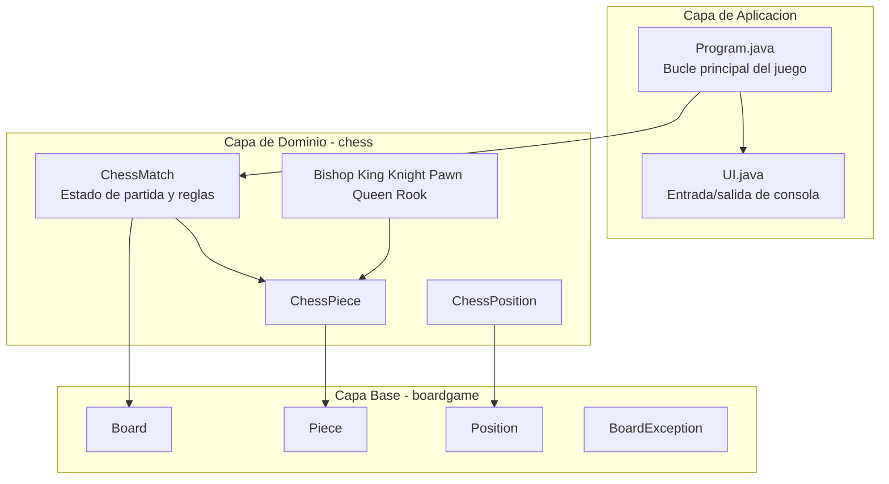

Puntos de diseno:

- Herencia entre pieza generica y pieza de ajedrez.
- Encapsulacion de cambios del tablero en Board y ChessMatch.
- Reglas centralizadas en ChessMatch.

---

## Stack Tecnologico

| Capa | Tecnologia | Proposito |
|---|---|---|
| Lenguaje | Java 21+ | Logica de juego y modelo de objetos |
| Build | Apache Ant + archivos de NetBeans | Compilar y ejecutar |
| UI | Consola con ANSI | Render de tablero y entrada |
| Arquitectura | OOP | Herencia, abstraccion, encapsulacion |

---

## Estructura del Proyecto

```text
chess_system_java/
|-- build.xml
|-- manifest.mf
|-- README.md
|-- README_PT.md
|-- README_ES.md
|-- nbproject/
|   |-- build-impl.xml
|   |-- project.properties
|   `-- ...
`-- src/
    |-- Program.java
    |-- UI.java
    |-- boardgame/
    |   |-- Board.java
    |   |-- BoardException.java
    |   |-- Piece.java
    |   `-- Position.java
    `-- chess/
        |-- ChessException.java
        |-- ChessMatch.java
        |-- ChessPiece.java
        |-- ChessPosition.java
        |-- Color.java
        `-- pieces/
            |-- Bishop.java
            |-- King.java
            |-- Knight.java
            |-- Pawn.java
            |-- Queen.java
            `-- Rook.java
```

---

## Reglas Implementadas

### Reglas estandar

- Movimiento por tipo de pieza.
- Capturas.
- Alternancia de turnos (WHITE y BLACK).
- Bloqueo de jugadas que dejan al propio rey en jaque.
- Deteccion de jaque y jaque mate.

### Reglas especiales

- Enroque:
  - Enroque corto.
  - Enroque largo.
  - Requiere rey/torre sin movimientos y camino libre.
- En passant:
  - Control por enPassantVulnerable.
  - Disponible inmediatamente despues del doble avance rival.
- Promocion:
  - Promocion automatica a Reina en la ultima fila.
  - Tipos aceptados: B (Alfil), H (Caballo), R (Torre), Q (Reina).

---

## Responsabilidades de Clases

| Clase | Responsabilidad |
|---|---|
| Program | Bucle principal, secuencia de entradas y manejo de excepciones |
| UI | Render en consola, impresion de tablero, lectura de posicion |
| ChessMatch | Ciclo de partida, ejecucion de jugadas, validaciones y jaque mate |
| ChessPiece | Abstraccion de pieza con color y contador de movimientos |
| ChessPosition | Conversion entre notacion (a1-h8) y coordenadas de matriz |
| Board | Matriz generica y operaciones de colocar/quitar piezas |
| Piece | Contrato generico de movimientos posibles |
| Bishop/King/Knight/Pawn/Queen/Rook | Logica especifica de movimiento |

---

## Flujo de Ejecucion

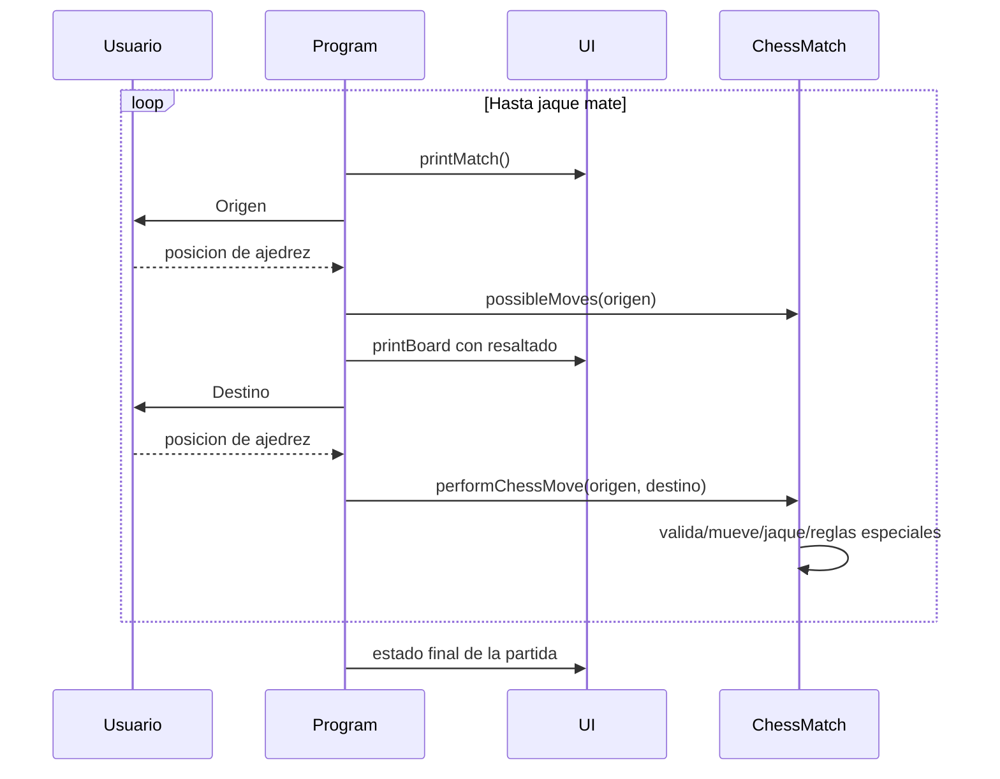

---

## 📚 Documentacion de Ingenieria de Software

<div align="center">

Requisitos, UML, modelado de datos y artefactos de UX de forma condensada.
Haz clic en cada item para expandir / contraer.

</div>

### 📋 Requisitos

<details>
<summary><b>✅ Requisitos Funcionales (RF)</b></summary>

| ID | Requisito |
|---|---|
| RF-01 | Permitir que dos jugadores alternen turnos (Blanco / Negro). |
| RF-02 | Calcular los movimientos legales de cada tipo de pieza. |
| RF-03 | Rechazar cualquier jugada que deje al propio rey en jaque. |
| RF-04 | Detectar jaque y jaque mate despues de cada jugada. |
| RF-05 | Soportar enroque (corto y largo). |
| RF-06 | Soportar captura al paso (en passant). |
| RF-07 | Soportar promocion de peon con la pieza elegida por el jugador. |
| RF-08 | Renderizar el tablero y las piezas capturadas despues de cada jugada. |
| RF-09 | Finalizar la partida automaticamente en jaque mate. |

</details>

<details>
<summary><b>⚙️ Requisitos No Funcionales (RNF)</b></summary>

| ID | Requisito | Categoria |
|---|---|---|
| RNF-01 | La validacion de jugadas responde en < 50 ms | Rendimiento |
| RNF-02 | Se ejecuta en cualquier SO con JDK 21+ | Portabilidad |
| RNF-03 | Mensajes de error claros ante entradas invalidas | Usabilidad |
| RNF-04 | Separacion estricta entre las capas genericas `boardgame` y de dominio `chess` | Mantenibilidad |
| RNF-05 | Ningun estado de tablero invalido puede alcanzarse | Confiabilidad |
| RNF-06 | Compila sin advertencias con `javac -Xlint` | Calidad de Codigo |

</details>

<details>
<summary><b>📏 Reglas de Negocio (RN)</b></summary>

| ID | Regla |
|---|---|
| RN-01 | Una jugada que exponga al propio rey al jaque es ilegal. |
| RN-02 | El enroque requiere que el rey y la torre nunca se hayan movido, camino libre, y que el rey no este en jaque ni pase por casillas atacadas. |
| RN-03 | La captura al paso solo es valida en la jugada inmediatamente posterior al avance de dos casillas del peon rival. |
| RN-04 | Un peon que alcance la ultima fila debe ser promovido (por defecto: Dama). |
| RN-05 | El jaque mate finaliza la partida; no se aceptan mas jugadas. |
| RN-06 | Un jugador solo puede mover sus propias piezas, y solo en su turno. |

</details>

<details>
<summary><b>🌐 Requisitos de Dominio</b></summary>

- Todas las reglas de movimiento, captura, jaque, jaque mate y tablas siguen las reglas estandar de la FIDE.
- El tablero es una cuadricula 8x8 direccionada en notacion algebraica (`a1`-`h8`).
- Cada pieza guarda `color` (WHITE/BLACK) y un `moveCount`, usados en el enroque, la captura al paso y el primer movimiento del peon.

</details>

<details>
<summary><b>🗄️ Requisitos de Datos</b></summary>

- **Board**: matriz 8x8 de referencias `Piece` (anulables).
- **ChessMatch**: `turn`, `currentPlayer`, `check`, `checkMate`, `enPassantVulnerable`, `promoted`, `piecesOnTheBoard`, `capturedPieces`.
- **ChessPosition**: `column` (a-h) y `row` (1-8), convertidos a coordenadas de la matriz.

</details>

<details>
<summary><b>🖥️ Requisitos de Interfaz</b></summary>

- Entrada/salida unicamente en modo texto por consola.
- Entrada de jugada como dos posiciones (ej.: `e2` y luego `e4`).
- Tablero renderizado con colores ANSI; los movimientos posibles se resaltan.
- La eleccion de promocion se ingresa como un solo caracter (`B`/`N`/`R`/`Q`).

</details>

<details>
<summary><b>🎯 Casos de Uso</b></summary>

| ID | Caso de Uso | Actor Principal | Resumen |
|---|---|---|---|
| UC-01 | Realizar Jugada | Jugador | Selecciona origen/destino; el sistema valida y aplica la jugada. |
| UC-02 | Enroque | Jugador | Mueve el rey dos casillas hacia una torre bajo las condiciones del enroque. |
| UC-03 | Captura al Paso | Jugador | Captura un peon adyacente que avanzo dos casillas. |
| UC-04 | Promover Peon | Jugador | Elige la pieza de reemplazo cuando un peon alcanza la ultima fila. |
| UC-05 | Detectar Jaque / Jaque Mate | Sistema | Evalua la seguridad del rey tras cada jugada; finaliza la partida en jaque mate. |
| UC-06 | Iniciar Nueva Partida | Jugador | Inicializa el tablero en la posicion inicial estandar. |

</details>

<details>
<summary><b>🔗 Matriz de Trazabilidad de Requisitos</b></summary>

| Requisito(s) | Caso de Uso | Clase(s) |
|---|---|---|
| RF-01, RN-06 | UC-01, UC-06 | `ChessMatch`, `Program` |
| RF-02 | UC-01 | `Bishop`, `King`, `Knight`, `Pawn`, `Queen`, `Rook` |
| RF-03, RN-01 | UC-01, UC-05 | `ChessMatch#testCheck`, `King` |
| RF-04, RN-05 | UC-05 | `ChessMatch#testCheckMate` |
| RF-05, RN-02 | UC-02 | `ChessMatch`, `King`, `Rook` |
| RF-06, RN-03 | UC-03 | `ChessMatch`, `Pawn` |
| RF-07, RN-04 | UC-04 | `ChessMatch`, `Pawn`, `UI` |
| RF-08 | todos | `UI`, `Board` |

</details>

<details>
<summary><b>📄 Especificacion de Requisitos de Software (SRS)</b></summary>

Este README forma un SRS condensado (inspirado en IEEE 830):

- **Introduccion / alcance** → [Resumen](#resumen)
- **Contexto del sistema** → [Arquitectura](#arquitectura)
- **Requisitos especificos** → Requisitos Funcionales, No Funcionales, Reglas de Negocio y Casos de Uso arriba
- **Vista de diseno** → [Responsabilidades de Clases](#responsabilidades-de-clases) y los diagramas UML abajo
- **Supuestos / pendientes** → [Limitaciones Conocidas](#limitaciones-conocidas)

</details>

---

### 🧩 Diagramas UML

<details>
<summary><b>🎭 Diagrama de Casos de Uso</b></summary>

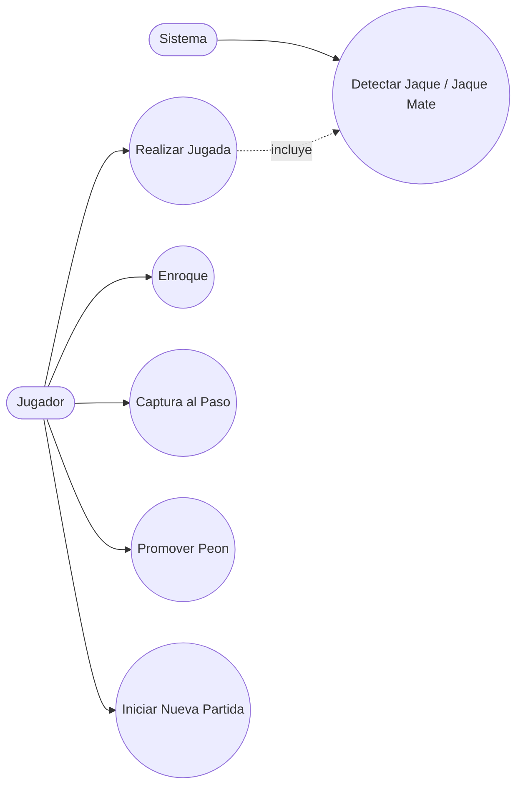

</details>

<details>
<summary><b>🏗️ Diagrama de Clases</b></summary>

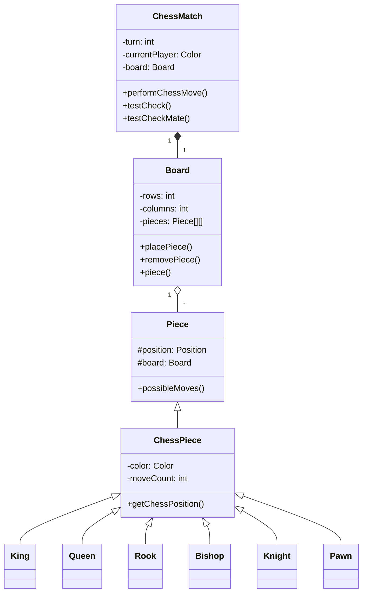

</details>

<details>
<summary><b>🧱 Diagrama de Objetos</b></summary>

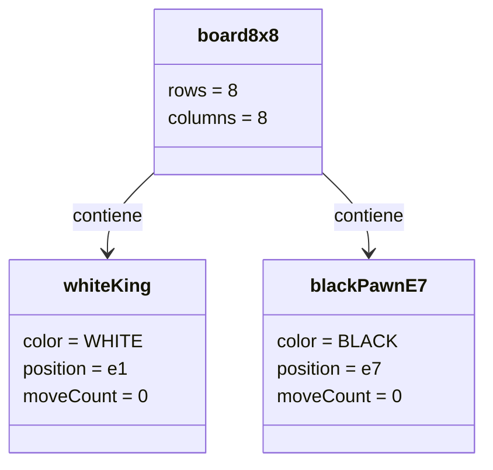

</details>

<details>
<summary><b>🔁 Diagrama de Secuencia</b></summary>

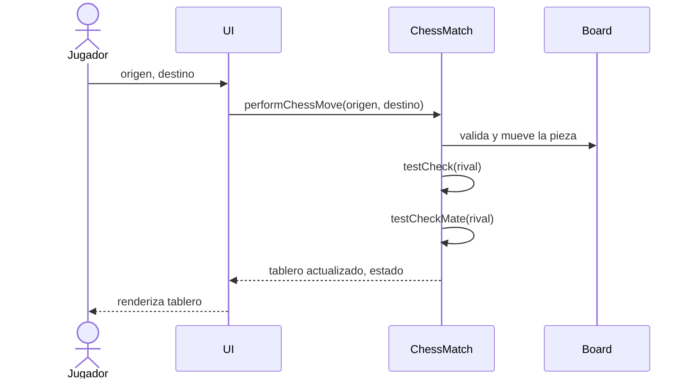

</details>

<details>
<summary><b>💬 Diagrama de Comunicacion</b></summary>

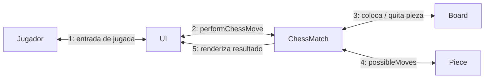

</details>

<details>
<summary><b>🏃 Diagrama de Actividades</b></summary>

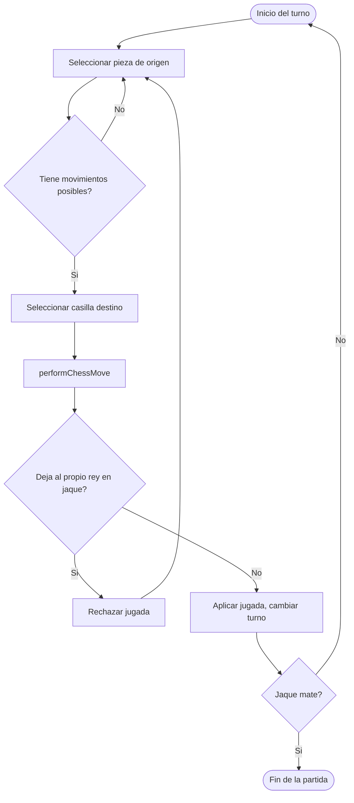

</details>

<details>
<summary><b>🔄 Diagrama de Maquina de Estados</b></summary>

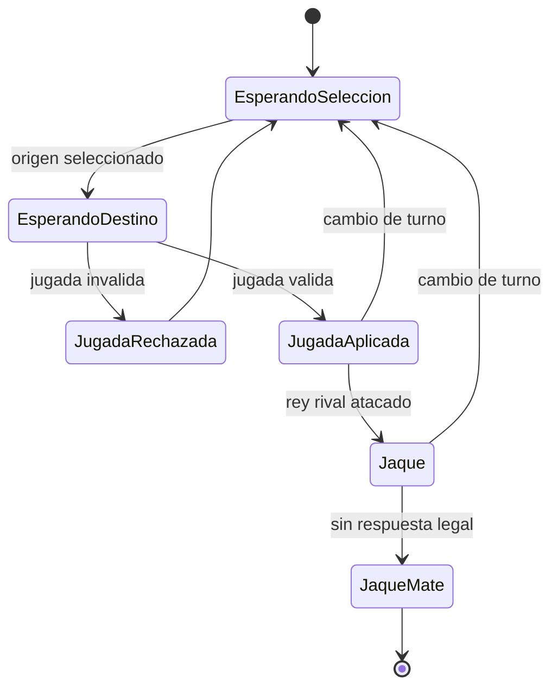

</details>

<details>
<summary><b>🧩 Diagrama de Componentes</b></summary>

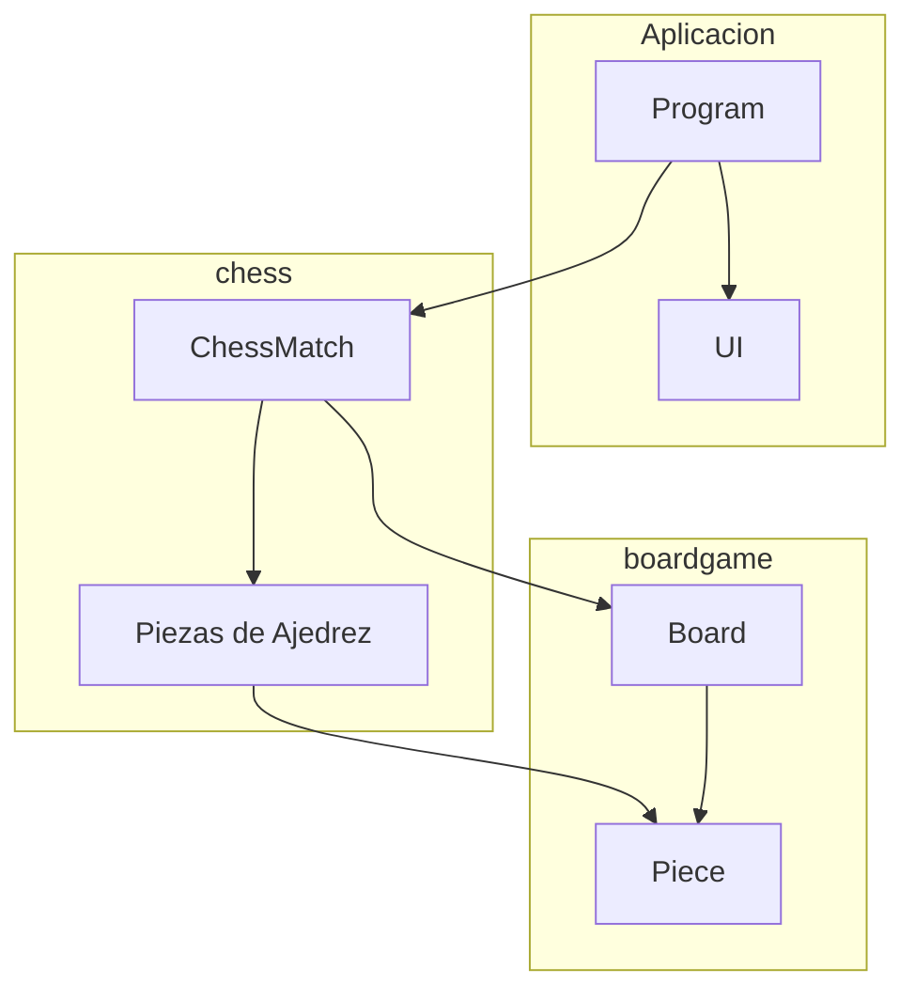

</details>

<details>
<summary><b>🚀 Diagrama de Despliegue</b></summary>

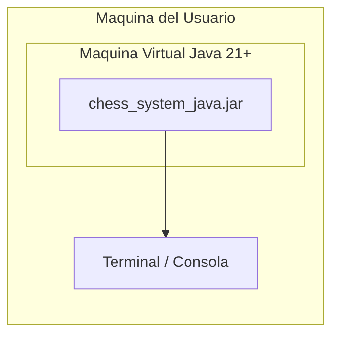

</details>

<details>
<summary><b>📦 Diagrama de Paquetes</b></summary>

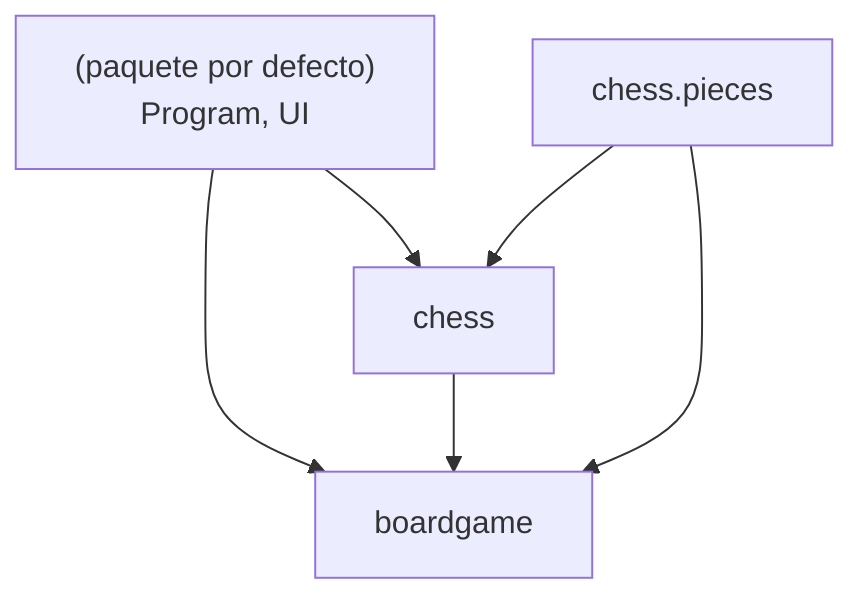

</details>

<details>
<summary><b>🧬 Diagrama de Estructura Compuesta</b></summary>

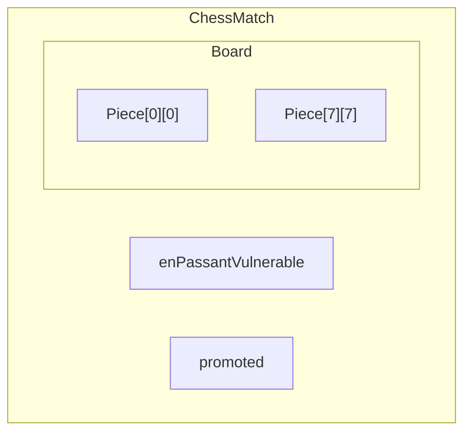

</details>

<details>
<summary><b>🗺️ Diagrama de Vision General de Interaccion</b></summary>

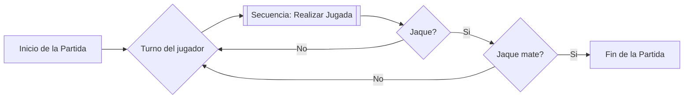

</details>

<details>
<summary><b>⏱️ Diagrama de Tiempo (Timing)</b></summary>

| Turno | currentPlayer | check | checkMate | Evento |
|---|---|---|---|---|
| 1 | WHITE | false | false | e2 → e4 |
| 2 | BLACK | false | false | e7 → e5 |
| 3 | WHITE | false | false | Bf1 → c4 |
| ... | ... | ... | ... | ... |
| n | BLACK | true | true | Qh4 → f2# |

</details>

---

### 🗃️ Modelado de Datos

<details>
<summary><b>🔗 Diagrama Entidad-Relacion (DER)</b></summary>

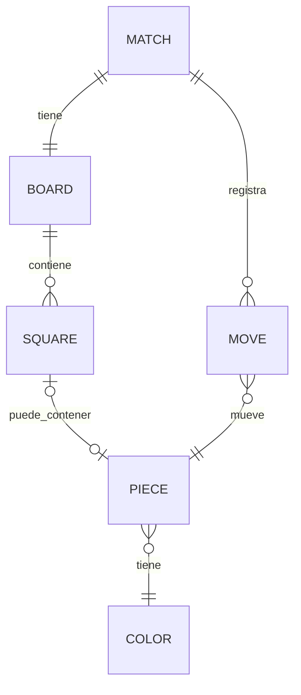

</details>

<details>
<summary><b>💡 Modelo Conceptual de Datos</b></summary>

- **Match**: una sesion de partida.
- **Board**: cuadricula 8x8 de Squares.
- **Square**: identificada por columna (a-h) y fila (1-8).
- **Piece**: tipo (King/Queen/Rook/Bishop/Knight/Pawn), color, posicion, moveCount.
- **Move**: casilla origen, casilla destino, pieza capturada (opcional), indicador de jugada especial (opcional).

</details>

<details>
<summary><b>🧮 Modelo Logico de Datos</b></summary>

| Entidad | Atributos |
|---|---|
| Match | turn: int, currentPlayer: enum, check: bool, checkMate: bool |
| Board | rows: int, columns: int |
| Piece | type: enum, color: enum, position: (col, row), moveCount: int |
| Move | source: (col, row), target: (col, row), capturedPiece: Piece?, specialMove: enum? |

</details>

<details>
<summary><b>⚙️ Modelo Fisico de Datos</b></summary>

| Entidad Logica | Representacion en Java | Tabla SQL Hipotetica |
|---|---|---|
| Match | campos de `ChessMatch` | `matches(id, turn, current_player, check, checkmate)` |
| Board | `Piece[8][8]` dentro de `Board` | `board_squares(match_id, col, row, piece_id)` |
| Piece | subclases de `ChessPiece` | `pieces(id, type, color, move_count)` |
| Move | no persistido actualmente | `moves(id, match_id, source, target, captured_piece_id, special_move)` |

</details>

<details>
<summary><b>📖 Diccionario de Datos</b></summary>

| Campo | Tipo | Dominio | Descripcion |
|---|---|---|---|
| color | enum | WHITE, BLACK | Dueno de la pieza / jugador actual |
| column | char | a-h | Columna del tablero (notacion algebraica) |
| row | int | 1-8 | Fila del tablero (notacion algebraica) |
| moveCount | int | >= 0 | Veces que la pieza se ha movido |
| check | boolean | true/false | Si el rey del jugador actual esta atacado |
| checkMate | boolean | true/false | Si no hay respuesta legal al jaque |
| promoted | ChessPiece | anulable | Peon pendiente de promocion |

</details>

<details>
<summary><b>🌊 Diagrama de Flujo de Datos (DFD)</b></summary>

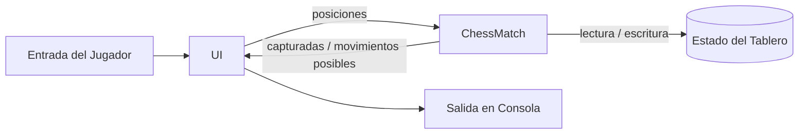

</details>

<details>
<summary><b>🧵 Diagrama de Linaje de Datos</b></summary>

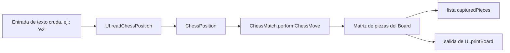

</details>

---

### 🏛️ Arquitectura y Flujo

<details>
<summary><b>🏛️ Diagrama de Arquitectura (vision general)</b></summary>

Ver el diagrama completo en la seccion [Arquitectura](#arquitectura) arriba — organizado en `Aplicacion` (`Program`, `UI`), `chess` (reglas de dominio) y `boardgame` (motor generico de tablero).

</details>

<details>
<summary><b>📐 Diagrama de Flujo (bucle principal)</b></summary>

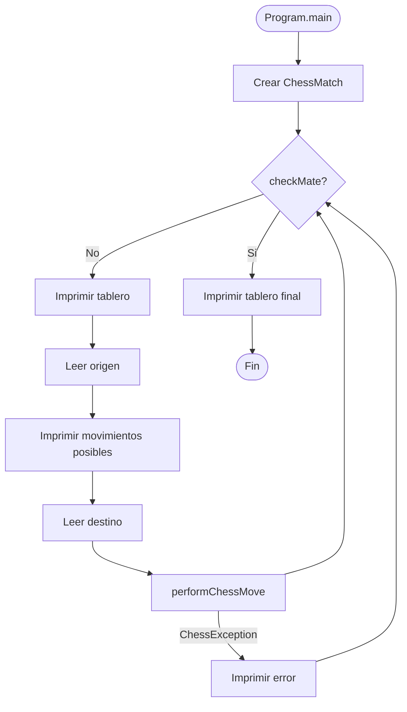

</details>

---

### 🎨 Artefactos de UX

<details>
<summary><b>🧑 Persona</b></summary>

**Alex, "El Estratega Casual"**

- **Edad**: 28
- **Objetivo**: Jugar una partida rapida de ajedrez con un amigo en una misma terminal.
- **Familiaridad tecnologica**: Comodo con la linea de comandos.
- **Frustracion**: Quiere retroalimentacion clara sobre jugadas ilegales y de quien es el turno.

</details>

<details>
<summary><b>🗺️ Mapa de Jornada del Usuario</b></summary>

| Etapa | Accion | Sentimiento | Punto de Dolor | Oportunidad |
|---|---|---|---|---|
| Inicio | Ejecutar `ant run` / `java Program` | Curioso | Necesita el JDK instalado | Ofrecer un JAR precompilado |
| Configuracion | Ver el tablero inicial | Familiar | Ninguno | - |
| Juego | Ingresar casillas origen/destino | Concentrado | Errores de tipeo causan fallos | Mensajes de validacion mas amigables |
| Jugada especial | Enroque / al paso / promocion | Encantado | Inseguro de cuando esta disponible | Resaltar jugadas especiales legales |
| Fin | Mensaje de jaque mate | Satisfecho | Sin opcion de revancha/guardar | Agregar guardar/exportar (PGN) |

</details>

<details>
<summary><b>🖼️ Wireframe</b></summary>

```text
+------------------------------------+
| Turno: 5      Esperando: WHITE      |
|                                      |
| 8 r n b q k b n r                   |
| 7 p p p p . p p p                   |
| 6 . . . . . . . .                   |
| 5 . . . . p . . .                   |
| 4 . . . . P . . .                   |
| 3 . . . . . . . .                   |
| 2 P P P P . P P P                   |
| 1 R N B Q K B N R                   |
|   a b c d e f g h                   |
|                                      |
| Capturadas - WHITE: []  BLACK: []   |
| Origen: _   Destino: _               |
+------------------------------------+
```

</details>

<details>
<summary><b>🎭 Mockup</b></summary>

```text
Leyenda:
  [x] = casilla de movimiento posible resaltada
  Letras cyan      = piezas WHITE
  Letras amarillas = piezas BLACK

   a  b  c  d  e  f  g  h
8  r  n  b  q  k  b  n  r
7  p  p  p  p  .  p  p  p
6  .  .  .  .  .  .  .  .
5  .  .  .  . [p] .  .  .
4  .  .  .  . [P] .  .  .
3  .  .  .  .  .  .  .  .
2  P  P  P  P  .  P  P  P
1  R  N  B  Q  K  B  N  R
```

</details>

---

## Como Ejecutar

### Requisitos

- JDK 21 o superior.
- Opcional: Apache NetBeans.
- Opcional: Apache Ant.

### Opcion 1: NetBeans

1. Abre la carpeta del proyecto en NetBeans.
2. Ejecuta el proyecto (F6).
3. Clase principal: Program.

### Opcion 2: Ant

Desde la raiz del repositorio:

```bash
ant run
```

### Opcion 3: javac/java

Desde la raiz del repositorio:

```bash
cd src
javac Program.java UI.java boardgame/*.java chess/*.java chess/pieces/*.java
java Program
```

En Windows PowerShell:

```powershell
cd src
javac Program.java UI.java boardgame\*.java chess\*.java chess\pieces\*.java
java Program
```

---

## Como Jugar

1. Escribe la casilla de origen en formato algebraico, por ejemplo e2.
2. Escribe la casilla de destino, por ejemplo e4.
3. Sigue el indicador de turno en consola.
4. Continua hasta jaque mate.

La consola muestra:

- Turno actual.
- Jugador actual.
- Estado de jaque.
- Lista de piezas capturadas.

---

## Limitaciones Conocidas

- Sin interfaz grafica (solo consola).
- Sin persistencia de partidas (estado en memoria).
- Sin suite automatica de pruebas en el repositorio.
- Algunos mensajes visibles al usuario estan en portugues.

---

## Contribucion

1. Haz un fork del repositorio.
2. Crea una branch de funcionalidad.
3. Haz commit con mensajes claros.
4. Abre un pull request explicando el cambio.

Buenas areas para contribuir:

- Pruebas unitarias de movimientos y escenarios de jaque mate.
- Internacionalizacion de mensajes de UI.
- Exportacion/importacion opcional de PGN.
- Reglas de tablas (triple repeticion, regla de 50 movimientos, etc.).

---

## Autor

Victor H. J. Santiago

- GitHub: https://github.com/VictorHJesusSantiago
- LinkedIn: https://www.linkedin.com/in/victor-henrique-de-jesus-santiago/

---

## Licencia

Licencia MIT.

Si el archivo LICENSE todavia no existe en tu clon local, agregalo antes de publicar trabajos derivados.

---

<div align="center">
Proyecto hecho para estudio, practica de arquitectura e implementacion limpia de reglas de ajedrez en Java.
</div>
