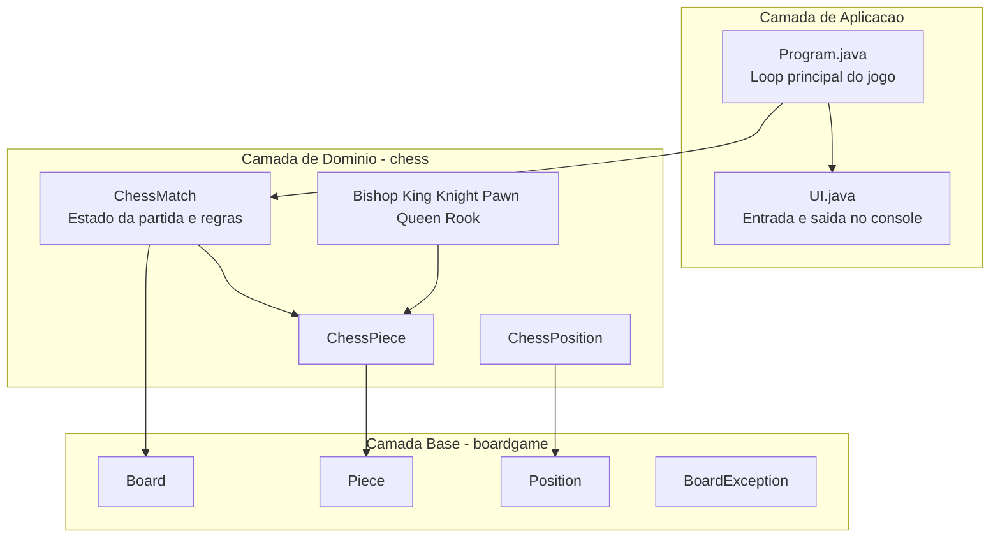
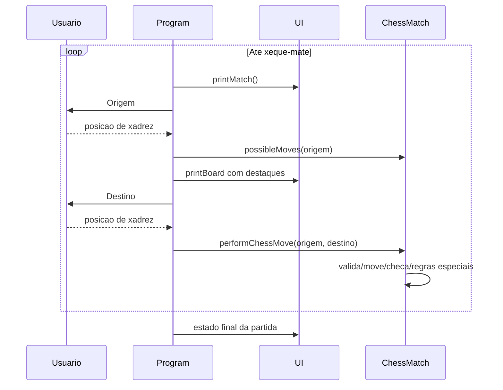

<div align="center">

**Choose Language / Selecione o Idioma / Elija el Idioma**

[](README.md)
[](README_PT.md)
[](README_ES.md)

</div>

---

<div align="center">

# Sistema de Xadrez Java

Implementacao completa de xadrez em console com Java, com arquitetura em camadas,
validacao de jogadas, deteccao de xeque/xeque-mate e regras especiais.


</div>

---

## Sumario

- [Visao Geral](#visao-geral)
- [Arquitetura](#arquitetura)
- [Stack Tecnologica](#stack-tecnologica)
- [Estrutura do Projeto](#estrutura-do-projeto)
- [Regras Implementadas](#regras-implementadas)
- [Responsabilidades das Classes](#responsabilidades-das-classes)
- [Fluxo de Execucao](#fluxo-de-execucao)
- [Como Executar](#como-executar)
- [Como Jogar](#como-jogar)
- [Limitacoes Conhecidas](#limitacoes-conhecidas)
- [Contribuicao](#contribuicao)
- [Autor](#autor)
- [Licenca](#licenca)

---

## Visao Geral

Chess System Java e um jogo de xadrez em terminal focado em design limpo e logica confiavel.

O projeto esta organizado em duas camadas:

- boardgame: abstracoes genericas de tabuleiro reutilizaveis.
- chess: regras especificas de xadrez e estado da partida.

Implementado atualmente:

- Ciclo completo por turnos.
- Geracao de movimentos legais por peca.
- Bloqueio de jogadas ilegais.
- Deteccao de xeque e xeque-mate.
- Roque pequeno e grande.
- En passant.
- Promocao de peao (rainha por padrao, com substituicao manual).

---

## Arquitetura



Pontos de design:

- Heranca entre peca generica e peca de xadrez.
- Encapsulamento de mutacao do tabuleiro em Board e ChessMatch.
- Regras centralizadas em ChessMatch.

---

## Stack Tecnologica

| Camada | Tecnologia | Finalidade |
|---|---|---|
| Linguagem | Java 21+ | Logica de jogo e modelo de objetos |
| Build | Apache Ant + arquivos do NetBeans | Compilar e executar |
| UI | Console com ANSI | Renderizacao do tabuleiro e entrada |
| Arquitetura | OOP | Heranca, abstracao e encapsulamento |

---

## Estrutura do Projeto

```text
chess_system_java/
|-- build.xml
|-- manifest.mf
|-- README.md
|-- README_PT.md
|-- README_ES.md
|-- nbproject/
|   |-- build-impl.xml
|   |-- project.properties
|   `-- ...
`-- src/
    |-- Program.java
    |-- UI.java
    |-- boardgame/
    |   |-- Board.java
    |   |-- BoardException.java
    |   |-- Piece.java
    |   `-- Position.java
    `-- chess/
        |-- ChessException.java
        |-- ChessMatch.java
        |-- ChessPiece.java
        |-- ChessPosition.java
        |-- Color.java
        `-- pieces/
            |-- Bishop.java
            |-- King.java
            |-- Knight.java
            |-- Pawn.java
            |-- Queen.java
            `-- Rook.java
```

---

## Regras Implementadas

### Regras padrao

- Movimentacao por tipo de peca.
- Capturas.
- Alternancia de turnos (WHITE e BLACK).
- Bloqueio de jogadas que deixam o proprio rei em xeque.
- Deteccao de xeque e xeque-mate.

### Regras especiais

- Roque:
  - Roque pequeno.
  - Roque grande.
  - Exige rei/torre sem movimentos e casas livres.
- En passant:
  - Controle por enPassantVulnerable.
  - Disponivel logo apos avanco duplo do peao adversario.
- Promocao:
  - Promocao automatica para Rainha ao chegar na ultima fileira.
  - Tipos aceitos: B (Bispo), H (Cavalo), R (Torre), Q (Rainha).

---

## Responsabilidades das Classes

| Classe | Responsabilidade |
|---|---|
| Program | Loop principal, sequencia de entrada e tratamento de excecoes |
| UI | Renderizacao no console, impressao de tabuleiro, leitura de posicao |
| ChessMatch | Ciclo da partida, execucao de jogadas, validacoes e xeque-mate |
| ChessPiece | Abstracao de peca de xadrez com cor e contador de movimentos |
| ChessPosition | Conversao entre notacao (a1-h8) e coordenadas de matriz |
| Board | Matriz generica e operacoes de posicionar/remover |
| Piece | Contrato generico de movimentos possiveis |
| Bishop/King/Knight/Pawn/Queen/Rook | Logica especifica de movimento |

---

## Fluxo de Execucao



---

## Como Executar

### Pre-requisitos

- JDK 21 ou superior.
- Opcional: Apache NetBeans.
- Opcional: Apache Ant.

### Opcao 1: NetBeans

1. Abra a pasta do projeto no NetBeans.
2. Execute o projeto (F6).
3. Classe principal: Program.

### Opcao 2: Ant

Na raiz do repositorio:

```bash
ant run
```

### Opcao 3: javac/java

Na raiz do repositorio:

```bash
cd src
javac Program.java UI.java boardgame/*.java chess/*.java chess/pieces/*.java
java Program
```

No Windows PowerShell:

```powershell
cd src
javac Program.java UI.java boardgame\*.java chess\*.java chess\pieces\*.java
java Program
```

---

## Como Jogar

1. Digite a casa de origem no formato algebrico, por exemplo e2.
2. Digite a casa de destino, por exemplo e4.
3. Siga o indicador de turno no console.
4. Continue ate ocorrer xeque-mate.

O console mostra:

- Turno atual.
- Jogador da vez.
- Estado de xeque.
- Lista de pecas capturadas.

---

## Limitacoes Conhecidas

- Sem interface grafica (somente console).
- Sem persistencia de partidas (estado apenas em memoria).
- Sem suite automatizada de testes no repositorio.
- Mensagens ao usuario estao majoritariamente em portugues.

---

## Contribuicao

1. Faça um fork do repositorio.
2. Crie uma branch de feature.
3. Commit com mensagens claras.
4. Abra um pull request descrevendo a alteracao.

Boas frentes para contribuir:

- Testes unitarios para movimentos e cenarios de xeque-mate.
- Internacionalizacao das mensagens da UI.
- Exportacao/importacao opcional de PGN.
- Regras de empate (tripla repeticao, 50 lances, etc.).

---

## Autor

Victor H. J. Santiago

- GitHub: https://github.com/VictorHJesusSantiago
- LinkedIn: https://www.linkedin.com/in/victor-henrique-de-jesus-santiago/

---

## Licenca

Licenca MIT.

Se o arquivo LICENSE ainda nao estiver no clone local, adicione-o antes de publicar trabalhos derivados.

---

<div align="center">
Projeto feito para estudo, pratica de arquitetura e implementacao limpa de regras de xadrez em Java.
</div>
