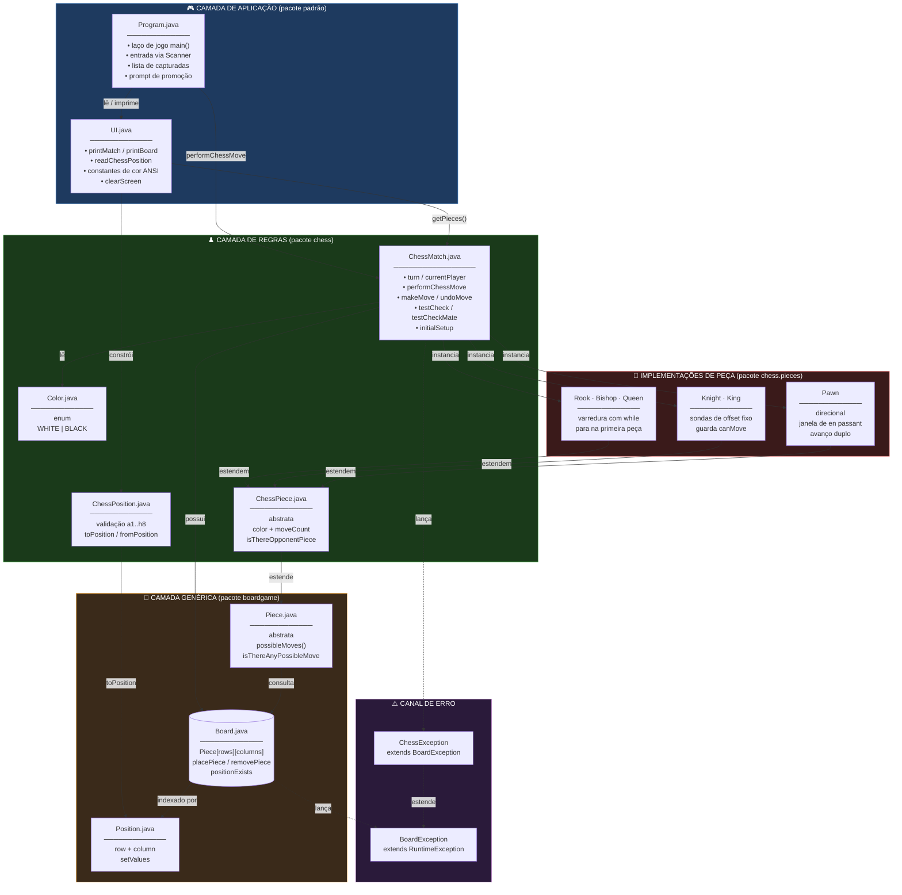
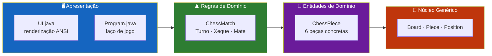
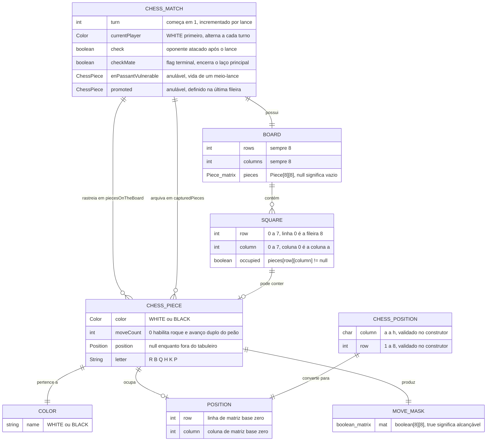
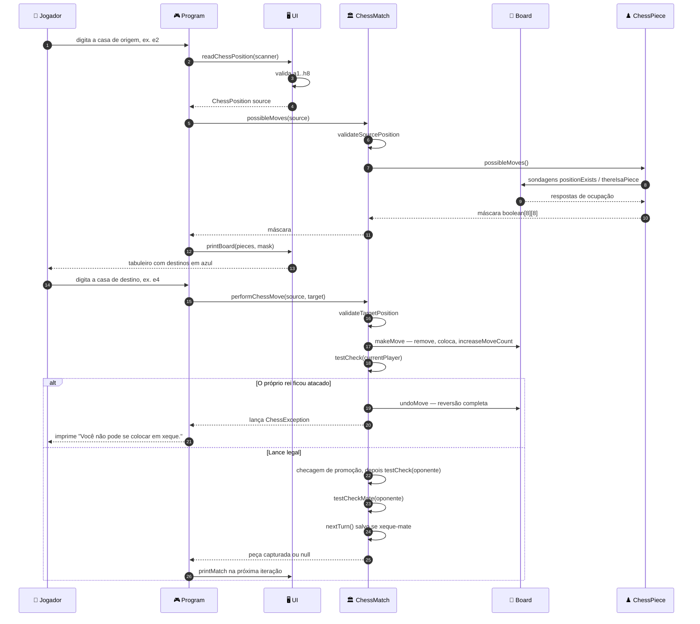
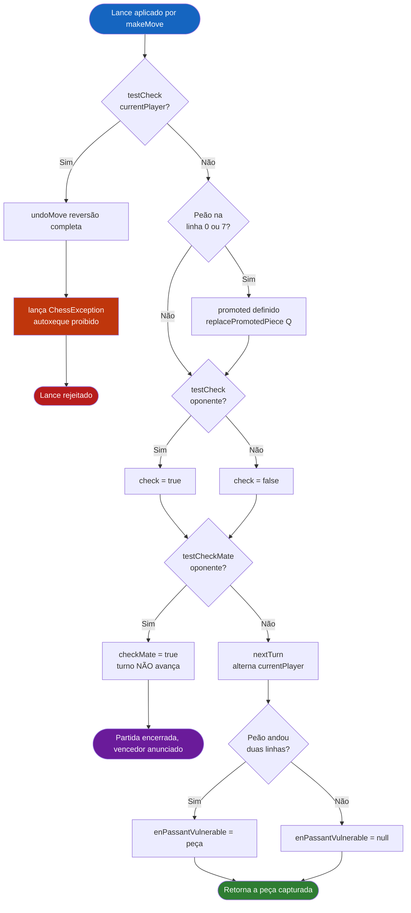
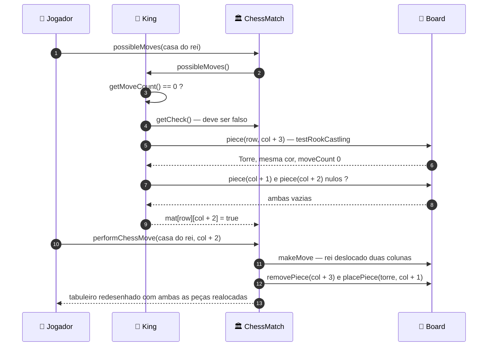
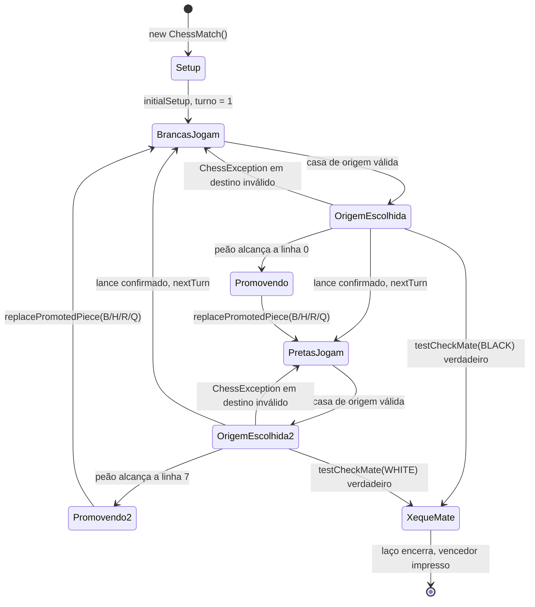
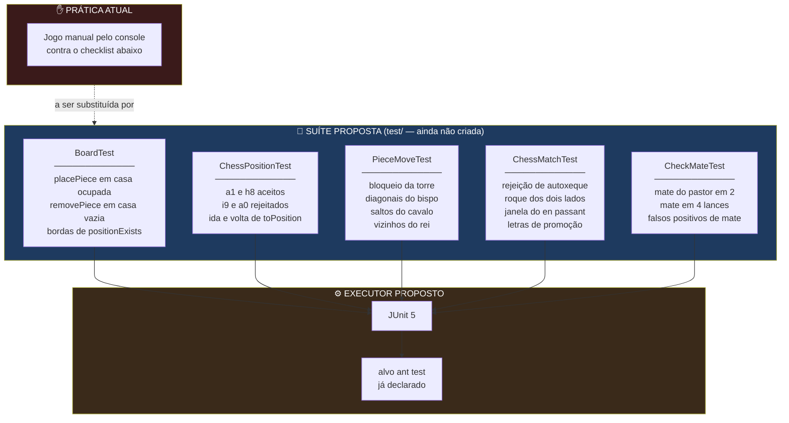

<div align="center">

**🌐 Choose Language / Selecione o Idioma / Elija el Idioma**

[](README.md)&nbsp;&nbsp;&nbsp;[](README_PT.md)&nbsp;&nbsp;&nbsp;[](README_ES.md)

</div>

---

<div align="center">

```
 ██████╗██╗  ██╗███████╗███████╗███████╗
██╔════╝██║  ██║██╔════╝██╔════╝██╔════╝
██║     ███████║█████╗  ███████╗███████╗
██║     ██╔══██║██╔══╝  ╚════██║╚════██║
╚██████╗██║  ██║███████╗███████║███████║
 ╚═════╝╚═╝  ╚═╝╚══════╝╚══════╝╚══════╝
       Motor de Xadrez Orientado a Objetos para o Terminal
```

---

[](https://openjdk.org/)
[](https://ant.apache.org/)
[](https://netbeans.apache.org/)
[]()
[]()
[]()
[]()

<br/>

> **Uma partida completa de xadrez para dois jogadores renderizada no terminal,**
> construída sobre uma camada genérica de tabuleiro reutilizável e uma camada de regras de xadrez empilhada sobre ela.

<br/>


</div>

---

## 📑 Índice

<details>
<summary>▶️ <strong>Clique para expandir / recolher esta seção</strong></summary>

<table>
<tr>
<td valign="top" width="50%">

**🏗️ Sistema**
- [Visão Geral](#-visão-geral)
- [Arquitetura do Sistema](#-arquitetura-do-sistema)
- [Stack Tecnológica](#-stack-tecnológica)
- [Padrões de Projeto](#-padrões-de-projeto-aplicados)
- [Estrutura do Projeto](#-estrutura-do-projeto)

**📦 Módulos**
- [Program — Ponto de Entrada](#-program--ponto-de-entrada-da-aplicação)
- [UI — Renderizador de Console](#-ui--renderizador-de-console)
- [Board — Matriz Genérica](#-board--matriz-genérica-de-tabuleiro)
- [Piece — Contrato Abstrato](#-piece--contrato-abstrato-de-movimento)
- [ChessMatch — Orquestrador](#-chessmatch--orquestrador-de-regras)
- [ChessPiece — Semântica de Xadrez](#-chesspiece--semântica-de-xadrez)
- [ChessPosition — Coordenada Algébrica](#-chessposition--coordenada-algébrica)
- [Peças Deslizantes](#-peças-deslizantes--torre-bispo-dama)
- [Knight — Saltos Fixos](#-knight--saltador-de-deslocamento-fixo)
- [King — Anfitrião do Roque](#-king--anfitrião-do-roque)
- [Pawn — En Passant e Promoção](#-pawn--anfitrião-do-en-passant-e-da-promoção)
- [Hierarquia de Exceções](#-hierarquia-de-exceções)

</td>
<td valign="top" width="50%">

**💼 Negócio**
- [Regras de Negócio](#-regras-de-negócio)
- [Requisitos Funcionais](#-requisitos-funcionais)
- [Requisitos Não Funcionais](#-requisitos-não-funcionais)

**📐 Design**
- [Modelo de Dados](#-modelo-de-dados)
- [Fluxos do Sistema](#-fluxos-do-sistema)
- [Fluxo de Execução de Lance](#fluxo-de-execução-de-lance)
- [Fluxo de Detecção de Xeque](#fluxo-de-detecção-de-xeque-e-xeque-mate)
- [Fluxo do Roque](#fluxo-do-roque)
- [Máquina de Estados da Partida](#máquina-de-estados-da-partida)

**🔐 Segurança & Operação**
- [Segurança](#-segurança)
- [Instalação & Execução](#-instalação--execução)
- [Testes Automatizados](#-testes-automatizados)
- [Métricas & Monitoramento](#-métricas--monitoramento)
- [Limitações Conhecidas](#-limitações-conhecidas)

</td>
</tr>
</table>

---

</details>

## 🌟 Visão Geral

<details>
<summary>▶️ <strong>Clique para expandir / recolher esta seção</strong></summary>

**chess_system** é um jogo de xadrez totalmente jogável, no modelo *hot-seat*, escrito em **Java puro** e sem nenhuma dependência externa. Dois jogadores humanos compartilham o mesmo terminal, digitando coordenadas algébricas como `e2` e `e4`, e o motor valida cada lance contra o conjunto completo de regras antes de aplicá-lo ao tabuleiro.

O código é deliberadamente dividido em **duas camadas empilhadas**. O pacote `boardgame` não sabe nada sobre xadrez: ele modela uma matriz `N × M` de objetos `Piece` abstratos, o conceito de `Position` e os invariantes de colocar e remover peças. O pacote `chess` fica por cima e adiciona tudo o que é específico do xadrez, ou seja, alternância de turnos, cores, notação algébrica, xeque, xeque-mate, roque, en passant e promoção. Essa separação significa que a camada inferior poderia hospedar damas ou outro jogo de grade sem uma única alteração.

A aplicação das regras é centralizada em `ChessMatch`, um orquestrador de 354 linhas que possui o tabuleiro, o contador de turnos, o jogador atual, as flags de xeque e xeque-mate, e dois inventários vivos de peças. Sua técnica mais característica é a **execução especulativa**: o lance é aplicado fisicamente com `makeMove`, a posição resultante é testada quanto a autoxeque, e `undoMove` reverte o tabuleiro átomo por átomo quando o lance é ilegal. O mesmo truque alimenta a detecção de xeque-mate, que percorre por força bruta todos os lances legais do lado ameaçado em busca de uma escapatória.

### 🎯 Objetivos do Sistema

| Objetivo | Descrição |
|----------|-----------|
| ♟️ **Conjunto Completo de Regras** | Os seis tipos de peça com movimento, captura e bloqueio corretos |
| 👑 **Lances Especiais** | Roque (pequeno e grande), en passant e promoção do peão |
| 🛡️ **Garantia de Legalidade** | Nenhum lance pode deixar ou colocar o próprio rei em xeque, verificado por simulação make/undo |
| 🏁 **Condições Terminais** | Detecção automática de xeque e xeque-mate, encerrando o laço principal |
| 🧱 **Separação de Camadas** | Um núcleo `boardgame` agnóstico ao xadrez reutilizado por uma camada `chess` específica |
| 🎨 **UI de Console Legível** | Grade 8×8 colorida com ANSI, réguas de coordenadas e destinos destacados |
| 🧯 **Tratamento Gracioso de Erros** | Exceções tipadas transformam entrada inválida em mensagem, nunca em queda do processo |
| 📦 **Zero Dependências** | Compila e executa em um JDK puro com o script Ant incluído |
| 🎓 **Artefato Didático** | Demonstra herança, polimorfismo, encapsulamento e abstração em um domínio coerente |

---

</details>

## 🏗️ Arquitetura do Sistema

<details>
<summary>▶️ <strong>Clique para expandir / recolher esta seção</strong></summary>

### Diagrama de Módulos



### Camadas da Arquitetura



---

</details>

## 🛠️ Stack Tecnológica

<details>
<summary>▶️ <strong>Clique para expandir / recolher esta seção</strong></summary>

<table>
<thead>
<tr>
<th>Camada</th>
<th>Tecnologia</th>
<th>Versão</th>
<th>Finalidade</th>
</tr>
</thead>
<tbody>
<tr>
<td rowspan="2"><strong>🧠 Linguagem</strong></td>
<td>Java SE</td>
<td>21</td>
<td>Nível de fonte e destino (<code>javac.source</code> / <code>javac.target</code> em <code>nbproject/project.properties</code>)</td>
</tr>
<tr>
<td>Codificação da fonte</td>
<td>UTF-8</td>
<td>Necessária para as mensagens acentuadas em português embutidas nos fontes</td>
</tr>
<tr>
<td rowspan="3"><strong>📚 Biblioteca Padrão</strong></td>
<td><code>java.util.Scanner</code></td>
<td>JDK</td>
<td>Lê a entrada do jogador linha a linha em <code>Program.main</code></td>
</tr>
<tr>
<td><code>java.util.List</code> / <code>ArrayList</code> / <code>stream</code></td>
<td>JDK</td>
<td>Inventários de peças, além de <code>filter</code> e <code>Collectors.toList()</code> em <code>testCheck</code>, <code>King()</code> e <code>printCapturedPieces</code></td>
</tr>
<tr>
<td><code>java.security.InvalidParameterException</code></td>
<td>JDK</td>
<td>Lançada por <code>replacePromotedPiece</code> diante de uma letra de promoção desconhecida</td>
</tr>
<tr>
<td rowspan="3"><strong>🔧 Build</strong></td>
<td>Apache Ant</td>
<td><code>build.xml</code></td>
<td>Delega ao <code>nbproject/build-impl.xml</code> gerado</td>
</tr>
<tr>
<td>Projeto NetBeans J2SE</td>
<td>schema 3</td>
<td><code>nbproject/project.xml</code> declara a raiz de fontes <code>src</code> e a de testes <code>test</code></td>
</tr>
<tr>
<td>Manifesto</td>
<td><code>manifest.mf</code></td>
<td><code>Main-Class</code> injetada no empacotamento a partir de <code>main.class=Program</code></td>
</tr>
<tr>
<td rowspan="2"><strong>🖥️ Interface</strong></td>
<td>Códigos de escape ANSI</td>
<td>—</td>
<td>16 constantes de cor mais a limpeza de tela <code>\033[H\033[2J</code>, todas declaradas em <code>UI.java</code></td>
</tr>
<tr>
<td>Notação algébrica</td>
<td><code>a1</code>–<code>h8</code></td>
<td>Contrato de entrada imposto pelo construtor de <code>ChessPosition</code></td>
</tr>
<tr>
<td rowspan="2"><strong>📦 Distribuição</strong></td>
<td>JAR executável</td>
<td><code>dist/chess_system.jar</code></td>
<td>Produzido por <code>ant jar</code>, executável com <code>java -jar</code></td>
</tr>
<tr>
<td>Dependências externas</td>
<td>nenhuma</td>
<td><code>javac.classpath</code> está vazio, o projeto compila apenas contra o JDK</td>
</tr>
</tbody>
</table>

---

</details>

## 🎨 Padrões de Projeto Aplicados

<details>
<summary>▶️ <strong>Clique para expandir / recolher esta seção</strong></summary>

| Padrão | Onde | Justificativa |
|--------|------|---------------|
| 🧬 **Template Method** | `Piece.possibleMoves()` abstrato, implementado pelas seis peças | O tabuleiro e a partida invocam uma assinatura e cada peça fornece sua própria geometria |
| 🏛️ **Arquitetura em Camadas** | Pacote `boardgame` versus pacote `chess` | A camada genérica de grade não importa nada da camada de xadrez, portanto permanece reutilizável |
| 🎭 **Polimorfismo** | `piecesOnTheBoard` tipado como `List<Piece>` | `testCheck` itera peças heterogêneas e chama um único método em todas elas |
| ↩️ **Memento (leve)** | Par `makeMove` / `undoMove` em `ChessMatch` | O tabuleiro é mutado especulativamente e restaurado campo a campo, incluindo posição da torre e contadores de lance |
| 🏭 **Factory Method** | `ChessMatch.newPiece(String, Color)` | Mapeia as letras de promoção `B`, `H`, `R`, `Q` para construtores concretos |
| 🎯 **Facade** | `ChessMatch.performChessMove(ChessPosition, ChessPosition)` | Uma chamada esconde validação, simulação, lances especiais, testes de xeque e avanço de turno |
| 🚦 **Guard Clause** | `validateSourcePosition` e `validateTargetPosition` | Entrada ilegal aborta com exceção tipada antes que qualquer mutação alcance o tabuleiro |
| 🧮 **Strategy por subclasse** | Varredura de `Rook`, `Bishop`, `Queen` versus sondagem de `Knight`, `King` | Dois algoritmos de movimento coexistem atrás do mesmo método abstrato |
| 🔒 **Encapsulamento com upcast protegido** | `Piece.position` é `protected`, `ChessPosition.toPosition()` é `protected` | A conversão de coordenadas fica restrita aos pacotes autorizados a conhecê-la |
| 🏷️ **Type Object** | Enum `Color` consultado por cada peça e por `ChessMatch.opponent` | A identidade do jogador é um valor, não um booleano, o que faz as regras lerem naturalmente |

---

</details>

## 📁 Estrutura do Projeto

<details>
<summary>▶️ <strong>Clique para expandir / recolher esta seção</strong></summary>

```
chess_system_java/
│
├── 📄 build.xml                          # Script Ant de entrada, importa nbproject/build-impl.xml
├── 📄 manifest.mf                        # Esqueleto do manifesto, Main-Class adicionada pelo build
├── 📄 .gitignore                         # Exclui build/, dist/ e arquivos privados da IDE
│
├── 📂 nbproject/                         # Metadados do projeto NetBeans J2SE
│   ├── 📄 build-impl.xml                 # Biblioteca Ant gerada (clean, compile, jar, run, test)
│   ├── 📄 project.xml                    # Tipo do projeto, raiz de fontes = src, de testes = test
│   ├── 📄 project.properties             # main.class=Program, javac.source=21, caminho do dist.jar
│   ├── 📄 genfiles.properties            # Checksums CRC dos arquivos de build gerados
│   └── 📂 private/                        # Configurações locais da máquina, não versionáveis
│       ├── config.properties
│       ├── private.properties
│       └── private.xml
│
├── 📂 src/
│   │
│   ├── 📄 Program.java                    # ★ main() — laço de jogo, Scanner, capturadas, prompt de promoção
│   ├── 📄 UI.java                         # Renderizador de console, paleta ANSI, parser de coordenadas
│   │
│   ├── 📂 boardgame/                      # Núcleo de tabuleiro agnóstico ao jogo
│   │   ├── 📄 Board.java                  # Piece[rows][columns], placePiece, removePiece, positionExists
│   │   ├── 📄 Piece.java                  # possibleMoves() abstrato, possibleMove(), isThereAnyPossibleMove()
│   │   ├── 📄 Position.java               # Coordenada de matriz base zero, setValues, toString
│   │   └── 📄 BoardException.java         # RuntimeException para violações de nível de tabuleiro
│   │
│   ├── 📂 chess/                          # Camada de regras específica do xadrez
│   │   ├── 📄 ChessMatch.java             # ★ Orquestrador — turno, xeque, mate, roque, en passant, promoção
│   │   ├── 📄 ChessPiece.java             # abstrata, adiciona Color e moveCount a Piece
│   │   ├── 📄 ChessPosition.java          # Coordenada a1..h8, valida e converte para Position
│   │   ├── 📄 Color.java                  # enum WHITE, BLACK
│   │   └── 📄 ChessException.java         # Estende BoardException, sinaliza violação de regra
│   │
│   └── 📂 chess/pieces/                   # As seis peças concretas
│       ├── 📄 Rook.java                   # "R" — 4 raios ortogonais
│       ├── 📄 Bishop.java                 # "B" — 4 raios diagonais
│       ├── 📄 Queen.java                  # "Q" — 8 raios, união de torre e bispo
│       ├── 📄 Knight.java                 # "H" — 8 deslocamentos fixos em L
│       ├── 📄 King.java                   # "K" — 8 vizinhos mais ambas as sondas de roque
│       └── 📄 Pawn.java                   # "P" — direção pela cor, avanço duplo, en passant
│
├── 📄 README.md                          # 🇺🇸 English (primário)
├── 📄 README_PT.md                       # 🇧🇷 Português
└── 📄 README_ES.md                       # 🇪🇸 Español
```

> [!NOTE]
> `nbproject/project.properties` declara `test.src.dir=test`, mas não existe diretório `test/` no repositório. Atualmente não há conjunto de fontes de teste automatizado.

---

</details>

## 📦 Módulos do Sistema

<details>
<summary>▶️ <strong>Clique para expandir / recolher esta seção</strong></summary>

### 🎮 Program — Ponto de Entrada da Aplicação

O método `main` de 59 linhas que conduz toda a sessão. Ele cria um `ChessMatch`, um `Scanner` e uma `List<ChessPiece> captured`, e então itera até que a partida reporte xeque-mate.

| Passo | Instrução | Finalidade |
|-------|-----------|------------|
| 1 | `UI.clearScreen()` | Limpa o terminal antes de cada redesenho |
| 2 | `UI.printMatch(chessMatch, captured)` | Tabuleiro, inventário de capturadas, turno, jogador, faixa de xeque |
| 3 | `UI.readChessPosition(sc)` → source | Lê a casa de origem, prompt `Procura:` |
| 4 | `chessMatch.possibleMoves(source)` | Retorna a máscara de legalidade `boolean[8][8]` |
| 5 | `UI.printBoard(pieces, possibleMoves)` | Redesenha com as casas alcançáveis destacadas |
| 6 | `UI.readChessPosition(sc)` → target | Lê a casa de destino, prompt `Alvo:` |
| 7 | `chessMatch.performChessMove(source, target)` | Executa o lance, retorna a peça capturada ou `null` |
| 8 | `captured.add(capturedPiece)` | Aumenta a lista de troféus quando houve captura |
| 9 | `chessMatch.getPromoted()` | Quando não nulo, pede `B/H/R/Q` e chama `replacePromotedPiece` |

Dois blocos `catch` mantêm o laço vivo: `ChessException` para violações de regra e `InputMismatchException` para coordenadas malformadas. Ambos imprimem a mensagem e consomem uma linha para que a próxima iteração comece limpa.

---

### 🖥️ UI — Renderizador de Console

Uma classe com visibilidade de pacote (`class UI`, sem modificador `public`) que concentra toda a preocupação de renderização. Ela nunca muta a partida, apenas a lê.

| Membro | Assinatura | Papel |
|--------|-----------|-------|
| Constantes ANSI | 17 `public static final String` | 8 cores de frente, 8 de fundo, 1 reset |
| `clearScreen` | `static void clearScreen()` | Emite `\033[H\033[2J` e faz flush |
| `readChessPosition` | `static ChessPosition readChessPosition(Scanner)` | Divide a linha em `char column` e `int row` |
| `printMatch` | `static void printMatch(ChessMatch, List<ChessPiece>)` | Tabuleiro, capturadas, turno e faixa de status |
| `printBoard` | `static void printBoard(ChessPiece[][])` | Renderização 8×8 simples com réguas de linha e coluna |
| `printBoard` | `static void printBoard(ChessPiece[][], boolean[][])` | Sobrecarga que pinta os destinos legais |
| `printPiece` | `private static void printPiece(ChessPiece, boolean)` | Uma célula, aplica fundo e cor |
| `printCapturedPieces` | `private static void printCapturedPieces(List<ChessPiece>)` | Particiona capturas por cor via stream |

**Contrato de cores**

| Elemento | Constante ANSI | Renderizado como |
|----------|----------------|------------------|
| Peça branca | `ANSI_WHITE` | Letra clara |
| Peça preta | `ANSI_YELLOW` | Letra amarela |
| Casa vazia | nenhuma | `-` |
| Destino legal | `ANSI_BLUE_BACKGROUND` | Célula com fundo azul |

`readChessPosition` embrulha qualquer `RuntimeException` em uma `InputMismatchException` com a mensagem *"Erro lendo a posição de Xadrez. Valores válidos são de a1 to h8."*, capturada pelo laço principal.

---

### 🧩 Board — Matriz Genérica de Tabuleiro

`boardgame.Board` é a única classe que possui o array `Piece[][]`. Ela é completamente livre de xadrez: nunca menciona cor, turno ou xeque.

| Método | Assinatura | Contrato |
|--------|-----------|----------|
| Construtor | `Board(int rows, int columns)` | Lança `BoardException` quando `rows < 1 \|\| columns < 1` |
| `getRows` / `getColumns` | `int` | Dimensões somente leitura, não existem setters |
| `piece` | `Piece piece(int row, int column)` | Valida existência e então indexa a matriz |
| `piece` | `Piece piece(Position position)` | Indexação direta, esta sobrecarga não checa limites |
| `placePiece` | `void placePiece(Piece, Position)` | Rejeita casa ocupada e então religa `piece.position` |
| `removePiece` | `Piece removePiece(Position)` | Retorna `null` em casa vazia, caso contrário desanexa e retorna |
| `positionExists` | `boolean positionExists(Position)` | Teste público de limites usado por toda implementação de peça |
| `thereIsaPiece` | `boolean thereIsaPiece(Position)` | Checa limites primeiro, depois testa ocupação |

A classe impõe exatamente três invariantes: o tabuleiro deve ter ao menos uma linha e uma coluna, uma coordenada deve estar dentro da grade, e uma casa deve estar vazia antes que uma peça pouse nela.

---

### ♟️ Piece — Contrato Abstrato de Movimento

`boardgame.Piece` é a raiz abstrata de toda a hierarquia de peças. Ela mantém um `protected Position position` e um `private Board board`.

| Membro | Tipo | Finalidade |
|--------|------|------------|
| `position` | `protected Position` | Escrito por `Board.placePiece` e `Board.removePiece`, lido por toda subclasse |
| `board` | `private Board` | Alcançado via `protected Board getBoard()` para que subclasses consultem a grade |
| `possibleMoves()` | `public abstract boolean[][]` | O único ponto de extensão que toda peça concreta deve implementar |
| `possibleMove(Position)` | `public boolean` | Consulta de conveniência na máscara retornada por `possibleMoves()` |
| `isThereAnyPossibleMove()` | `public boolean` | Varre a máscara por ao menos um `true`, usado para rejeitar peças travadas |

O construtor deliberadamente define `position = null`, de modo que uma peça existe antes de ser colocada e o tabuleiro é a autoridade única sobre onde ela está.

**Tipo companheiro — `boardgame.Position`** é um par mutável de inteiros base zero (`getRow`/`setRow`, `getColumn`/`setColumn`, `setValues(int, int)`, `toString` como `"row, column"`). A mutabilidade é intencional: toda peça deslizante reutiliza uma instância enquanto percorre um raio com `setValues`, o que evita alocar um objeto por casa.

---

### 🏛️ ChessMatch — Orquestrador de Regras

O coração do projeto, 354 linhas. Possui o `Board`, o contador de turnos, o jogador atual, ambas as flags de status e dois inventários de peças.

| Campo | Tipo | Significado |
|-------|------|-------------|
| `turn` | `int` | Começa em 1, incrementado por `nextTurn()` |
| `currentPlayer` | `Color` | Começa `WHITE`, alterna a cada turno |
| `board` | `Board` | Sempre uma instância 8×8 |
| `check` | `boolean` | Verdadeiro quando o oponente está em xeque após o lance |
| `checkMate` | `boolean` | Verdadeiro encerra o laço em `Program` |
| `enPassantVulnerable` | `ChessPiece` | O peão que acabou de avançar duas casas, ou `null` |
| `promoted` | `ChessPiece` | A peça na fileira de promoção, ou `null` |
| `piecesOnTheBoard` | `List<Piece>` | Inventário vivo varrido por `testCheck` e `King()` |
| `capturedPieces` | `List<Piece>` | Arquivo interno de capturas, distinto da lista mantida por `Program` |

**API pública**

| Método | Retorna | Comportamento |
|--------|---------|---------------|
| `getPieces()` | `ChessPiece[][]` | Faz downcast de todo o tabuleiro para uma matriz tipada para a UI |
| `possibleMoves(ChessPosition)` | `boolean[][]` | Valida a origem e então delega à peça |
| `performChessMove(ChessPosition, ChessPosition)` | `ChessPiece` | Pipeline completo do lance, retorna a peça capturada ou `null` |
| `replacePromotedPiece(String)` | `ChessPiece` | Troca o peão promovido por `B`, `H`, `R` ou `Q` |
| `getTurn`, `getCurrentPlayer`, `getCheck`, `getCheckMate`, `getEnPassantVulnerable`, `getPromoted` | — | Acessores de status somente leitura consumidos por `UI` e `Program` |

**Maquinaria privada**

| Método | Papel |
|--------|-------|
| `makeMove(Position, Position)` | Aplica o lance, trata ambos os roques e a captura en passant, atualiza os dois inventários |
| `undoMove(Position, Position, Piece)` | Inverso exato de `makeMove`, incluindo restauração da torre e `decreaseMoveCount` |
| `validateSourcePosition(Position)` | Três checagens: existe peça, ela é do jogador atual, ela tem ao menos um lance |
| `validateTargetPosition(Position, Position)` | Rejeita destino ausente da máscara da peça de origem |
| `testCheck(Color)` | Localiza o rei e pergunta a cada peça adversária se ela alcança aquela casa |
| `testCheckMate(Color)` | Percorre por força bruta todo lance legal do lado em xeque procurando uma escapatória |
| `King(Color)` | Faz stream de `piecesOnTheBoard` pelo rei de uma cor, lança `IllegalStateException` se ausente |
| `opponent(Color)` | Retorna a outra cor |
| `nextTurn()` | Incrementa o contador e alterna o jogador |
| `newPiece(String, Color)` | Fábrica de promoção |
| `placeNewPiece(char, int, ChessPiece)` | Coloca uma peça com coordenadas algébricas e a registra no inventário |
| `initialSetup()` | 32 chamadas a `placeNewPiece` construindo a posição inicial padrão |

---

### ♜ ChessPiece — Semântica de Xadrez

`chess.ChessPiece extends boardgame.Piece` e acrescenta exatamente o que o xadrez precisa sobre uma peça genérica.

| Membro | Tipo | Finalidade |
|--------|------|------------|
| `color` | `private Color` | Imutável após a construção, exposta por `getColor()` |
| `moveCount` | `private int` | Governa a elegibilidade ao roque e o avanço duplo do peão |
| `increaseMoveCount` / `decreaseMoveCount` | `public void` | Chamados por `makeMove` e `undoMove` para que a simulação seja reversível |
| `getChessPosition()` | `ChessPosition` | Converte a posição interna de matriz de volta para notação algébrica |
| `isThereOpponentPiece(Position)` | `protected boolean` | Teste de captura compartilhado por toda peça concreta |

---

### 🔤 ChessPosition — Coordenada Algébrica

A fronteira de tradução entre o que o jogador digita e o que a matriz entende.

| Aspecto | Detalhe |
|---------|---------|
| Campos | `char column` (`a`–`h`), `int row` (`1`–`8`) |
| Validação | O construtor lança `ChessException` fora dessa faixa |
| `toPosition()` | `new Position(8 - row, column - 'a')`, visibilidade `protected` |
| `fromPosition(Position)` | `new ChessPosition((char)('a' + column), 8 - row)`, `protected static` |
| `toString()` | `"" + column + row`, por exemplo `e4` |

Como ambos os métodos de conversão são `protected`, código fora do pacote `chess` nunca consegue obter uma `Position` bruta de matriz a partir de uma coordenada de xadrez, o que mantém a indexação base zero como detalhe de implementação.

**Tipo companheiro — `chess.Color`** é um enum de oito linhas com duas constantes, `BLACK` e `WHITE`, consultado em cinco lugares: `ChessMatch.currentPlayer` (de quem é a vez), `ChessMatch.opponent(Color)` (a inversão ternária usada pelos testes de xeque e mate), `ChessPiece.color` (posse), `Pawn.possibleMoves` (direção do avanço, para cima nas brancas e para baixo nas pretas) e `UI.printPiece` / `printCapturedPieces` (escolha da cor ANSI e particionamento das capturas).

---

### 🎯 Peças Deslizantes — Torre, Bispo, Dama

Três classes compartilhando um algoritmo: escolha uma direção, percorra-a com um laço `while` enquanto as casas estiverem vazias, marque cada uma, e então marque a primeira casa ocupada apenas quando ela contiver um adversário.

| Peça | Letra | Direções | Linhas |
|------|-------|----------|--------|
| `Rook` | `R` | Cima, baixo, esquerda, direita | 64 |
| `Bishop` | `B` | As quatro diagonais | 64 |
| `Queen` | `Q` | Todas as oito, a união das duas acima | 100 |

```java
p.setValues(position.getRow() - 1, position.getColumn());
while (getBoard().positionExists(p) && !getBoard().thereIsaPiece(p)) {
    mat[p.getRow()][p.getColumn()] = true;
    p.setRow(p.getRow() - 1);
}
if (getBoard().positionExists(p) && isThereOpponentPiece(p)) {
    mat[p.getRow()][p.getColumn()] = true;
}
```

A única `Position p` mutável é reiniciada com `setValues` antes de cada raio, e é exatamente por isso que `Position` expõe setters.

---

### 🐴 Knight — Saltador de Deslocamento Fixo

`Knight` é renderizado como `H` (de *cavalo*) e sonda oito deslocamentos explícitos. Ele nunca inspeciona casas intermediárias, e é precisamente isso que o faz saltar sobre peças.

| # | Delta de linha | Delta de coluna |
|---|----------------|------------------|
| 1 | −1 | −2 |
| 2 | −2 | −1 |
| 3 | −2 | +1 |
| 4 | −1 | +2 |
| 5 | +1 | +2 |
| 6 | +2 | +1 |
| 7 | +2 | −1 |
| 8 | +1 | −2 |

Cada sonda passa pelo auxiliar privado `canMove(Position)`, que aceita a casa quando ela está vazia ou ocupada por um adversário.

---

### 👑 King — Anfitrião do Roque

`King` é a única peça construída com uma referência de volta à partida: `King(Board, Color, ChessMatch)`. Ele precisa dessa referência para consultar `chessMatch.getCheck()` antes de oferecer um lance de roque.

| Aspecto | Implementação |
|---------|---------------|
| Casas adjacentes | Oito sondas `setValues` filtradas por `canMove` |
| Pré-condição do roque | `getMoveCount() == 0 && !chessMatch.getCheck()` |
| Sonda da torre do lado do rei | `new Position(row, column + 3)` testada por `testRookCastling` |
| Teste de vazio, lado do rei | Ambas as casas em `column + 1` e `column + 2` devem ser `null` |
| Resultado, lado do rei | Marca `mat[row][column + 2]` |
| Sonda da torre do lado da dama | `new Position(row, column - 4)` testada por `testRookCastling` |
| Teste de vazio, lado da dama | Três casas em `column - 1`, `column - 2`, `column - 3` devem ser `null` |
| Resultado, lado da dama | Marca `mat[row][column - 2]` |
| `testRookCastling` | Exige peça não nula que seja `instanceof Rook`, mesma cor, `moveCount == 0` |

A realocação da torre em si vive em `ChessMatch.makeMove`, que detecta um deslocamento de duas colunas do rei e move a torre correspondente, e em `ChessMatch.undoMove`, que reverte isso.

> [!WARNING]
> As oito sondas de adjacência contêm uma duplicata: o deslocamento `(+1, +1)` é testado duas vezes e `(+1, −1)` nunca é testado. Portanto o rei não consegue se mover para a casa diagonal inferior esquerda. Veja [Limitações Conhecidas](#-limitações-conhecidas).

---

### ♙ Pawn — Anfitrião do En Passant e da Promoção

Como o rei, `Pawn` recebe a referência à partida: `Pawn(Board, Color, ChessMatch)`. Ele precisa de `chessMatch.getEnPassantVulnerable()` para decidir se a captura diagonal de uma casa vazia é legal.

| Lance | Brancas | Pretas | Condição |
|-------|---------|--------|----------|
| Avanço simples | linha − 1 | linha + 1 | Destino vazio |
| Avanço duplo | linha − 2 | linha + 2 | Ambas as casas vazias e `getMoveCount() == 0` |
| Captura diagonal esquerda | linha − 1, col − 1 | linha + 1, col − 1 | `isThereOpponentPiece` |
| Captura diagonal direita | linha − 1, col + 1 | linha + 1, col + 1 | `isThereOpponentPiece` |
| En passant à esquerda | a partir da linha 3 | a partir da linha 4 | O vizinho é o peão `enPassantVulnerable` |
| En passant à direita | a partir da linha 3 | a partir da linha 4 | O vizinho é o peão `enPassantVulnerable` |

As linhas 3 e 4 são as linhas de matriz base zero correspondentes às fileiras 5 e 4, as únicas a partir das quais o en passant é possível.

**A promoção** é tratada em `ChessMatch.performChessMove`: quando a peça movida é um `Pawn` e ela pousa na linha 0 (brancas) ou 7 (pretas), `promoted` é definido e imediatamente substituído por uma `Queen` como padrão. `Program` então pergunta ao jogador e chama `replacePromotedPiece(type)` uma segunda vez com a letra escolhida.

---

### ⚠️ Hierarquia de Exceções

Dois tipos de exceção não verificada formam uma hierarquia de dois níveis, de modo que um único `catch` pode absorver qualquer uma quando isso for desejável.

| Exceção | Estende | Lançada por | Exemplo de mensagem |
|---------|---------|-------------|---------------------|
| `BoardException` | `RuntimeException` | Construtor de `Board`, `piece`, `placePiece`, `removePiece`, `thereIsaPiece` | *"Posição não está no tabuleiro."* |
| `ChessException` | `BoardException` | Construtor de `ChessPosition`, `validateSourcePosition`, `validateTargetPosition`, `performChessMove` | *"Você não pode se colocar em xeque."* |
| `IllegalStateException` | `RuntimeException` | `King(Color)`, `replacePromotedPiece` | *"Não há peça para ser promovida."* |
| `InvalidParameterException` | `IllegalArgumentException` | `replacePromotedPiece` com letra desconhecida | *"Tipo de promoção inválido."* |
| `InputMismatchException` | `NoSuchElementException` | `UI.readChessPosition` | *"Erro lendo a posição de Xadrez…"* |

`Program` captura apenas `ChessException` e `InputMismatchException`. As outras três escapam do laço e encerram o processo.

---

</details>

## 💼 Regras de Negócio

<details>
<summary>▶️ <strong>Clique para expandir / recolher esta seção</strong></summary>

### ♟️ Regras de Turno e Posse

| # | Regra | Aplicação |
|---|-------|-----------|
| RN-01 | As brancas sempre jogam primeiro | `currentPlayer = Color.WHITE` no construtor de `ChessMatch` |
| RN-02 | Os jogadores alternam após cada lance completado | Inversão ternária em `nextTurn()` |
| RN-03 | O contador de turnos começa em 1 e nunca decresce | `turn = 1`, `turn++` em `nextTurn()` |
| RN-04 | Um jogador só pode selecionar peça da própria cor | `validateSourcePosition` compara `currentPlayer` com a cor da peça |
| RN-05 | Um jogador não pode selecionar casa vazia | Guarda `board.thereIsaPiece(position)` |
| RN-06 | Um jogador não pode selecionar peça sem lance legal | Guarda `isThereAnyPossibleMove()` |
| RN-07 | O destino deve constar na máscara da peça de origem | `validateTargetPosition` consulta `possibleMove(target)` |
| RN-08 | O turno não avança quando xeque-mate é detectado | `nextTurn()` só é alcançado no ramo `else` |

### 🛡️ Regras de Legalidade e Xeque

| # | Regra | Aplicação |
|---|-------|-----------|
| RN-09 | Nenhum lance pode deixar o próprio rei em xeque | `makeMove`, depois `testCheck(currentPlayer)`, depois `undoMove` e lança |
| RN-10 | O xeque é recalculado para o oponente após cada lance aceito | `check = testCheck(opponent(currentPlayer))` |
| RN-11 | Xeque-mate exige xeque mais nenhum lance de escape | `testCheckMate` retorna `false` cedo quando `testCheck` é falso |
| RN-12 | Cada escape candidato é verificado por simulação completa | `testCheckMate` chama `makeMove`, `testCheck`, `undoMove` por candidato |
| RN-13 | Uma captura remove a peça de `piecesOnTheBoard` e a anexa a `capturedPieces` | Contabilidade dentro de `makeMove` |
| RN-14 | Uma captura desfeita restaura ambas as listas exatamente | Contabilidade simétrica dentro de `undoMove` |
| RN-15 | A partida termina assim que `checkMate` se torna verdadeiro | `while (!chessMatch.getCheckMate())` em `Program` |

### 👑 Regras de Lances Especiais

| # | Regra | Aplicação |
|---|-------|-----------|
| RN-16 | O roque exige um rei que ainda não se moveu | `getMoveCount() == 0` em `King.possibleMoves` |
| RN-17 | O roque exige uma torre da mesma cor que ainda não se moveu | `testRookCastling` checa tipo, cor e `moveCount` |
| RN-18 | O roque é proibido enquanto o rei está em xeque | Guarda `!chessMatch.getCheck()` |
| RN-19 | Todas as casas entre rei e torre devem estar vazias | Duas casas no lado do rei, três no lado da dama |
| RN-20 | A torre salta para a casa que o rei atravessou | `makeMove` a realoca quando o rei desloca duas colunas |
| RN-21 | Um peão só pode avançar duas casas em seu primeiro lance | `getMoveCount() == 0` mais ambas as casas vazias |
| RN-22 | Um avanço duplo torna aquele peão vulnerável ao en passant | `enPassantVulnerable = movedPiece` quando o delta de linha é 2 |
| RN-23 | A vulnerabilidade ao en passant dura exatamente um meio-lance | O campo é zerado em qualquer outro lance |
| RN-24 | Uma captura en passant remove o peão ao lado do destino | `makeMove` remove em `target.row ± 1` |
| RN-25 | Um peão que alcança a última fileira deve ser promovido | Linhas 0 (brancas) e 7 (pretas) disparam a promoção |
| RN-26 | A promoção aceita apenas `B`, `H`, `R` ou `Q` | `replacePromotedPiece` lança `InvalidParameterException` caso contrário |
| RN-27 | A promoção usa Dama como padrão antes de perguntar ao jogador | `promoted = replacePromotedPiece("Q")` dentro de `performChessMove` |

---

</details>

## ✅ Requisitos Funcionais

<details>
<summary>▶️ <strong>Clique para expandir / recolher esta seção</strong></summary>

| ID | Requisito | Prioridade | Status |
|----|-----------|------------|--------|
| **RF-01** | O sistema deve montar um tabuleiro 8×8 com a posição inicial padrão de 32 peças | 🔴 Alta | ✅ Implementado |
| **RF-02** | O sistema deve renderizar o tabuleiro no terminal com réguas de fileira e coluna | 🔴 Alta | ✅ Implementado |
| **RF-03** | O sistema deve aceitar lances em notação algébrica de `a1` a `h8` | 🔴 Alta | ✅ Implementado |
| **RF-04** | O sistema deve rejeitar coordenadas fora do tabuleiro com mensagem legível | 🔴 Alta | ✅ Implementado |
| **RF-05** | O sistema deve destacar todo destino legal da peça selecionada | 🟡 Média | ✅ Implementado |
| **RF-06** | O sistema deve impor o movimento em raio de torre, bispo e dama com bloqueio | 🔴 Alta | ✅ Implementado |
| **RF-07** | O sistema deve impor o movimento em L do cavalo ignorando peças intermediárias | 🔴 Alta | ✅ Implementado |
| **RF-08** | O sistema deve impor direção, avanço duplo e captura diagonal do peão | 🔴 Alta | ✅ Implementado |
| **RF-09** | O sistema deve impor o movimento de uma casa do rei | 🔴 Alta | ⚠️ Parcial — falta a diagonal inferior esquerda |
| **RF-10** | O sistema deve suportar roque pequeno e roque grande | 🟡 Média | ✅ Implementado |
| **RF-11** | O sistema deve suportar a captura en passant | 🟡 Média | ✅ Implementado |
| **RF-12** | O sistema deve promover um peão que alcance a última fileira | 🟡 Média | ✅ Implementado |
| **RF-13** | O sistema deve permitir ao jogador escolher a peça de promoção | 🟡 Média | ✅ Implementado |
| **RF-14** | O sistema deve proibir qualquer lance que deixe o rei de quem move em xeque | 🔴 Alta | ✅ Implementado |
| **RF-15** | O sistema deve anunciar o xeque no console | 🔴 Alta | ✅ Implementado |
| **RF-16** | O sistema deve detectar xeque-mate e encerrar a partida | 🔴 Alta | ✅ Implementado |
| **RF-17** | O sistema deve anunciar o vencedor quando a partida terminar | 🔴 Alta | ✅ Implementado |
| **RF-18** | O sistema deve listar peças capturadas separadas por cor | 🟢 Baixa | ✅ Implementado |
| **RF-19** | O sistema deve exibir o número do turno e o jogador da vez | 🟢 Baixa | ✅ Implementado |
| **RF-20** | O sistema deve limpar a tela entre redesenhos | 🟢 Baixa | ✅ Implementado |
| **RF-21** | O sistema deve continuar executando após um lance inválido em vez de terminar | 🔴 Alta | ✅ Implementado |
| **RF-22** | O sistema deve alternar os turnos automaticamente | 🔴 Alta | ✅ Implementado |
| **RF-23** | O sistema deve detectar afogamento e declarar empate | 🟡 Média | ⬜ Planejado |
| **RF-24** | O sistema deve suportar empate por repetição, regra dos 50 lances ou material insuficiente | 🟢 Baixa | ⬜ Planejado |
| **RF-25** | O sistema deve permitir que o jogador desfaça um lance | 🟢 Baixa | ⬜ Planejado — `undoMove` existe mas é privado e só serve à simulação |

---

</details>

## ⚡ Requisitos Não Funcionais

<details>
<summary>▶️ <strong>Clique para expandir / recolher esta seção</strong></summary>

| ID | Categoria | Requisito | Meta |
|----|-----------|-----------|------|
| **RNF-01** | ⚡ Desempenho | Tempo para calcular a máscara de legalidade de uma peça | Abaixo de 1 ms, no máximo 64 sondagens no tabuleiro |
| **RNF-02** | ⚡ Desempenho | Tempo para avaliar `testCheckMate` | Abaixo de 100 ms, limitado por peças × 64 simulações |
| **RNF-03** | ⚡ Desempenho | Latência percebida entre entrada e redesenho | Instantânea, sem I/O além de `System.out` |
| **RNF-04** | 🧠 Memória | Total de objetos residentes durante a partida | Menos de 100 objetos, um tabuleiro mais no máximo 32 peças |
| **RNF-05** | 📦 Tamanho | Tamanho do artefato de distribuição | Bem abaixo de 100 KB para `dist/chess_system.jar` |
| **RNF-06** | 🔌 Portabilidade | Requisito de runtime | Qualquer JRE 21 ou superior, sem código nativo |
| **RNF-07** | 🔌 Portabilidade | Requisito de terminal | Qualquer terminal com ANSI, degrada para escapes crus nos demais |
| **RNF-08** | 🧱 Manutenibilidade | Direção do acoplamento | `boardgame` nunca deve importar de `chess` |
| **RNF-09** | 🧱 Manutenibilidade | Adicionar um novo tipo de peça | Uma classe nova estendendo `ChessPiece`, sem mudar `Board` ou `ChessMatch` |
| **RNF-10** | 🧱 Manutenibilidade | Maior classe | `ChessMatch` com 354 linhas, todas as demais abaixo de 120 |
| **RNF-11** | 🧯 Confiabilidade | Entrada inválida nunca deve encerrar o processo | Ambos os tipos de exceção esperados são capturados no laço principal |
| **RNF-12** | 🧯 Confiabilidade | Um lance rejeitado deve deixar o tabuleiro idêntico | Garantido pelo inverso `undoMove` |
| **RNF-13** | 🎨 Usabilidade | Tamanho da entrada de lance | Exatamente dois caracteres, por exemplo `e2` |
| **RNF-14** | 🎨 Usabilidade | Retorno em toda rejeição | A mensagem da exceção é impressa antes do próximo redesenho |
| **RNF-15** | 🌍 Internacionalização | Idioma da interface | Literais em português embutidos nos fontes, não externalizados |
| **RNF-16** | 🔐 Privacidade | Dados que deixam a máquina | Nenhum, sem rede, sem arquivo, sem telemetria |
| **RNF-17** | 🧪 Testabilidade | Isolamento do domínio | `ChessMatch` é totalmente dirigível sem `UI` ou `Program` |
| **RNF-18** | 🔧 Build | Reprodutibilidade | Um `ant jar` em um JDK puro, zero downloads |

---

</details>

## 🗄️ Modelo de Dados

<details>
<summary>▶️ <strong>Clique para expandir / recolher esta seção</strong></summary>

> [!IMPORTANT]
> Este projeto **não possui banco de dados nem persistência de qualquer tipo**. Nada é gravado em disco, nenhum arquivo é aberto, nenhuma conexão é criada. O modelo abaixo descreve o **grafo de objetos em memória** que vive dentro de um único processo JVM pela duração de uma partida. Quando o processo termina, a partida se vai.

### Diagrama Entidade-Relacionamento



### Mapeamento de Coordenadas do Tabuleiro

| Entrada algébrica | `ChessPosition` | `Position` (matriz) | Rótulo da linha |
|-------------------|-----------------|---------------------|-----------------|
| `a8` | `column='a'`, `row=8` | `[0][0]` | `8` |
| `h8` | `column='h'`, `row=8` | `[0][7]` | `8` |
| `e4` | `column='e'`, `row=4` | `[4][4]` | `4` |
| `a1` | `column='a'`, `row=1` | `[7][0]` | `1` |
| `h1` | `column='h'`, `row=1` | `[7][7]` | `1` |

Fórmula de conversão: `linha_matriz = 8 - linha_algébrica` e `coluna_matriz = caractere_coluna - 'a'`.

### Registro de Peças e Mapa de Promoção

O método `initialSetup()` preenche a linha de matriz 0 (fileira 8) e a linha 1 (fileira 7) com peças pretas, as linhas 2–5 ficam vazias, e as linhas 6–7 (fileiras 2 e 1) recebem as brancas, ambas as fileiras de trás ordenadas como `R H B Q K B H R` da coluna `a` à coluna `h`.

| Classe | `toString()` | Família de movimento | Aceita como entrada de promoção |
|--------|--------------|----------------------|----------------------------------|
| `Rook` | `R` | Deslizante, 4 raios ortogonais | ✅ `R`, também o retorno padrão de `newPiece` |
| `Knight` | `H` | Saltadora, 8 deslocamentos fixos | ✅ `H`, de *cavalo*, não `N` |
| `Bishop` | `B` | Deslizante, 4 raios diagonais | ✅ `B` |
| `Queen` | `Q` | Deslizante, 8 raios | ✅ `Q`, também o padrão automático |
| `King` | `K` | Passo, 8 vizinhos mais roque | ❌ um peão nunca pode virar rei |
| `Pawn` | `P` | Direcional, avanço duplo, en passant | ❌ qualquer outra letra levanta `InvalidParameterException` |

---

</details>

## 🔄 Fluxos do Sistema

<details>
<summary>▶️ <strong>Clique para expandir / recolher esta seção</strong></summary>

### Fluxo de Execução de Lance



### Fluxo de Detecção de Xeque e Xeque-Mate



### Fluxo do Roque



### Máquina de Estados da Partida



---

</details>

## 🔐 Segurança

<details>
<summary>▶️ <strong>Clique para expandir / recolher esta seção</strong></summary>

Esta é uma aplicação de console offline, de processo único, sem pilha de rede, sem persistência e sem contas de usuário. Sua superfície de segurança fica portanto reduzida a **validação de entrada, integridade de estado e contenção de falhas**, que é exatamente o que os controles abaixo endereçam.

### Controles Implementados

| Controle | Implementação | Efeito |
|----------|---------------|--------|
| 🔤 **Validação de faixa da entrada** | O construtor de `ChessPosition` rejeita qualquer coisa fora de `a1`–`h8` | Coordenadas malformadas nunca alcançam o indexador da matriz |
| 🧱 **Imposição de limites** | `Board.positionExists` guarda `piece`, `removePiece` e `thereIsaPiece` | Evita `ArrayIndexOutOfBoundsException` originado da entrada do usuário |
| 🧯 **Contenção de exceções** | `Program` captura `ChessException` e `InputMismatchException` | Um lance ruim custa um turno, nunca o processo |
| ↩️ **Semântica atômica de lance** | `makeMove` seguido de `undoMove` na rejeição | Um lance rejeitado deixa o tabuleiro exatamente como estava |
| 🔒 **Coordenadas encapsuladas** | `toPosition` e `fromPosition` são `protected` | Código externo não pode fabricar índices brutos de matriz |
| 🛡️ **Checagem de posse** | `validateSourcePosition` compara a cor da peça com `currentPlayer` | Um jogador não pode mover as peças do oponente |
| 🚫 **Invariante de ocupação** | `placePiece` lança quando a casa de destino está ocupada | Duas peças nunca podem compartilhar uma casa |
| 🧾 **Hierarquia de erro tipada** | `ChessException extends BoardException extends RuntimeException` | Chamadores distinguem violações de regra de violações estruturais |
| 🌐 **Sem superfície de I/O** | Nenhum socket, arquivo, reflexão ou desserialização | Nada a atacar remotamente e nada a envenenar a partir do disco |
| 📦 **Sem código de terceiros** | `javac.classpath` está vazio | Exposição zero à cadeia de suprimentos |

### Limitações Conhecidas de Segurança

> [!WARNING]
> Os itens abaixo são fraquezas reais do código atual. Nenhum deles é explorável remotamente, porque o programa não tem superfície remota alguma, mas cada um é um defeito de correção ou robustez que importaria se este motor fosse embutido em um servidor.

| Limitação | Risco | Caminho de mitigação |
|-----------|-------|----------------------|
| 🕳️ **`Board.piece(Position)` pula a checagem de limites** | A sobrecarga indexa a matriz diretamente, então uma `Position` fora de faixa construída internamente lançaria `ArrayIndexOutOfBoundsException` não verificada | Rotear a sobrecarga por `positionExists` como faz a variante `(int, int)` |
| 💣 **`IllegalStateException` não capturada** | `King(Color)` e `replacePromotedPiece` lançam um tipo que o laço principal não captura, encerrando a JVM | Ampliar o `catch` em `Program` ou converter essas em `ChessException` |
| 💣 **`InvalidParameterException` não capturada** | Uma letra de promoção inesperada derruba o processo em vez de repetir o prompt | Repetir o prompt em laço até uma letra válida ser digitada |
| 🔁 **Sem checagem de tamanho em `readChessPosition`** | `s.charAt(0)` em linha vazia lança, e embora esteja embrulhado, o catch ao redor depende de um `RuntimeException` amplo | Validar o comprimento da string antes de fazer o parse |
| 🧬 **`Position` mutável compartilhada por referência** | `Board.placePiece` guarda a instância de `Position` do chamador em `piece.position`, então um `setValues` externo poderia realocar uma peça silenciosamente | Guardar uma cópia defensiva dentro de `placePiece` |
| 📤 **`getPieces()` expõe referências vivas de peça** | A UI recebe os objetos `ChessPiece` reais, não cópias, então qualquer chamador poderia mutar `moveCount` | Retornar uma visão imutável ou um DTO de renderização |
| ♾️ **Sem detecção de afogamento** | Uma posição de afogamento faz `Program` iterar para sempre pedindo um lance que não pode ser feito legalmente | Adicionar `testStaleMate` espelhando `testCheckMate` sem a pré-condição de xeque |
| 🧮 **O roque ignora casas de trânsito atacadas** | O rei pode legalmente rocar atravessando uma casa que o oponente ataca, o que é ilegal no xadrez | Simular a casa intermediária com `makeMove` e `testCheck` antes de oferecer o roque |

---

</details>

## 🚀 Instalação & Execução

<details>
<summary>▶️ <strong>Clique para expandir / recolher esta seção</strong></summary>

### Pré-requisitos

```bash
# JDK 21 ou superior, porque nbproject/project.properties fixa source e target em 21
java -version        # espera-se 21 ou acima
javac -version       # espera-se 21 ou acima

# Apache Ant, apenas se você quiser usar o script de build incluído
ant -version         # qualquer 1.10.x recente funciona

# Um terminal com suporte a ANSI é fortemente recomendado:
#   Terminais Linux e macOS suportam ANSI nativamente.
#   Windows Terminal e PowerShell 7 suportam.
#   O console legado cmd.exe imprime as sequências de escape cruas em vez de cores.
```

### Build

```bash
# --- Opção A: o build Ant incluído (alvos gerados pelo NetBeans) ---

# Compila todo fonte sob src/ para build/classes
ant compile

# Compila e empacota dist/chess_system.jar com Main-Class=Program
ant jar

# Remove build/ e dist/
ant clean

# Rebuild limpo em um comando
ant clean jar

# --- Opção B: javac puro, sem Ant ---

# Cria o diretório de saída e compila a partir do ponto de entrada
mkdir -p build/classes
javac -encoding UTF-8 -d build/classes -sourcepath src src/Program.java
```

### Execução

```bash
# --- A partir do jar empacotado ---
java -jar dist/chess_system.jar

# --- A partir das classes compiladas ---
java -cp build/classes Program

# --- Direto pelo Ant, que compila e então executa main.class ---
ant run

# --- Pelo NetBeans ---
# Abra a pasta como projeto e pressione F6 (Run Project).
```

**Como jogar**

1. O tabuleiro é impresso com os números de fileira de `8` até `1` à esquerda e as letras de coluna de `a` a `h` embaixo.
2. No prompt `Procura:`, digite a casa da peça que deseja mover, por exemplo `e2`, e pressione Enter.
3. O tabuleiro é redesenhado com todo destino legal daquela peça pintado com fundo azul.
4. No prompt `Alvo:`, digite a casa de destino, por exemplo `e4`.
5. Se o lance for ilegal o motivo é impresso e você pressiona Enter para continuar, caso contrário o tabuleiro passa ao oponente.
6. Quando um peão alcança a última fileira você é questionado com `Entre com a promoção da peça (B/H/R/Q:` — digite uma letra e pressione Enter.
7. O laço termina no xeque-mate, imprimindo `XEQUEMATE!` e a cor vencedora.

### Alvos Ant

| Alvo | Finalidade |
|------|-----------|
| `ant compile` | Compila `src/` para `build/classes` |
| `ant jar` | Constrói `dist/chess_system.jar` com a main class do manifesto |
| `ant run` | Compila se necessário e então executa `Program` |
| `ant clean` | Apaga `build/` e `dist/` |
| `ant debug` | Inicia sob o transporte de depuração do NetBeans |
| `ant javadoc` | Gera documentação de API em `dist/javadoc` |
| `ant test` | Declarado por `build-impl.xml`, atualmente inócuo porque `test/` não existe |
| `ant -p` | Lista todo alvo exposto pelo arquivo de build importado |

### Configuração de Build

| Configuração | Valor | Declarada em |
|--------------|-------|--------------|
| `application.title` | `chess_system` | `nbproject/project.properties` |
| `main.class` | `Program` | `nbproject/project.properties` |
| `javac.source` / `javac.target` | `21` / `21` | `nbproject/project.properties` |
| `source.encoding` | `UTF-8` | `nbproject/project.properties` |
| `src.dir` | `src` | `nbproject/project.properties` |
| `test.src.dir` | `test` (diretório ausente) | `nbproject/project.properties` |
| `dist.jar` | `dist/chess_system.jar` | `nbproject/project.properties` |
| `javac.classpath` | vazio | `nbproject/project.properties` |
| `jar.compress` | `false` | `nbproject/project.properties` |
| `manifest.file` | `manifest.mf` | `nbproject/project.properties` |
| `build.sysclasspath` | `ignore` | `nbproject/project.properties` |

---

</details>

## 🧪 Testes Automatizados

<details>
<summary>▶️ <strong>Clique para expandir / recolher esta seção</strong></summary>

> [!IMPORTANT]
> **Atualmente não há testes automatizados neste repositório.** `nbproject/project.properties` declara `test.src.dir=test` e `build-impl.xml` expõe um alvo `test`, mas o diretório `test/` não existe e nenhum framework de teste está no classpath. Tudo abaixo descreve a suíte **proposta** e o procedimento **manual** de aceitação usado hoje.

### Arquitetura de Testes



### Fontes de Teste Presentes no Repositório

| Caminho | Status | Notas |
|---------|--------|-------|
| `test/` | ❌ Ausente | Declarado como `test.src.dir` mas nunca criado |
| `build/test/results` | ❌ Ausente | Guardaria a saída XML do JUnit de `ant test` |
| JUnit no classpath | ❌ Ausente | `javac.classpath` está vazio |

### Executando os Testes

```bash
# O alvo existe e será executado, mas não encontra nada para compilar ou rodar:
ant test

# Para torná-lo significativo, primeiro crie a raiz de fontes:
mkdir -p test/chess

# Depois adicione o JUnit ao classpath do projeto no NetBeans
#   (Project Properties > Libraries > Add Library > JUnit),
# escreva as suítes listadas acima e execute novamente:
ant test

# Os relatórios então apareceriam em:
#   build/test/results/*.xml
```

### Checklist Manual de Aceitação

| # | Cenário | Resultado esperado |
|---|---------|--------------------|
| 1 | Iniciar o programa | Tabuleiro 8×8, brancas nas fileiras 1–2, `Turno: 1`, `Aguardando o jogador: WHITE` |
| 2 | Digitar `e2` como origem | Tabuleiro redesenhado, `e3` e `e4` destacados em azul |
| 3 | Digitar `e4` como destino | O peão avança, o turno vira 2, o jogador vira BLACK |
| 4 | Digitar casa de peça preta com as brancas jogando | Mensagem *A peça escolhida não é sua.* |
| 5 | Digitar casa vazia como origem | Mensagem *Não há peça na posicão procurada.* |
| 6 | Digitar `z9` | Mensagem *Erro lendo a posição de Xadrez…*, o laço continua |
| 7 | Tentar mover peça cravada para fora da linha de cravada | Mensagem *Você não pode se colocar em xeque.* |
| 8 | Mover um cavalo por cima de casas ocupadas | Aceito, provando que o salto não é bloqueado |
| 9 | Deslizar uma torre até peça amiga e depois até peça inimiga | A casa amiga não é destacada, a inimiga sim, e nada além dela |
| 10 | Limpar e1–h1 e então rocar pelo lado do rei | O rei vai a `g1`, a torre a `f1`, ambos os contadores sobem |
| 11 | Limpar b1–d1 e então rocar pelo lado da dama | O rei vai a `c1`, a torre a `d1` |
| 12 | Avançar um peão duas casas ao lado de um peão inimigo na fileira 5 | A casa de captura en passant é destacada para o peão inimigo |
| 13 | Deixar de capturar en passant por um lance | A casa de captura não é mais destacada |
| 14 | Empurrar um peão à fileira 8 e responder `Q` | Surge `Entre com a promoção da peça (B/H/R/Q:` e depois um `Q` ocupa a casa |
| 15 | Responder `X` no prompt de promoção | O processo termina com `InvalidParameterException` (defeito conhecido) |
| 16 | Dar um xeque | `XEQUE!` impresso acima do prompt |
| 17 | Aplicar o mate do pastor (`f2f3`, `e7e5`, `g2g4`, `d8h4`) | `XEQUEMATE!` e `VENCEDOR: BLACK` impressos, o programa encerra |
| 18 | Capturar várias peças | `Peças capturadas:` as lista dividida em `BRANCAS:` e `PRETAS:` |
| 19 | Tentar mover o rei na diagonal inferior esquerda | A casa não é destacada (defeito conhecido) |

---

</details>

## 📊 Métricas & Monitoramento

<details>
<summary>▶️ <strong>Clique para expandir / recolher esta seção</strong></summary>

### Métricas do Código

| Métrica | Valor |
|---------|-------|
| Arquivos-fonte Java | 17 |
| Total de linhas de Java | 1.284 |
| Pacotes | 4 (padrão, `boardgame`, `chess`, `chess.pieces`) |
| Classes abstratas | 2 (`Piece`, `ChessPiece`) |
| Classes concretas de peça | 6 |
| Enums | 1 (`Color`) |
| Classes de exceção próprias | 2 (`BoardException`, `ChessException`) |
| Classes de teste | 0 |
| Dependências externas | 0 |
| Maior classe | `ChessMatch.java`, 354 linhas |
| Menor classe | `Color.java`, 8 linhas |
| Métodos públicos de `ChessMatch` | 10 |
| Métodos privados de `ChessMatch` | 11 |
| Peças colocadas por `initialSetup()` | 32, via 32 chamadas a `placeNewPiece` |

### Sinais de Execução

| Sinal | Origem | Onde observar |
|-------|--------|---------------|
| Número do turno | `chessMatch.getTurn()` | Linha `Turno: N` impressa por `printMatch` |
| Lado da vez | `chessMatch.getCurrentPlayer()` | `Aguardando o jogador: WHITE\|BLACK` |
| Estado de xeque | `chessMatch.getCheck()` | Faixa `XEQUE!` |
| Estado terminal | `chessMatch.getCheckMate()` | `XEQUEMATE!` mais `VENCEDOR:` |
| Conjunto de lances legais | `chessMatch.possibleMoves(source)` | Casas com fundo azul no redesenho |
| Histórico de capturas | `List<ChessPiece> captured` em `Program` | Bloco `Peças capturadas:` |
| Violação de regra | `ChessException.getMessage()` | Linha impressa, o laço continua |
| Falha de parse | `InputMismatchException.getMessage()` | Linha impressa, o laço continua |

### Comandos Úteis de Diagnóstico

```bash
# Conta linhas por arquivo-fonte, do maior para o menor
find src -name "*.java" -exec wc -l {} + | sort -rn

# Encontra todo ponto onde uma violação de regra é levantada e toda mutação do tabuleiro
grep -rn "throw new ChessException" src
grep -rn "placePiece\|removePiece" src

# Verifica que a camada genérica nunca importa a camada de xadrez
grep -rn "import chess" src/boardgame        # não deve imprimir nada

# Confirma a main class declarada e então inspeciona o jar produzido
grep -n "main.class" nbproject/project.properties
unzip -p dist/chess_system.jar META-INF/MANIFEST.MF
```

### Sinais de Status Padronizados

| Sinal | Origem | Significado |
|-------|--------|-------------|
| `turn = 1`, `currentPlayer = WHITE` | Construtor | Partida nova, nada aconteceu ainda |
| `check = false`, `checkMate = false` | Estado padrão dos campos | Jogo normal |
| `check = true` | `testCheck(oponente)` | O lado da vez precisa resolver o ataque |
| `checkMate = true` | `testCheckMate(oponente)` | O laço encerra, quem moveu antes vence |
| `enPassantVulnerable != null` | Avanço duplo de peão | A janela de captura fica aberta por exatamente um meio-lance |
| `promoted != null` | Peão na linha 0 ou 7 | `Program` vai pedir uma letra de substituição |
| `performChessMove` retorna não nulo | Houve captura | A peça é anexada à lista exibida |
| `performChessMove` retorna `null` | Lance quieto | Sem captura neste meio-lance |
| Código de saída `0` da JVM | `main` retorna após o xeque-mate | Término normal |
| Código de saída `1` da JVM | `IllegalStateException` ou `InvalidParameterException` não capturada | Término anormal, veja Limitações Conhecidas |

---

</details>

## ⚠️ Limitações Conhecidas

<details>
<summary>▶️ <strong>Clique para expandir / recolher esta seção</strong></summary>

> [!IMPORTANT]
> Este projeto é uma implementação educacional construída para praticar design orientado a objetos em Java: herança, abstração, polimorfismo, encapsulamento e empacotamento em camadas. Ele joga uma partida legal de xadrez na vasta maioria das posições, mas não é um motor de competição e os defeitos abaixo são reais e reproduzíveis.

| Categoria | Problema | Status |
|-----------|----------|--------|
| 👑 **Movimento do rei** | `King.possibleMoves` sonda o deslocamento `(+1, +1)` duas vezes e nunca sonda `(+1, −1)`, então o rei não consegue ir para a casa diagonal inferior esquerda | ⚠️ Aberto — trocar a oitava sonda por `position.getRow() + 1, position.getColumn() - 1` |
| 🏰 **Legalidade do roque** | O rei pode rocar atravessando uma casa atacada pelo oponente, o que as regras oficiais proíbem | ⚠️ Aberto — simular a casa de trânsito com `makeMove` e `testCheck` |
| 🤝 **Afogamento** | Somente o xeque-mate encerra a partida, então um jogador afogado é questionado eternamente por um lance impossível de fazer | ⚠️ Aberto — adicionar `testStaleMate` e um ramo de empate no laço principal |
| 📜 **Regras de empate** | Repetição tripla, regra dos cinquenta lances e material insuficiente não estão implementados | ⚠️ Aberto |
| 👑 **Prompt de promoção** | `performChessMove` promove a Dama automaticamente e depois `Program` pergunta de novo, então o peão é substituído duas vezes por uma única promoção | ➕ Intencional como padrão, mas a dupla substituição é desperdício |
| 💥 **Entrada da promoção** | Uma letra inesperada levanta `InvalidParameterException`, que `Program` não captura, encerrando o processo | ⚠️ Aberto — repetir o prompt em laço |
| 💥 **Rei ausente** | `King(Color)` lança `IllegalStateException` não capturada se um rei jamais faltar em `piecesOnTheBoard` | ⚠️ Aberto — impossível em jogo normal, porém desprotegido |
| 🔁 **Validação redundante** | `validateTargetPosition` contém o mesmo `if` aninhado dentro de si mesmo, avaliando `possibleMove(target)` duas vezes | ⚠️ Aberto — limpeza trivial |
| 🧪 **Sem testes automatizados** | A raiz de fontes `test/` declarada em `project.properties` não existe | ⚠️ Aberto — a suíte proposta está descrita na seção de Testes |
| 🌍 **Português embutido** | Todo prompt, faixa e mensagem de exceção é um literal em português dentro dos arquivos-fonte | ➕ Intencional para o público original, mas bloqueia a localização |
| 🖥️ **Suposição de ANSI** | `clearScreen` e as constantes de cor imprimem sequências de escape cruas em terminais sem suporte a ANSI, como o `cmd.exe` legado | ➕ Intencional — o preço de uma UI sem dependências |
| ♻️ **Sem desfazer para o jogador** | `undoMove` existe mas é `private` e usado apenas para simulação, não há comando de voltar lance | ➕ Intencional — a API pública expõe deliberadamente só lances confirmados |
| 💾 **Sem persistência** | Uma partida não pode ser salva, carregada, exportada para PGN ou revista | ➕ Intencional — o escopo é o motor de regras, não armazenamento |
| 🤖 **Sem IA adversária** | Ambos os lados são humanos, não há motor contra o qual jogar | ➕ Intencional — *hot-seat* por projeto |

> [!TIP]
> A correção de maior valor é a **sonda diagonal inferior esquerda ausente do rei**. É uma mudança de uma linha em `King.possibleMoves`, afeta silenciosamente toda partida jogada até hoje, e é o único defeito desta lista que faz o motor rejeitar um lance que as regras do xadrez permitem explicitamente.

</details>

---

<div align="center">

---

### ♟️ chess_system

*Um tabuleiro genérico, uma camada de xadrez e uma regra que nunca cede: nunca exponha o próprio rei*

[](https://openjdk.org/)
[](https://ant.apache.org/)
[]()
[]()
[]()

<br/>

```
"Todo lance é uma hipótese.
 Jogue-o, teste o rei e desfaça se o tabuleiro discordar."
```

</div>
