<div align="center">

**Choose Language / Selecione o Idioma / Elija el Idioma**

[](README.md)
[](README_PT.md)
[](README_ES.md)

</div>

---

<div align="center">

# Sistema de Xadrez Java

Implementacao completa de xadrez em console com Java, com arquitetura em camadas,
validacao de jogadas, deteccao de xeque/xeque-mate e regras especiais.


</div>

---

## Sumario

- [Visao Geral](#visao-geral)
- [Arquitetura](#arquitetura)
- [Stack Tecnologica](#stack-tecnologica)
- [Estrutura do Projeto](#estrutura-do-projeto)
- [Regras Implementadas](#regras-implementadas)
- [Responsabilidades das Classes](#responsabilidades-das-classes)
- [Fluxo de Execucao](#fluxo-de-execucao)
- [Documentacao de Engenharia de Software](#-documentacao-de-engenharia-de-software)
- [Como Executar](#como-executar)
- [Como Jogar](#como-jogar)
- [Limitacoes Conhecidas](#limitacoes-conhecidas)
- [Contribuicao](#contribuicao)
- [Autor](#autor)
- [Licenca](#licenca)

---

## Visao Geral

Chess System Java e um jogo de xadrez em terminal focado em design limpo e logica confiavel.

O projeto esta organizado em duas camadas:

- boardgame: abstracoes genericas de tabuleiro reutilizaveis.
- chess: regras especificas de xadrez e estado da partida.

Implementado atualmente:

- Ciclo completo por turnos.
- Geracao de movimentos legais por peca.
- Bloqueio de jogadas ilegais.
- Deteccao de xeque e xeque-mate.
- Roque pequeno e grande.
- En passant.
- Promocao de peao (rainha por padrao, com substituicao manual).

---

## Arquitetura

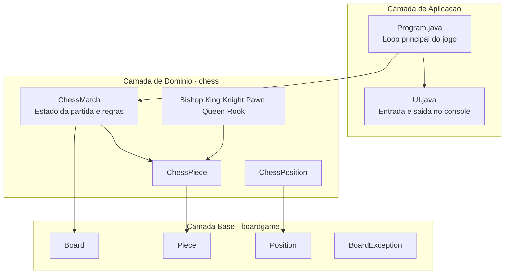

Pontos de design:

- Heranca entre peca generica e peca de xadrez.
- Encapsulamento de mutacao do tabuleiro em Board e ChessMatch.
- Regras centralizadas em ChessMatch.

---

## Stack Tecnologica

| Camada | Tecnologia | Finalidade |
|---|---|---|
| Linguagem | Java 21+ | Logica de jogo e modelo de objetos |
| Build | Apache Ant + arquivos do NetBeans | Compilar e executar |
| UI | Console com ANSI | Renderizacao do tabuleiro e entrada |
| Arquitetura | OOP | Heranca, abstracao e encapsulamento |

---

## Estrutura do Projeto

```text
chess_system_java/
|-- build.xml
|-- manifest.mf
|-- README.md
|-- README_PT.md
|-- README_ES.md
|-- nbproject/
|   |-- build-impl.xml
|   |-- project.properties
|   `-- ...
`-- src/
    |-- Program.java
    |-- UI.java
    |-- boardgame/
    |   |-- Board.java
    |   |-- BoardException.java
    |   |-- Piece.java
    |   `-- Position.java
    `-- chess/
        |-- ChessException.java
        |-- ChessMatch.java
        |-- ChessPiece.java
        |-- ChessPosition.java
        |-- Color.java
        `-- pieces/
            |-- Bishop.java
            |-- King.java
            |-- Knight.java
            |-- Pawn.java
            |-- Queen.java
            `-- Rook.java
```

---

## Regras Implementadas

### Regras padrao

- Movimentacao por tipo de peca.
- Capturas.
- Alternancia de turnos (WHITE e BLACK).
- Bloqueio de jogadas que deixam o proprio rei em xeque.
- Deteccao de xeque e xeque-mate.

### Regras especiais

- Roque:
  - Roque pequeno.
  - Roque grande.
  - Exige rei/torre sem movimentos e casas livres.
- En passant:
  - Controle por enPassantVulnerable.
  - Disponivel logo apos avanco duplo do peao adversario.
- Promocao:
  - Promocao automatica para Rainha ao chegar na ultima fileira.
  - Tipos aceitos: B (Bispo), H (Cavalo), R (Torre), Q (Rainha).

---

## Responsabilidades das Classes

| Classe | Responsabilidade |
|---|---|
| Program | Loop principal, sequencia de entrada e tratamento de excecoes |
| UI | Renderizacao no console, impressao de tabuleiro, leitura de posicao |
| ChessMatch | Ciclo da partida, execucao de jogadas, validacoes e xeque-mate |
| ChessPiece | Abstracao de peca de xadrez com cor e contador de movimentos |
| ChessPosition | Conversao entre notacao (a1-h8) e coordenadas de matriz |
| Board | Matriz generica e operacoes de posicionar/remover |
| Piece | Contrato generico de movimentos possiveis |
| Bishop/King/Knight/Pawn/Queen/Rook | Logica especifica de movimento |

---

## Fluxo de Execucao

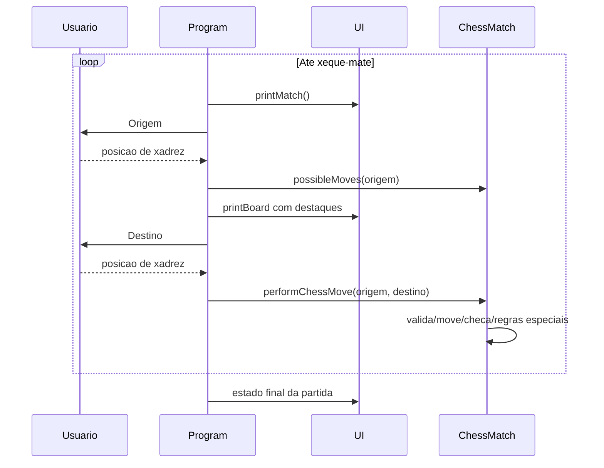

---

## 📚 Documentacao de Engenharia de Software

<div align="center">

Requisitos, UML, modelagem de dados e artefatos de UX de forma condensada.
Clique em cada item para expandir / recolher.

</div>

### 📋 Requisitos

<details>
<summary><b>✅ Requisitos Funcionais (RF)</b></summary>

| ID | Requisito |
|---|---|
| RF-01 | Permitir que dois jogadores alternem turnos (Branco / Preto). |
| RF-02 | Calcular os movimentos legais de cada tipo de peca. |
| RF-03 | Rejeitar qualquer jogada que deixe o proprio rei em xeque. |
| RF-04 | Detectar xeque e xeque-mate apos cada jogada. |
| RF-05 | Suportar roque (pequeno e grande). |
| RF-06 | Suportar captura en passant. |
| RF-07 | Suportar promocao de peao com peca escolhida pelo jogador. |
| RF-08 | Renderizar o tabuleiro e as pecas capturadas apos cada jogada. |
| RF-09 | Encerrar a partida automaticamente em xeque-mate. |

</details>

<details>
<summary><b>⚙️ Requisitos Nao Funcionais (RNF)</b></summary>

| ID | Requisito | Categoria |
|---|---|---|
| RNF-01 | Validacao de jogada responde em < 50 ms | Desempenho |
| RNF-02 | Executa em qualquer SO com JDK 21+ | Portabilidade |
| RNF-03 | Mensagens de erro claras para entradas invalidas | Usabilidade |
| RNF-04 | Separacao estrita entre as camadas genericas `boardgame` e de dominio `chess` | Manutenibilidade |
| RNF-05 | Nenhum estado de tabuleiro invalido pode ser alcancado | Confiabilidade |
| RNF-06 | Compila sem avisos com `javac -Xlint` | Qualidade de Codigo |

</details>

<details>
<summary><b>📏 Regras de Negocio (RN)</b></summary>

| ID | Regra |
|---|---|
| RN-01 | Uma jogada que exponha o proprio rei ao xeque e ilegal. |
| RN-02 | O roque exige que rei e torre nunca tenham se movido, caminho livre e o rei nao esteja em xeque nem passe por casas atacadas. |
| RN-03 | O en passant so e valido na jogada imediatamente apos o avanco de duas casas do peao adversario. |
| RN-04 | Um peao que alcance a ultima fileira deve ser promovido (padrao: Dama). |
| RN-05 | O xeque-mate encerra a partida; nenhuma jogada adicional e aceita. |
| RN-06 | Um jogador so pode mover suas proprias pecas, e apenas em seu turno. |

</details>

<details>
<summary><b>🌐 Requisitos de Dominio</b></summary>

- Todas as regras de movimento, captura, xeque, xeque-mate e empate seguem as regras padrao da FIDE.
- O tabuleiro e uma grade 8x8 endereçada em notacao algebrica (`a1`-`h8`).
- Cada peca guarda `color` (WHITE/BLACK) e um `moveCount`, usados no roque, en passant e no primeiro movimento do peao.

</details>

<details>
<summary><b>🗄️ Requisitos de Dados</b></summary>

- **Board**: matriz 8x8 de referencias `Piece` (anulaveis).
- **ChessMatch**: `turn`, `currentPlayer`, `check`, `checkMate`, `enPassantVulnerable`, `promoted`, `piecesOnTheBoard`, `capturedPieces`.
- **ChessPosition**: `column` (a-h) e `row` (1-8), convertidos para coordenadas da matriz.

</details>

<details>
<summary><b>🖥️ Requisitos de Interface</b></summary>

- Entrada/saida apenas em modo texto via console.
- Entrada de jogada como duas posicoes (ex.: `e2` e depois `e4`).
- Tabuleiro renderizado com cores ANSI; movimentos possiveis sao destacados.
- Escolha de promocao informada como um unico caractere (`B`/`N`/`R`/`Q`).

</details>

<details>
<summary><b>🎯 Casos de Uso</b></summary>

| ID | Caso de Uso | Ator Principal | Resumo |
|---|---|---|---|
| UC-01 | Realizar Jogada | Jogador | Seleciona origem/destino; o sistema valida e aplica a jogada. |
| UC-02 | Roque | Jogador | Move o rei duas casas em direcao a uma torre sob as condicoes do roque. |
| UC-03 | Captura En Passant | Jogador | Captura um peao adjacente que avancou duas casas. |
| UC-04 | Promover Peao | Jogador | Escolhe a peca de substituicao quando um peao alcanca a ultima fileira. |
| UC-05 | Detectar Xeque / Xeque-mate | Sistema | Avalia a seguranca do rei apos cada jogada; encerra a partida em xeque-mate. |
| UC-06 | Iniciar Nova Partida | Jogador | Inicializa o tabuleiro na posicao inicial padrao. |

</details>

<details>
<summary><b>🔗 Matriz de Rastreabilidade de Requisitos</b></summary>

| Requisito(s) | Caso de Uso | Classe(s) |
|---|---|---|
| RF-01, RN-06 | UC-01, UC-06 | `ChessMatch`, `Program` |
| RF-02 | UC-01 | `Bishop`, `King`, `Knight`, `Pawn`, `Queen`, `Rook` |
| RF-03, RN-01 | UC-01, UC-05 | `ChessMatch#testCheck`, `King` |
| RF-04, RN-05 | UC-05 | `ChessMatch#testCheckMate` |
| RF-05, RN-02 | UC-02 | `ChessMatch`, `King`, `Rook` |
| RF-06, RN-03 | UC-03 | `ChessMatch`, `Pawn` |
| RF-07, RN-04 | UC-04 | `ChessMatch`, `Pawn`, `UI` |
| RF-08 | todos | `UI`, `Board` |

</details>

<details>
<summary><b>📄 Documento de Especificacao de Requisitos de Software (SRS)</b></summary>

Este README forma um SRS condensado (inspirado na IEEE 830):

- **Introducao / escopo** → [Visao Geral](#visao-geral)
- **Contexto do sistema** → [Arquitetura](#arquitetura)
- **Requisitos especificos** → Requisitos Funcionais, Nao Funcionais, Regras de Negocio e Casos de Uso acima
- **Visao de projeto** → [Responsabilidades das Classes](#responsabilidades-das-classes) e os diagramas UML abaixo
- **Premissas / pendencias** → [Limitacoes Conhecidas](#limitacoes-conhecidas)

</details>

---

### 🧩 Diagramas UML

<details>
<summary><b>🎭 Diagrama de Casos de Uso</b></summary>

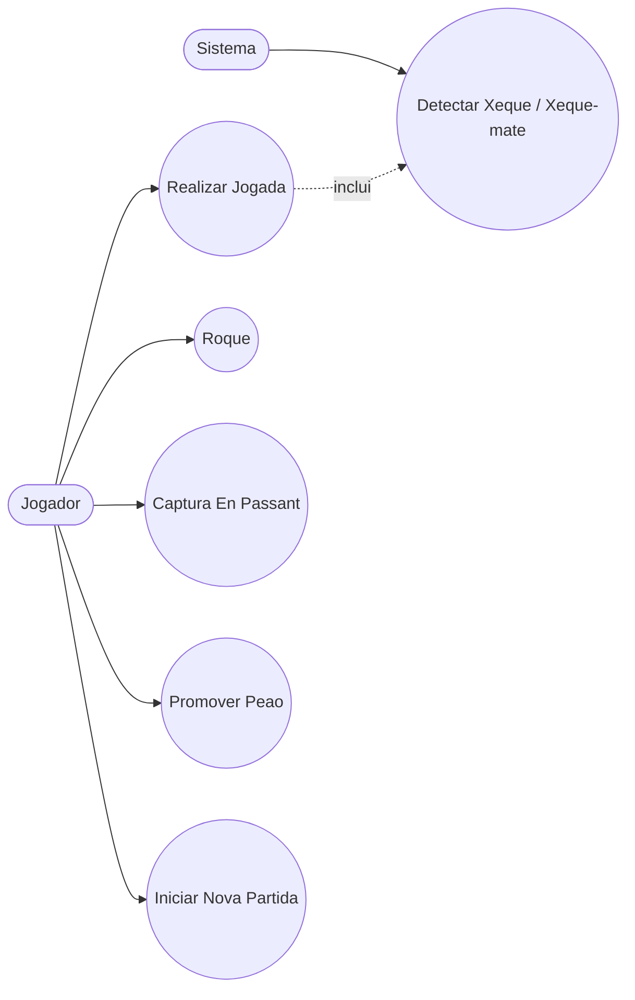

</details>

<details>
<summary><b>🏗️ Diagrama de Classes</b></summary>

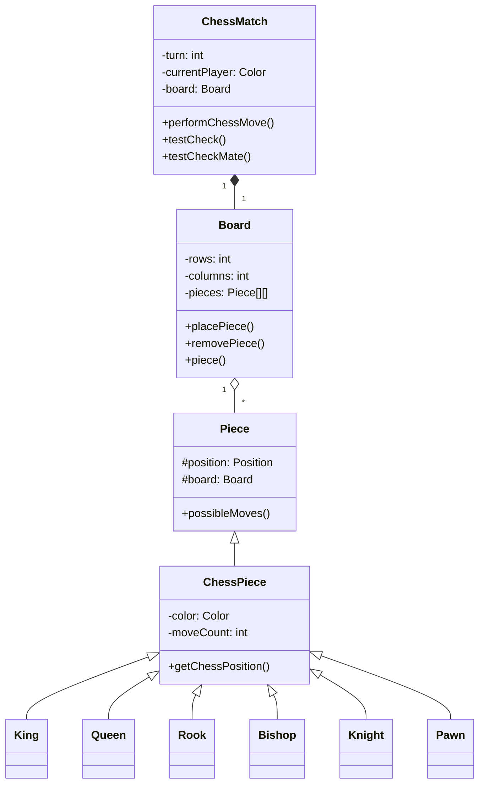

</details>

<details>
<summary><b>🧱 Diagrama de Objetos</b></summary>

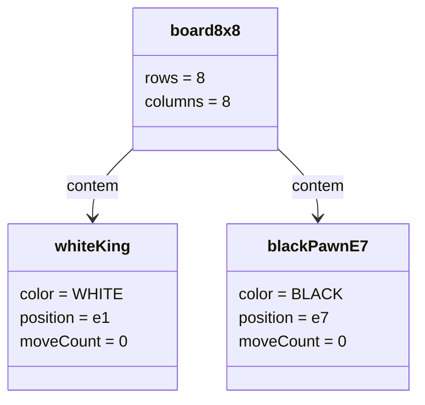

</details>

<details>
<summary><b>🔁 Diagrama de Sequencia</b></summary>

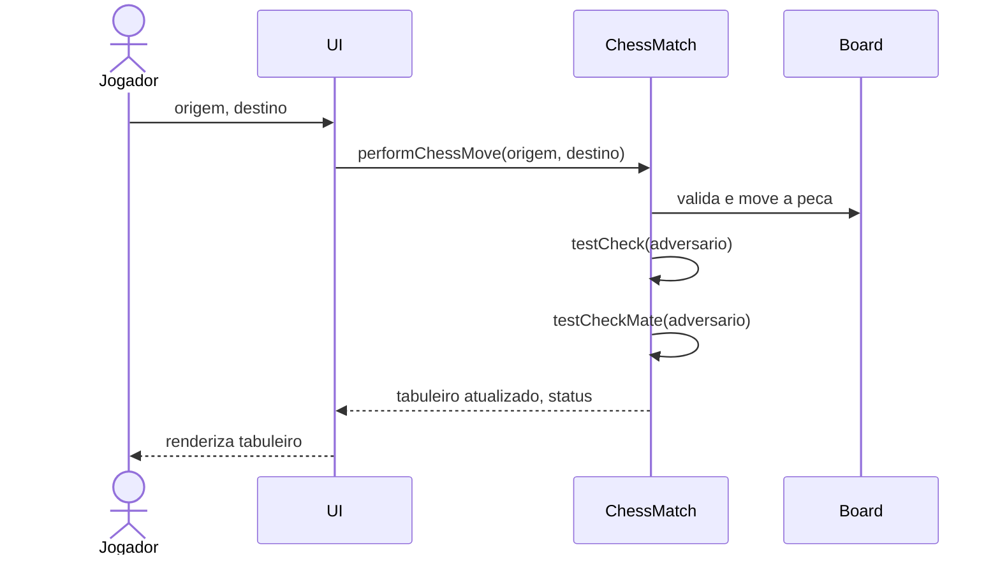

</details>

<details>
<summary><b>💬 Diagrama de Comunicacao</b></summary>

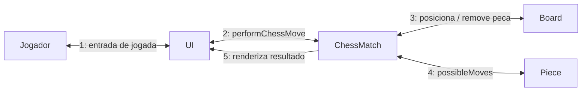

</details>

<details>
<summary><b>🏃 Diagrama de Atividades</b></summary>

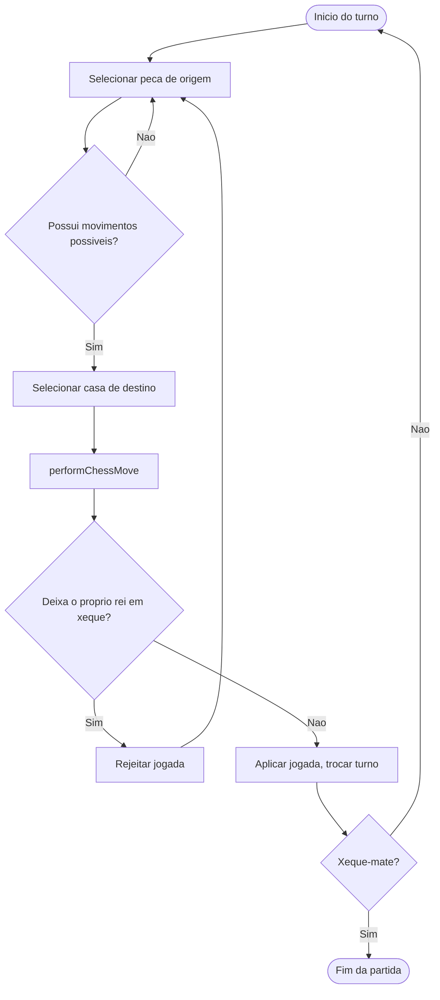

</details>

<details>
<summary><b>🔄 Diagrama de Maquina de Estados</b></summary>

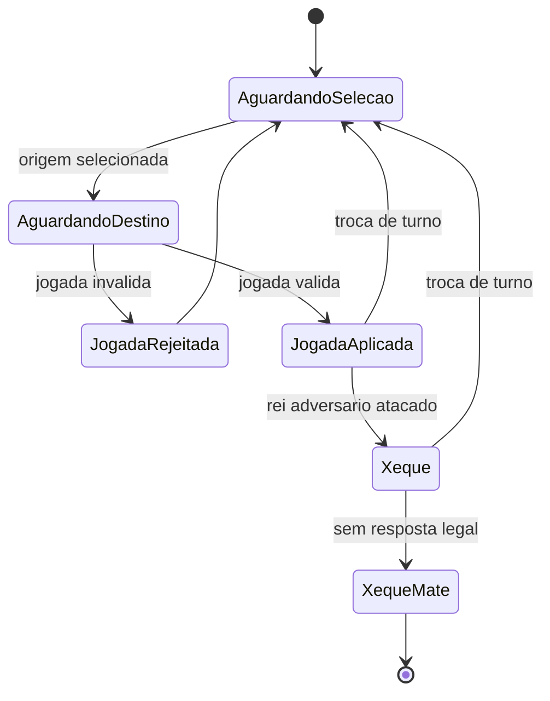

</details>

<details>
<summary><b>🧩 Diagrama de Componentes</b></summary>

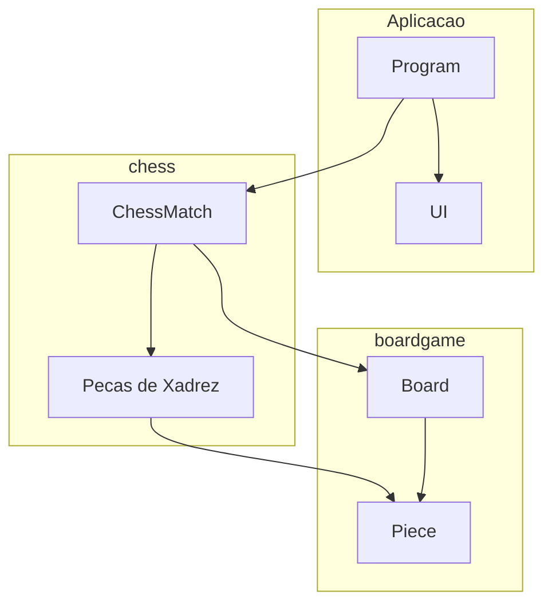

</details>

<details>
<summary><b>🚀 Diagrama de Implantacao</b></summary>

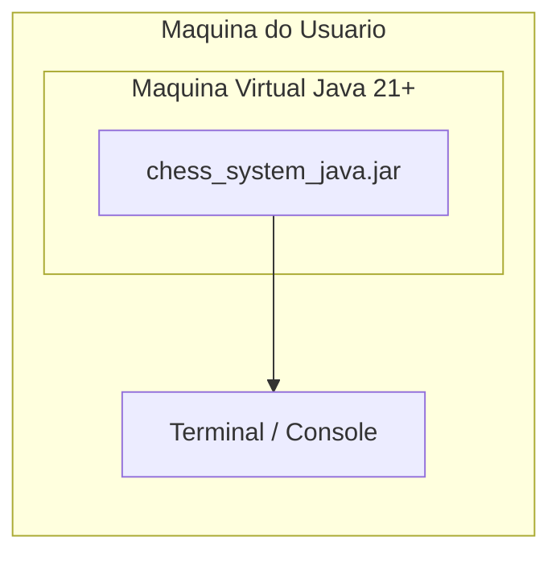

</details>

<details>
<summary><b>📦 Diagrama de Pacotes</b></summary>

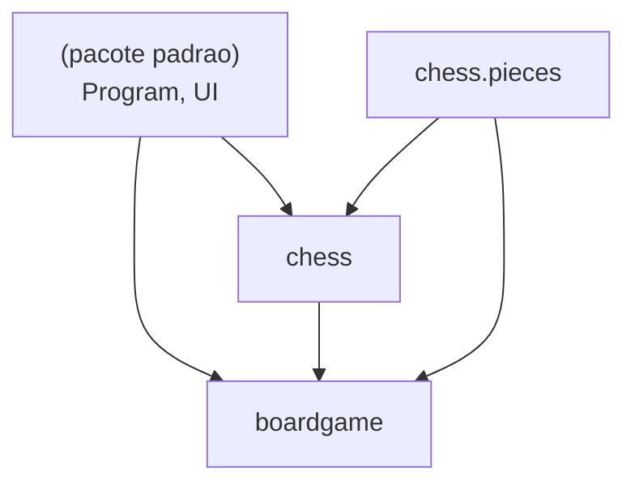

</details>

<details>
<summary><b>🧬 Diagrama de Estrutura Composta</b></summary>

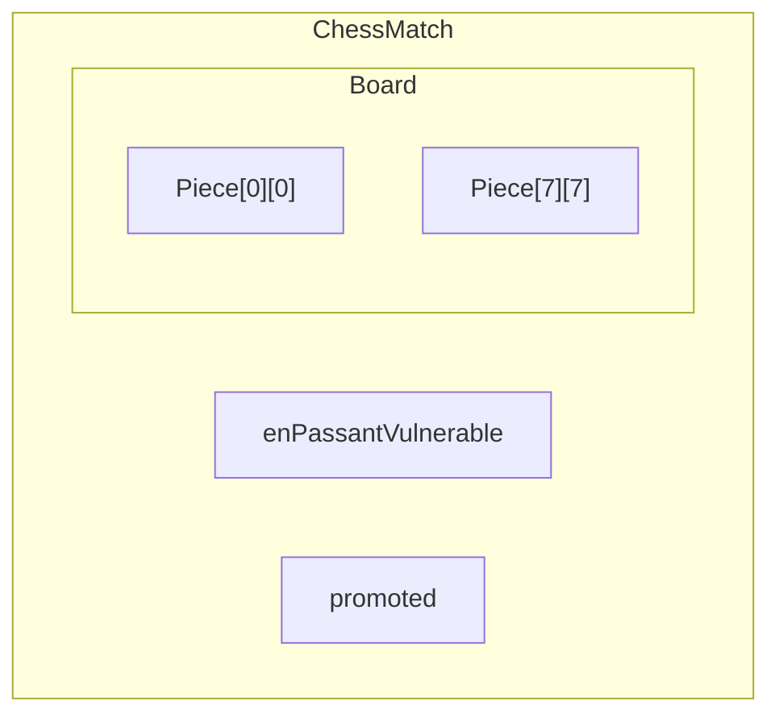

</details>

<details>
<summary><b>🗺️ Diagrama de Visao Geral de Interacao</b></summary>

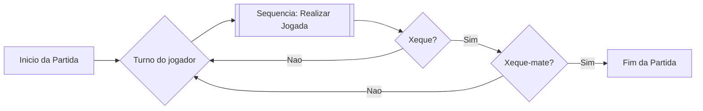

</details>

<details>
<summary><b>⏱️ Diagrama de Tempo (Timing)</b></summary>

| Turno | currentPlayer | check | checkMate | Evento |
|---|---|---|---|---|
| 1 | WHITE | false | false | e2 → e4 |
| 2 | BLACK | false | false | e7 → e5 |
| 3 | WHITE | false | false | Bf1 → c4 |
| ... | ... | ... | ... | ... |
| n | BLACK | true | true | Qh4 → f2# |

</details>

---

### 🗃️ Modelagem de Dados

<details>
<summary><b>🔗 Diagrama Entidade-Relacionamento (DER)</b></summary>

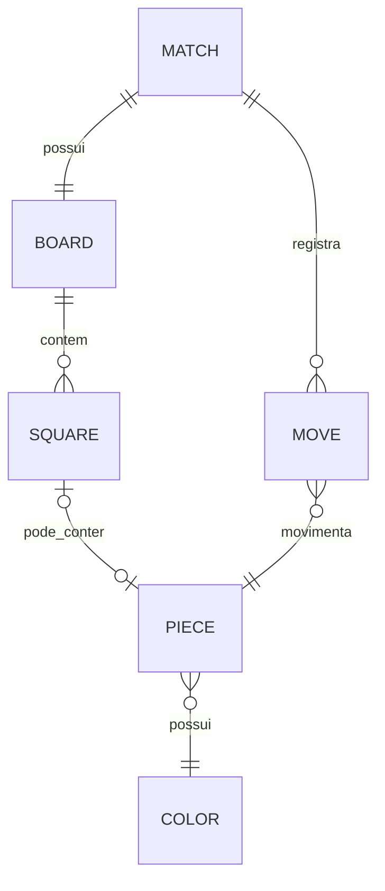

</details>

<details>
<summary><b>💡 Modelo Conceitual de Dados</b></summary>

- **Match**: uma sessao de jogo.
- **Board**: grade 8x8 de Squares.
- **Square**: identificada por coluna (a-h) e linha (1-8).
- **Piece**: tipo (King/Queen/Rook/Bishop/Knight/Pawn), cor, posicao, moveCount.
- **Move**: casa de origem, casa de destino, peca capturada (opcional), flag de jogada especial (opcional).

</details>

<details>
<summary><b>🧮 Modelo Logico de Dados</b></summary>

| Entidade | Atributos |
|---|---|
| Match | turn: int, currentPlayer: enum, check: bool, checkMate: bool |
| Board | rows: int, columns: int |
| Piece | type: enum, color: enum, position: (col, row), moveCount: int |
| Move | source: (col, row), target: (col, row), capturedPiece: Piece?, specialMove: enum? |

</details>

<details>
<summary><b>⚙️ Modelo Fisico de Dados</b></summary>

| Entidade Logica | Representacao em Java | Tabela SQL Hipotetica |
|---|---|---|
| Match | campos de `ChessMatch` | `matches(id, turn, current_player, check, checkmate)` |
| Board | `Piece[8][8]` dentro de `Board` | `board_squares(match_id, col, row, piece_id)` |
| Piece | subclasses de `ChessPiece` | `pieces(id, type, color, move_count)` |
| Move | nao persistido hoje | `moves(id, match_id, source, target, captured_piece_id, special_move)` |

</details>

<details>
<summary><b>📖 Dicionario de Dados</b></summary>

| Campo | Tipo | Dominio | Descricao |
|---|---|---|---|
| color | enum | WHITE, BLACK | Dono da peca / jogador atual |
| column | char | a-h | Coluna do tabuleiro (notacao algebrica) |
| row | int | 1-8 | Linha do tabuleiro (notacao algebrica) |
| moveCount | int | >= 0 | Quantas vezes a peca se moveu |
| check | boolean | true/false | Se o rei do jogador atual esta sob ataque |
| checkMate | boolean | true/false | Se nao ha resposta legal ao xeque |
| promoted | ChessPiece | anulavel | Peao pendente de promocao |

</details>

<details>
<summary><b>🌊 Diagrama de Fluxo de Dados (DFD)</b></summary>

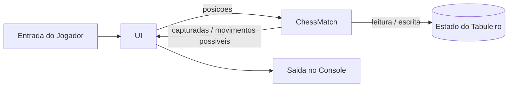

</details>

<details>
<summary><b>🧵 Diagrama de Linhagem de Dados</b></summary>

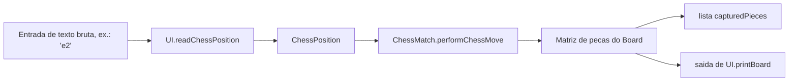

</details>

---

### 🏛️ Arquitetura e Fluxo

<details>
<summary><b>🏛️ Diagrama de Arquitetura (visao geral)</b></summary>

Veja o diagrama completo na secao [Arquitetura](#arquitetura) acima — organizado em `Aplicacao` (`Program`, `UI`), `chess` (regras de dominio) e `boardgame` (motor generico de tabuleiro).

</details>

<details>
<summary><b>📐 Fluxograma (loop principal)</b></summary>

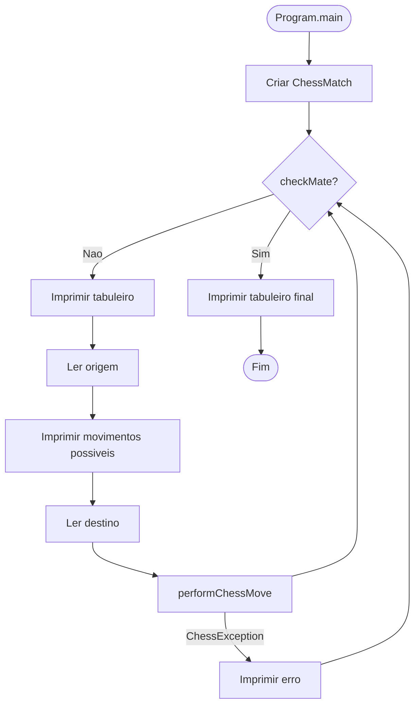

</details>

---

### 🎨 Artefatos de UX

<details>
<summary><b>🧑 Persona</b></summary>

**Alex, "O Estrategista Casual"**

- **Idade**: 28
- **Objetivo**: Jogar uma partida rapida de xadrez com um amigo no mesmo terminal.
- **Familiaridade com tecnologia**: Confortavel com linha de comando.
- **Frustracao**: Quer feedback claro sobre jogadas ilegais e de quem e o turno.

</details>

<details>
<summary><b>🗺️ Mapa de Jornada do Usuario</b></summary>

| Etapa | Acao | Sentimento | Ponto de Dor | Oportunidade |
|---|---|---|---|---|
| Inicio | Executar `ant run` / `java Program` | Curioso | Precisa ter o JDK instalado | Disponibilizar um JAR pronto |
| Configuracao | Ver o tabuleiro inicial | Familiar | Nenhum | - |
| Jogo | Informar casas de origem/destino | Concentrado | Erros de digitacao geram falhas | Mensagens de validacao mais amigaveis |
| Jogada especial | Roque / en passant / promocao | Encantado | Inseguro sobre quando esta disponivel | Destacar jogadas especiais legais |
| Fim | Mensagem de xeque-mate | Satisfeito | Sem opcao de revanche/salvar | Adicionar salvar/exportar (PGN) |

</details>

<details>
<summary><b>🖼️ Wireframe</b></summary>

```text
+------------------------------------+
| Turno: 5      Aguardando: WHITE     |
|                                      |
| 8 r n b q k b n r                   |
| 7 p p p p . p p p                   |
| 6 . . . . . . . .                   |
| 5 . . . . p . . .                   |
| 4 . . . . P . . .                   |
| 3 . . . . . . . .                   |
| 2 P P P P . P P P                   |
| 1 R N B Q K B N R                   |
|   a b c d e f g h                   |
|                                      |
| Capturadas - WHITE: []  BLACK: []   |
| Origem: _   Destino: _               |
+------------------------------------+
```

</details>

<details>
<summary><b>🎭 Mockup</b></summary>

```text
Legenda:
  [x] = casa de movimento possivel destacada
  Letras cyan    = pecas WHITE
  Letras amarelas = pecas BLACK

   a  b  c  d  e  f  g  h
8  r  n  b  q  k  b  n  r
7  p  p  p  p  .  p  p  p
6  .  .  .  .  .  .  .  .
5  .  .  .  . [p] .  .  .
4  .  .  .  . [P] .  .  .
3  .  .  .  .  .  .  .  .
2  P  P  P  P  .  P  P  P
1  R  N  B  Q  K  B  N  R
```

</details>

---

## Como Executar

### Pre-requisitos

- JDK 21 ou superior.
- Opcional: Apache NetBeans.
- Opcional: Apache Ant.

### Opcao 1: NetBeans

1. Abra a pasta do projeto no NetBeans.
2. Execute o projeto (F6).
3. Classe principal: Program.

### Opcao 2: Ant

Na raiz do repositorio:

```bash
ant run
```

### Opcao 3: javac/java

Na raiz do repositorio:

```bash
cd src
javac Program.java UI.java boardgame/*.java chess/*.java chess/pieces/*.java
java Program
```

No Windows PowerShell:

```powershell
cd src
javac Program.java UI.java boardgame\*.java chess\*.java chess\pieces\*.java
java Program
```

---

## Como Jogar

1. Digite a casa de origem no formato algebrico, por exemplo e2.
2. Digite a casa de destino, por exemplo e4.
3. Siga o indicador de turno no console.
4. Continue ate ocorrer xeque-mate.

O console mostra:

- Turno atual.
- Jogador da vez.
- Estado de xeque.
- Lista de pecas capturadas.

---

## Limitacoes Conhecidas

- Sem interface grafica (somente console).
- Sem persistencia de partidas (estado apenas em memoria).
- Sem suite automatizada de testes no repositorio.
- Mensagens ao usuario estao majoritariamente em portugues.

---

## Contribuicao

1. Faça um fork do repositorio.
2. Crie uma branch de feature.
3. Commit com mensagens claras.
4. Abra um pull request descrevendo a alteracao.

Boas frentes para contribuir:

- Testes unitarios para movimentos e cenarios de xeque-mate.
- Internacionalizacao das mensagens da UI.
- Exportacao/importacao opcional de PGN.
- Regras de empate (tripla repeticao, 50 lances, etc.).

---

## Autor

Victor H. J. Santiago

- GitHub: https://github.com/VictorHJesusSantiago
- LinkedIn: https://www.linkedin.com/in/victor-henrique-de-jesus-santiago/

---

## Licenca

Licenca MIT.

Se o arquivo LICENSE ainda nao estiver no clone local, adicione-o antes de publicar trabalhos derivados.

---

<div align="center">
Projeto feito para estudo, pratica de arquitetura e implementacao limpa de regras de xadrez em Java.
</div>
